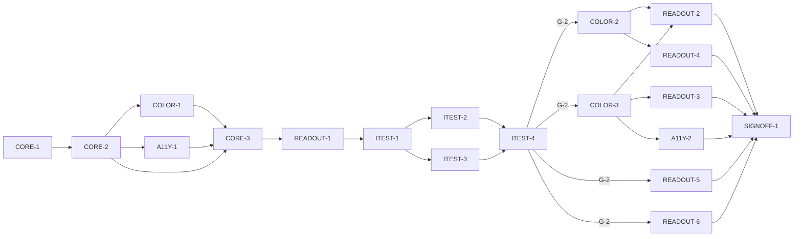

# Master Plan — Color readout (bs-01)

**Spec:** [bs-01-color-readout.feature](../bs-01-color-readout.feature)
**Status:** In progress — ITEST-3 done (AC-1..12 pending + red baseline, grade all A); next ITEST-4 (test review, G-2)
**Architecture:** [solution intent](../../docs/paint-color-app-solution-intent.md) · [scope](../../docs/paint-color-app-scope.md) · [wireframe derivation](../wireframe-spec-derivation.md) · wireframe `Paint Color Assistant.dc.html` Readout screen (S1.R1, E9–E14), in `docs/Color blindness artist tool.zip`
**Code home:** `/Users/matthew.quirk/Nuance` · remote `https://github.com/meatsquirk/Nuance` · base `main` · greenfield Flutter app (confirmed by Matt, 2026-10-05)

> First feature of the app. Its scaffold and shells bootstrap the whole Flutter project and the cross-cutting
> accessibility services (Speech, Haptics, label-contract widgets) that every later feature reuses.

## Gap analysis (against greenfield — no prior commit)

Nothing exists at the base: no repo, no Flutter project, no color-science, no UI. Every AC is net-new. The
per-AC "Missing" column is what the behavior stage must build.

| AC | Scenario | Exists today | Missing |
|---|---|---|---|
| AC-1 | Lightness prominent + grayscale + Munsell value | — | L extraction, Munsell value, grayscale render, size-prominence layout |
| AC-2 | Numeric lightness + value word | — | value-word derivation from L (e.g. "middle value") |
| AC-3 | Plain-language colour name large | — | ISCC-NBS nearest-name derivation; large name header |
| AC-4 | Warm sample described "warm" | — | hue→temperature-word derivation relative to a neutral |
| AC-5 | Colour-space selector (LCh/Munsell/sRGB/CIELAB), one at a time | — | sRGB/hex, CIELCh, Munsell, CIELAB conversions; exclusive selector |
| AC-6 | Measured value badged "Measured" | — | provenance model + badge rendering (Measured tier) |
| AC-7 | Estimated value badged + note | — | provenance Estimated tier + "Seeded by a model…" note |
| AC-8 | Speak whole readout | — | Speech/TTS service; spoken decomposition (name, value, temperature, hue words, chroma, hue angle) |
| AC-9 | Carry reading into comparison slot A | — | nav handoff to Comparison (stub) with sample in slot A |
| AC-10 | Carry reading into comparison slot B | — | nav handoff to Comparison (stub) with sample in slot B |
| AC-11 | Start recipe search from reading | — | nav handoff to Recipes (stub) with sample as target |
| AC-12 | Just-captured reading confirmed w/ haptic | — | Haptics service; just-captured state + acknowledge |

## Build order

| Stage | Phases |
|---|---|
| 1 Scaffold | CORE-1 |
| 2 Component shells | CORE-2 (domain + router + stubs), COLOR-1 ∥ A11Y-1, CORE-3 (buildApp assembly), READOUT-1 |
| 3 Acceptance tests | ITEST-1, ITEST-2, ITEST-3, ITEST-4 (test review, G-2) |
| 4 Behavior | COLOR-2 *(enabler)*, COLOR-3 *(enabler)*, READOUT-2, READOUT-3, READOUT-4, READOUT-5, READOUT-6, A11Y-2 |
| 5 Sign-off | SIGNOFF-1 |

## Acceptance criteria coverage

| AC | Scenario | Integration test (ITEST) | Behavior phases | Status |
|---|---|---|---|---|
| AC-1 | Lightness is displayed as the prominent value with a grayscale preview | ITEST-2 `TestAC01_LightnessProminent` | COLOR-2, READOUT-2 | ⬜ Todo |
| AC-2 | The numeric lightness is paired with a plain-language value word | ITEST-2 `TestAC02_ValueWord` | COLOR-3, READOUT-2 | ⬜ Todo |
| AC-3 | A plain-language colour name is shown large | ITEST-2 `TestAC03_ColourName` | COLOR-3, READOUT-3 | ⬜ Todo |
| AC-4 | A warm sample is described as warm in words | ITEST-2 `TestAC04_Temperature` | COLOR-3, READOUT-3 | ⬜ Todo |
| AC-5 | The painter selects a colour space and sees the sample in that space | ITEST-2 `TestAC05_ColourSpaceSelector` | COLOR-2, READOUT-4 | ⬜ Todo |
| AC-6 | A measured value is badged Measured | ITEST-2 `TestAC06_MeasuredBadge` | READOUT-5 | ⬜ Todo |
| AC-7 | An unverified seeded value is badged Estimated and labelled not yet verified | ITEST-2 `TestAC07_EstimatedBadge` | READOUT-5 | ⬜ Todo |
| AC-8 | The painter hears the whole readout spoken | ITEST-3 `TestAC08_SpeakReadout` | COLOR-3, A11Y-2 | ⬜ Todo |
| AC-9 | The painter uses the reading as comparison sample A | ITEST-3 `TestAC09_CompareAsA` | READOUT-6 | ⬜ Todo |
| AC-10 | The painter uses the reading as comparison sample B | ITEST-3 `TestAC10_CompareAsB` | READOUT-6 | ⬜ Todo |
| AC-11 | The painter starts a recipe search from the reading | ITEST-3 `TestAC11_FindRecipes` | READOUT-6 | ⬜ Todo |
| AC-12 | A just-captured reading is confirmed with a haptic and acknowledged | ITEST-3 `TestAC12_JustCaptured` | A11Y-2 | ⬜ Todo |

## Design decisions

| # | Decision | Why |
|---|---|---|
| D-1 | Flutter single codebase; bs-01 is pure-Dart logic + widgets (no native capture yet) | SI D1; the Readout screen consumes a `Sample`, capture is bs-02 |
| D-2 | Color-science behind a `ColorScience` interface; pick an established conversions lib for sRGB/CIELAB/CIELCh (SI D4), bundle lookup data for Munsell + ISCC-NBS naming | Hand-rolled color math is error-prone; Munsell/ISCC-NBS need reference tables; interface keeps the lib swappable |
| D-3 | `Sample` carries a `Provenance` (Measured / Calculated / Estimated / Confirmed) as a required, non-null field, stored append-ready for the future P2P layer | SI D9 — provenance enforced in the model, not UI policy |
| D-4 | Accessibility services (`Speech`, `Haptics`) and label-contract widgets (`ColorChip`, badges) are app-injected shared services, bootstrapped by bs-01 | SI Accessibility is a cross-cutting architectural concern; bs-01 is the first consumer |
| D-5 | bs-01 owns thin **stub** Comparison and Recipes screens as navigation targets; the real screens are bs-03 / bs-04 | AC-9/10/11 observe navigation handoff; the stub is the read endpoint the acceptance test finds |
| D-6 | Acceptance suite = Flutter `integration_test` driving the assembled app via `WidgetTester`; platform TTS/haptics faked by recording services. **Runs on a booted iOS simulator** (`flutter test integration_test/ -d <udid>`) — ITEST-1 found `flutter test` routes the `integration_test/` dir to on-device execution, so with no device the plain command exits 0 having run **zero** tests (false green); host-headless isn't available (no desktop platform folder). Owner chose the simulator path 2026-10-05 (over host widget-tests / desktop device). CI must add an emulator. | Tests go through the real UI surface; only platform sinks (infrastructure) are faked |
| D-7 | Split the old CORE-2 shell into CORE-2 (domain + router + stub screens) and CORE-3 (`buildApp` assembly + service registration + `main.dart` wiring) | Breaks a dependency cycle: COLOR-1/A11Y-1 reference domain types (`Sample`, `Provenance`) so need CORE-2, while `buildApp` injects their interfaces so needs them — assembly must come after both. COLOR-1/A11Y-1 defer their "register in buildApp" step to CORE-3 |

## Acceptance integration test plan

Module plan: [modules/ITEST.md](modules/ITEST.md).

**Where it lives and how it runs:** `integration_test/` (Flutter `integration_test` package), **on a booted
iOS simulator** (the dir forces on-device execution — ITEST-1 finding, D-6). Boot once
(`xcrun simctl boot <udid>`; iPhone 17 = `5AB9D06D-AE5D-43A2-A2E8-CBD46ED51685`). Default:
`flutter test integration_test/ -d <udid>` (pending ACs skipped). Run-pending:
`flutter test integration_test/ -d <udid> --dart-define=BS01_RUN_PENDING=true` (executes pending tests —
ITEST-2 found the old `BS01_RUN_PENDING=1` env form silently skips on-device; the simulator app process does
not inherit the host env). Single lane (widget tests are not parallel-safe within a process; and one
simulator). First build ~80s; later runs ~20s.
One import — `integration_test/harness.dart` — carries the fixtures, pending gate (`acTestWidgets`,
un-pend by deleting the AC's `pendingACs` row) and the Given/When/Then vocabulary.
**Where assertions look:** the rendered widget tree via `WidgetTester` finders (text, keys, semantics labels,
relative font sizes); the recording `FakeSpeech` utterance log; the recording `FakeHaptics` event log; the
current route and its passed arguments (observed via the stub target screens' rendered content).
**What is real and what is faked:** the whole app is assembled through the one production `buildApp(deps)`
entry; color-science, controllers, widgets, navigation and provenance logic are real. Faked (infrastructure
only): the platform TTS sink (`FakeSpeech` records utterances) and the platform haptic sink (`FakeHaptics`
records pulses). No color math is faked.

**Fixtures:**

| Fixture | Shape |
|---|---|
| `SAMPLE_TERRACOTTA` | name "Warm Terracotta"; CIELCh L58 C34 h42; Munsell 10R 5.5/6; provenance Measured. Drives AC-1,2,3,4,5,8,9,10 |
| `SAMPLE_OLIVE` | name "Deep Olive Green"; used as recipe target / capture subject. Drives AC-11, AC-12 |
| `SAMPLE_COOL` | a cool sample at hue ~250°; **control** for AC-4 (must read "cool", not "warm") |
| `SAMPLE_MEASURED` | a sample read with a spectrophotometer → provenance Measured. Drives AC-6 |
| `SAMPLE_ESTIMATED` | a model-seeded, unverified value → provenance Estimated. Drives AC-7 |

**Test catalogue:**

| AC | Given: built via public flows → checked by | When | Then: exact assertions (negative Thens: after <settle point>) | Rejects |
|---|---|---|---|---|
| AC-1 | Open Readout on `SAMPLE_TERRACOTTA` → assert screen shows reading for "Warm Terracotta"; assert L is 58 | readout shown | the "58" Lightness widget's font size > every other reading's font size (exact ordering, not just present); a grayscale-preview widget is present; Munsell value "5.5" shown beside the Lightness | an impl that renders L at equal/!largest size; one with no grayscale preview; one omitting Munsell value |
| AC-2 | Open Readout on a sample with L58 → assert L shown as 58 | value reading shown | a value word (e.g. "middle value") is shown adjacent to the number | shows the number only; shows a word unrelated to L (control: a dark sample L~15 reads "low/dark value", a light L~90 reads "high/light value") |
| AC-3 | Open Readout on sample whose nearest name is "Warm Terracotta" → assert sample loaded | readout shown | "Warm Terracotta" shown as a large header at the top; font size ≥ all other text | name absent; name shown small/not at top (assert top-of-tree + largest-text) |
| AC-4 | Open Readout on sample at hue 42° → assert hue is 42 | readout shown | temperature stated as the word "warm" | emits a hue angle/number instead of a word; always emits "warm" (control: `SAMPLE_COOL` hue~250° → "cool") |
| AC-5 | Open Readout on `SAMPLE_TERRACOTTA` → assert loaded | select each `<space>` in turn | the shown values equal the row's `<shown>` (LCh: L58 C34 h42; Munsell 10R 5.5/6; sRGB: a triplet + hex; CIELAB: L,a,b); the other three spaces' value strings are **not** present after the switch settles | shows all spaces at once (no exclusivity); shows wrong values for a space; selector that never hides the previous space |
| AC-6 | Open Readout on `SAMPLE_MEASURED` (spectrophotometer) → assert provenance == Measured in model | readout shown | the provenance badge text is "Measured" | badges everything identically (control vs AC-7); no badge |
| AC-7 | Open Readout on `SAMPLE_ESTIMATED` (model-seeded, unverified) → assert provenance == Estimated | readout shown | badge reads "Estimated — not yet verified"; the note "Seeded by a model. Treat as a starting point." is shown | shows "Estimated" without the note; shows "Measured"; (control: `SAMPLE_MEASURED` has no note) |
| AC-8 | Open Readout on `SAMPLE_TERRACOTTA` → assert loaded; `FakeSpeech` log empty | ask to speak this readout | `FakeSpeech` received exactly one utterance containing the name, the value, the temperature word, the hue in words, the chroma, and the hue angle (assert each substring) | speaks only the name; speaks a hex/swatch; omits any required component (each checked separately) |
| AC-9 | Open Readout on `SAMPLE_TERRACOTTA` → assert loaded; assert not already on Comparison | use reading as comparison sample A | current screen is Comparison; its slot **A** shows "Warm Terracotta"; slot B empty | puts the sample in slot B; navigates without carrying the sample; doesn't navigate (control: AC-10 asserts slot B) |
| AC-10 | Open Readout on `SAMPLE_TERRACOTTA` → assert loaded | use reading as comparison sample B | current screen is Comparison; slot **B** shows "Warm Terracotta"; slot A empty | puts it in slot A; wrong/empty sample (control pair with AC-9) |
| AC-11 | Open Readout on `SAMPLE_OLIVE` → assert loaded | ask to find mixing recipes | current screen is Recipes; the target shows "Deep Olive Green" | navigates with no target set; wrong sample as target |
| AC-12 | Capture `SAMPLE_OLIVE` then open its Readout → assert just-captured marker present; `FakeHaptics` log has one confirm pulse | acknowledge the captured reading | **before** acknowledge: marker present (settle = readout rendered); **after** acknowledge: marker gone; control: a non-fresh readout shows no marker and fires no haptic | no haptic on capture; marker never set; marker never clears after acknowledge |

**Red baseline** and **test augmentations:** tracked in [modules/ITEST.md](modules/ITEST.md).
Pre-seeded augmentations: AC-1's "largest reading" size-ordering is strengthened by READOUT-4 once the
colour-space readings also render (more readings to out-rank); AC-5's exclusivity control is confirmed by
READOUT-4.

## Modules

| Module | Plan | Purpose | Depends on | Status |
|---|---|---|---|---|
| CORE | [modules/CORE.md](modules/CORE.md) | Project scaffold, domain model (`Sample`, `Provenance`, coordinates), app assembly, navigation + stub Compare/Recipes screens | — | ✅ Done |
| COLOR | [modules/COLOR.md](modules/COLOR.md) | Color-science: conversions, ISCC-NBS naming, value/temperature words, spoken decomposition, behind `ColorScience` | CORE | 🔄 In progress |
| A11Y | [modules/A11Y.md](modules/A11Y.md) | Cross-cutting accessibility: `Speech`/`Haptics` services + label-contract widgets; speak-readout + haptic behavior | CORE | 🔄 In progress |
| READOUT | [modules/READOUT.md](modules/READOUT.md) | Readout screen UI + controller; renders value/name/temperature/spaces/provenance; carries into compare/recipes | CORE, COLOR, A11Y | 🔄 In progress |
| ITEST | [modules/ITEST.md](modules/ITEST.md) | Acceptance integration suite: one pending test per AC, and its review | all shell phases | 🔄 In progress |

## Dependency graph

**Parallel windows:** CORE-2 (domain + router + stubs) runs first alone — it is the root the others compile
against. Then `{COLOR-1, A11Y-1}` run concurrently (disjoint files: `lib/color_science/` vs
`lib/a11y/`+`lib/widgets/`; only COLOR-1 touches `pubspec.yaml`; neither touches `build_app.dart` since
registration is deferred). Then CORE-3 (buildApp assembly) alone, then READOUT-1.
`{ITEST-2, ITEST-3}` concurrently. Enablers `{COLOR-2, COLOR-3}` concurrently after G-2. **Merge-risky:**
READOUT-2..6 and A11Y-2 all edit the Readout screen widget / controller — run them serially (or split the
screen into per-region files first); A11Y-2 also touches the readout controller.

## Open gates

| Gate | Kind | Decision needed | Blocks | Status |
|---|---|---|---|---|
| G-1 | decision | Approve the spec (the `.feature` is marked "Draft: awaiting owner approval"; record approval as its first line) | CORE-1 | ✅ Resolved 2026-10-05: approved — owner Matt Quirk. Spec first line records approval. |
| G-2 | decision | Approve the acceptance tests (ITEST-4's packet) | every behavior phase | Open |

Resolved: `✅ Resolved <date time>: <decision, one line> — <who>`.

## Known flakes

| Test | Symptom | Rate (runs) | Measured at | Owner | Status |
|---|---|---|---|---|---|
| — | none yet | | | | |

## Session log

| # | Phase | Target | Status | Tokens | Time | Notes |
|---|---|---|---|---|---|---|
| 1 | CORE-1 | scaffold: flutter project, test + coverage gate, baseline | ✅ Done | 4,803,956 | 12m 33s (13m 49s) | G-1 resolved; gate proven; Flutter 3.47.6 installed |
| 2 | CORE-2 | shell: domain model (`Sample`/`Provenance`/`ColorCoordinates`), router + stub Compare/Recipes screens | ✅ Done | 6,628,852 | 22m 29s (28m 18s) | root shell; incl. D-7 restructure |
| 3 | COLOR-1 | shell: `ColorScience` interface + stub impl, lib dep | ✅ Done | 2,633,008 | 7m 21s (7m 21s) | `color_models` dep added; impl throws until COLOR-2/3 |
| 4 | A11Y-1 | shell: `Speech`/`Haptics` interfaces + no-op, label widgets | ✅ Done | 2,963,594 | 7m 55s | services + 3 label-contract widgets; 100% cov on 14 files; 1 fix pass |
| 5 | CORE-3 | shell: `buildApp` assembly + register stub services + wire `main.dart` to Readout route | ✅ Done | 2,455,251 | 4m 44s (4m 44s) | `AppDependencies`+`AppScope`+`buildApp`; opens on placeholder Readout route; 1 fix pass |
| 6 | READOUT-1 | shell: Readout screen scaffold + controller (placeholder data) | ✅ Done | 7,613,743 | 14m 38s | screen + controller + 6 region widgets; every region/action keyed as a finder anchor; `initialSample` seam added; 92 tests, 100% cov |
| 7 | ITEST-1 | acceptance-tests: harness, fixtures, pending gate (12 ACs), smoke | ✅ Done | 7,980,954 | 29m 01s (1h 13m) | harness + fakes + smoke green on iOS sim; grade A; runner → sim (owner decision, D-6) |
| 8 | ITEST-2 | acceptance-tests: AC-1..7 (pending) + red baseline | ✅ Done | 6,226,248 | 27m 50s | 7×A; red baseline (Then) recorded; run-pending → dart-define |
| 9 | ITEST-3 | acceptance-tests: AC-8..12 (pending) + red baseline | ✅ Done | 6,061,969 | 17m 53s | 5×A (AC-8 B→A, G5 fix); red baseline (Then) recorded |
| 10 | ITEST-4 | test-review: packet; G-2 | ⬜ Next | | | preconditions met: AC-1..12 pending, grid all A |
| 11 | COLOR-2 | behavior/enabler: sRGB/CIELCh/Munsell/CIELAB conversions | ⬜ Todo | | | ∥ COLOR-3 |
| 12 | COLOR-3 | behavior/enabler: name, value word, temperature, decomposition | ⬜ Todo | | | ∥ COLOR-2 |
| 13 | READOUT-2 | behavior: AC-1, AC-2 (value region) | ⬜ Todo | | | |
| 14 | READOUT-3 | behavior: AC-3, AC-4 (name + temperature) | ⬜ Todo | | | |
| 15 | READOUT-4 | behavior: AC-5 (colour-space selector) | ⬜ Todo | | | |
| 16 | READOUT-5 | behavior: AC-6, AC-7 (provenance badges) | ⬜ Todo | | | |
| 17 | READOUT-6 | behavior: AC-9, AC-10, AC-11 (navigation handoffs) | ⬜ Todo | | | |
| 18 | A11Y-2 | behavior: AC-8, AC-12 (speak + haptic/just-captured) | ⬜ Todo | | | |
| 19 | SIGNOFF-1 | sign-off: packet + summary page + manual approval | ⬜ Todo | | | |

*Tokens* / *Time* = the phase totals from the *Token usage* ledger (Time = active, wall in brackets), filled
when the row is marked done.

## Next phase

ITEST-3 is **done** — AC-8..AC-12 written as pending tests in the actions group of
`integration_test/readout_test.dart`, grade all A (5×A; AC-8 was B on a vacuous temperature assertion and was
fixed to assert against the name-stripped utterance). Red baseline recorded (each fails on a Then naming its
phase). The **whole AC catalogue (AC-1..AC-12) is now written and pending**; default suite green (12 skipped,
5 harness pass); unit 92 green; coverage gate PASS (test-only).

- **ITEST-4 (test review, G-2)** — the stage's last phase and the only one left before behaviour. Assemble the
  review packet (per-AC: test name, Given checks, When, Then + Rejects; red-baseline summary; augmentations +
  owning phase; grid path + counts; what to look at first), set the phase `⏸ Awaiting review` and G-2
  *awaiting decision*, then stop for the human decision via
  `/feature-next-phase --gate bs-01-color-readout G-2 approved | "<changes>"`.
- **G-2 stays open** and blocks the whole behaviour stage (COLOR-2/3, READOUT-2..6, A11Y-2) — not ITEST-4
  itself. No behaviour phase can start until a human approves the tests.
- **Runner note** for ITEST-4 (full cross-feature regression) and every behaviour phase: boot the sim first;
  run-pending uses `--dart-define=BS01_RUN_PENDING=true`; CI must add an emulator and pass the define before
  the acceptance job is wired.

## Token usage

<!-- One row per session, appended as that session's last edit (SKILL.md § Token usage). -->

| Phase / activity | Session | Start | End | Wall | Active | Model(s) | Input | Cache write | Cache read | Output | Total | Outcome |
|---|---|---|---|---|---|---|---|---|---|---|---|---|
| PLAN | 45358853 | 2026-10-05 10:51 EDT | 12:04 | 1h 12m | 11m 22s | claude-opus-4-8 | 38 | 158,309 | 1,522,221 | 43,633 | 1,724,201 | plan written: 18 phases, 5 modules, 12 ACs; G-1/G-2 open |
| CORE-1 | 9566cc01 | 2026-10-05 16:43 EDT | 16:57 | 13m 49s | 12m 33s | claude-opus-4-8 | 118 | 82,528 | 4,691,763 | 29,547 | 4,803,956 | scaffold complete — analyze clean, 2 tests green, coverage gate proven (PASS clean / FAIL on planted gap); G-1 resolved; Flutter 3.47.6 installed |
| CORE-2 | 3b711674 | 2026-10-05 17:00 EDT | 17:29 | 28m 18s | 22m 29s | claude-opus-4-8 | 94 | 149,678 | 6,389,064 | 90,016 | 6,628,852 | ✅ gate passed — domain + router + stubs; analyze clean, 34 tests, 100% line coverage (7 files); 2 fix passes; incl. D-7 restructure (split CORE-3; COLOR-1/A11Y-1 re-pointed to CORE-2) |
| COLOR-1 | 6298ac89 | 2026-10-05 17:46 EDT | 17:54 | 7m 21s | 7m 21s | claude-opus-4-8 | 62 | 75,780 | 2,529,781 | 27,385 | 2,633,008 | ✅ gate passed — ColorScience interface + value types + stub impl; color_models ^2.0.0 dep added; analyze clean, 46 tests green, 100% line coverage (2 new files); 0 fix passes |
| A11Y-1 | bd246d4f | 2026-10-05 18:06 EDT | 18:14 | 7m 55s | 7m 55s | claude-opus-4-8 | 68 | 79,687 | 2,856,787 | 27,052 | 2,963,594 | gate passed — Speech/Haptics interfaces + no-op impls + 3 label-contract widgets; analyze clean, 65 tests green, 100% line coverage (14 files, 5 new); 1 fix pass (firstBaseline→baseline) |
| CORE-3 | 4ec73d65 | 2026-10-05 19:31 EDT | 19:35 | 4m 44s | 4m 44s | claude-opus-4-8 | 68 | 71,787 | 2,367,231 | 16,165 | 2,455,251 | gate passed — buildApp assembly (AppDependencies/AppScope) + main.dart wired; opens on placeholder Readout route; analyze clean, 72 tests green, 100% line coverage (build_app.dart + main.dart); 1 fix pass (const-canonicalisation in updateShouldNotify test) |
| READOUT-1 | 6fc2089c | 2026-10-05 20:20 EDT | 20:35 | 14m 38s | 14m 38s | claude-opus-4-8 | 140 | 125,169 | 7,435,436 | 52,998 | 7,613,743 | gate passed — Readout screen + controller shell; analyze clean, 92 tests green, 100% line coverage on 23 touched lib files (7 new readout + build_app.dart); 2 fix passes (lint + const-only coverage); no AC behaviour (pre-G-2) |
| ITEST-1 | fe74d129 | 2026-10-05 22:00 EDT | 23:13 | 1h 13m | 29m 01s | claude-opus-4-8 | 114 | 199,506 | 7,711,531 | 69,803 | 7,980,954 | gate passed — acceptance harness + fakes + smoke green on iOS sim (both pending modes); 12-AC pending gate; unit 92 green; coverage gate PASS (no lib touched); analyze clean; grade A; runner → iOS simulator (owner decision, D-6 kept) |
| ITEST-2 | 6e55de65 | 2026-10-05 23:42 EDT | 2026-10-06 00:10 | 27m 50s | 27m 50s | claude-opus-4-8 | 104 | 228,634 | 5,929,899 | 67,611 | 6,226,248 | AC-1..7 pending + red baseline (Then, each names owning phase); grade 7×A; default green; run-pending fixed to dart-define |
| ITEST-3 | 7c0d4d84 | 2026-10-06 05:43 EDT | 06:01 | 17m 53s | 17m 53s | claude-opus-4-8 | 112 | 214,214 | 5,803,717 | 43,926 | 6,061,969 | AC-8..12 pending + red baseline (Then, each names owning phase); grade 5×A (AC-8 B→A, G5 fix); default green; unit 92 green; coverage PASS (test-only) |
| **Feature total** |  | **2026-10-05 10:51 EDT** | **2026-10-06 06:01** | **4h 27m** | **2h 35m** |  | **918** | **1,385,292** | **47,237,430** | **468,136** | **49,091,776** |  |

## Sign-off

| Round | Packet | At code | Grades | Decision |
|---|---|---|---|---|
| 1 | [signoff/round-1.md](signoff/round-1.md) | — | — | ⏸ Awaiting |
