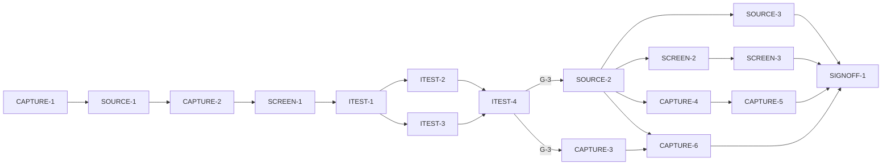

# Master Plan — Sample capture and sampling (bs-02)

**Spec:** [bs-02-sample-capture.feature](../bs-02-sample-capture.feature)
**Status:** In progress — next CAPTURE-2 (shell). G-3 approve-tests still open, blocks behaviour only
**Architecture:** [solution intent](../../docs/paint-color-app-solution-intent.md) (Capture & sampling; NFR accuracy table; D2/D9; Reliability) · [scope](../../docs/paint-color-app-scope.md) · [wireframe derivation](../wireframe-spec-derivation.md) · wireframe `Paint Color Assistant.dc.html` Capture screen (S1.R1, E15–E21), in `docs/Color blindness artist tool.zip`
**Code home:** `/Users/matthew.quirk/Nuance` · remote `https://github.com/meatsquirk/Nuance` · base `main` · **extends** the bs-01 Flutter project (same code home, confirmed by Matt 2026-10-05 for bs-01)

> Second feature. It builds the Capture screen on top of bs-01's shared foundation (Flutter project, `Sample`/
> `Provenance`, `buildApp`, `Haptics`/`Speech`, color-science, coverage-gate tool, `integration_test`, the
> Readout screen). It adds one new architectural layer: the native-camera path behind the SI `CaptureSource`
> interface (D2), exercised in tests through a deterministic software source.

## Gap analysis (against bs-01 foundation, once merged)

bs-01 supplies the project, domain model, assembly, accessibility services, color-science and the Readout
screen. Nothing capture-side exists: no `CaptureSource`, no sampling, no Capture controller/screen, no
accuracy label. Every AC below is net-new capture behaviour.

| AC | Scenario | Exists today (post bs-01) | Missing |
|---|---|---|---|
| AC-1 | Centre-point eyedropper on live view | — | live-view frame feed; centre eyedropper marker |
| AC-2 | Sample under centre = 5 px area average | — | point + area-average sampling; default 5 px radius; sampled-colour read endpoint |
| AC-3 | Radius selector → reticle 8/20/44, averaged over radius | — | radius selector (E18); reticle sizing; radius-driven averaging |
| AC-4 | Lock AE/WB/focus → LOCKED + STABLE 12/12 | — | lock lifecycle; stability settling counter |
| AC-5 | Before lock: SETTLING 6/12, lock invites | — | pre-lock settling state + lock affordance |
| AC-6 | Low light → approximate (ΔE 8), not refused | — | low-light detection; `CaptureAccuracy`; low-light warning |
| AC-7 | Dismiss low-light warning, stays approximate | — | warning dismiss (E15); accuracy persists |
| AC-8 | Reference card → normalised, upgraded ΔE 3 | — | reference-card calibration + normalisation; accuracy upgrade |
| AC-9 | Sample a colour from a gallery photo | — | photo import; sample-point on an imported image |
| AC-10 | Value-only grayscale preview, "✓ Value" | — | value-only grayscale render toggle (E21) |
| AC-11 | Capture commits settled reading, haptic, opens readout | — | multi-frame averaging on commit; haptic; nav to Readout carrying the sample |

## Build order

| Stage | Phases |
|---|---|
| 1 Scaffold | CAPTURE-1 |
| 2 Component shells | SOURCE-1, CAPTURE-2, SCREEN-1 |
| 3 Acceptance tests | ITEST-1, ITEST-2, ITEST-3, ITEST-4 (test review, G-3) |
| 4 Behavior | SOURCE-2, SOURCE-3, CAPTURE-3, CAPTURE-4, CAPTURE-5, CAPTURE-6, SCREEN-2, SCREEN-3 |
| 5 Sign-off | SIGNOFF-1 |

## Acceptance criteria coverage

| AC | Scenario | Integration test (ITEST) | Behavior phases | Status |
|---|---|---|---|---|
| AC-1 | The live camera view shows a centre-point eyedropper | ITEST-2 `TestAC01_Eyedropper` | SCREEN-2 | ⬜ Todo |
| AC-2 | The painter samples the colour under the centre point | ITEST-2 `TestAC02_AreaAverage5px` | SOURCE-2 | ⬜ Todo |
| AC-3 | The painter selects an area-average radius | ITEST-2 `TestAC03_RadiusSelector` | SOURCE-2, SCREEN-2 | ⬜ Todo |
| AC-4 | Locking exposure, white balance and focus settles the reading | ITEST-3 `TestAC04_LockSettles` | CAPTURE-3 | ⬜ Todo |
| AC-5 | Before locking, the stability indicator warns it is still settling | ITEST-3 `TestAC05_SettlingWarns` | CAPTURE-3 | ⬜ Todo |
| AC-6 | A low-light reading is marked approximate rather than refused | ITEST-3 `TestAC06_LowLightApproximate` | CAPTURE-4 | ⬜ Todo |
| AC-7 | The painter dismisses the low-light warning, capture continues | ITEST-3 `TestAC07_DismissWarning` | CAPTURE-4 | ⬜ Todo |
| AC-8 | Calibrating against a reference card upgrades the accuracy tier | ITEST-3 `TestAC08_CardCalibrates` | CAPTURE-5 | ⬜ Todo |
| AC-9 | The painter samples a colour from a gallery photo | ITEST-2 `TestAC09_SampleFromPhoto` | SOURCE-3 | ⬜ Todo |
| AC-10 | The painter previews the camera feed in value-only grayscale | ITEST-2 `TestAC10_ValueOnly` | SCREEN-3 | ⬜ Todo |
| AC-11 | Capturing commits a settled reading and opens its readout with a haptic | ITEST-3 `TestAC11_CommitOpensReadout` | CAPTURE-6 | ⬜ Todo |

## Design decisions

| # | Decision | Why |
|---|---|---|
| D-1 | bs-02 **extends** bs-01's project and shared foundation (`Sample`/`Provenance`, `buildApp`, `Haptics`/`Speech`, color-science ΔE00/convert, coverage-gate tool, `integration_test`, Readout screen). A dependency gate (G-2) gates the whole build on that foundation being merged to `main` | bs-02 is the Capture screen only; duplicating the bootstrap would fork the project. SI D1 |
| D-2 | Platform camera behind the SI `CaptureSource` interface (D2); bs-02 ships a deterministic **software source** exercised in tests via `FakeCaptureSource` (known ground-truth scene, lighting, lock capability, card presence; records frame reads). Native CameraX/AVFoundation impls are platform work tracked outside this pure-Dart build | AE/AWB/focus lock and wide gamut aren't exposed uniformly by plugins (D2); the fake is the only faked infrastructure and supplies ground truth for the accuracy ACs |
| D-3 | Capture **accuracy** is a first-class label distinct from provenance: `CaptureAccuracy` { approximate ≤ ΔE00 8 (card-less), calibrated ≤ ΔE00 3 (reference card) } per the NFR table, attached to the committed `Sample`. Poor light / card-less **downgrades** the label, never fails | SI Reliability + NFR accuracy table; provenance (D9) is about data source, accuracy is about capture confidence — two separate honesty signals |
| D-4 | Ground truth for the accuracy ACs is the `FakeCaptureSource`'s known scene colour; tests assert the committed sample is within the tier's ΔE00 of that ground truth **and** carries the right accuracy label | makes "within ΔE N" an actual numeric check, not just label text (G4/G5) |
| D-5 | Commit averages several source frames, sets `justCaptured`, fires `Haptics`, stamps provenance, and navigates to bs-01's Readout carrying the sample — symmetric to bs-01's capture→readout handoff; bs-01's AC-12 consumes the same `justCaptured` marker | SI performance (settle ~1–2 s) + haptic-on-capture; one handoff contract shared both directions |
| D-6 | Acceptance suite = Flutter `integration_test` driving the assembled app via `WidgetTester`; faked only: the camera source and bs-01's TTS/haptic sinks. Controller, sampling, accuracy/calibration, screen, routing are real | tests go through the real UI surface; only platform sinks are infrastructure |
| D-7 | Sampling (point, area-average over 1/5/21 px, sample-from-photo) operates on source frames in the SOURCE layer; **default radius 5 px** so AC-2's Given holds without the selector; the radius selector + reticle (8/20/44 px) are SCREEN | separates pixel math (SOURCE) from the control surface (SCREEN); lets AC-2 un-pend before the selector exists |

## Acceptance integration test plan

Module plan: [modules/ITEST.md](modules/ITEST.md).

**Where it lives and how it runs:** `integration_test/capture_test.dart` (Flutter `integration_test`).
Default: `flutter test integration_test/capture_test.dart` (pending ACs skipped). Run-pending:
`BS02_RUN_PENDING=1 flutter test integration_test/capture_test.dart`. Single lane (widget tests are not
parallel-safe within a process).
**Where assertions look:** rendered widget tree via `WidgetTester` (text, keys, semantics, reticle widget
size, grayscale render); the Capture controller **read endpoint** (lockState, stabilityText, radiusPx,
accuracy label + value, `currentSample`/`lastCommittedSample` ColorCoordinates, `framesAveraged`); the
`FakeHaptics` log; the current route + its carried sample (observed via bs-01's Readout rendering).
**What is real and what is faked:** the whole app assembled through bs-01's production `buildApp(deps)` with
the Capture route added; sampling, lock/settle, accuracy/calibration, screen, routing are real. Faked
(infrastructure only): `FakeCaptureSource` (software frames + ground truth), and bs-01's `FakeHaptics` sink.
No colour or sampling math is faked.

**Fixtures:**

| Fixture | Shape |
|---|---|
| `SCENE_OLIVE` | source scene, ground truth "Deep Olive Green" (known CIELAB); known 5 px-average at centre. Drives AC-1, AC-2, AC-3, AC-11 |
| `SCENE_CENTRE_VARIED` | scene where the centre **pixel** ≠ its 5 px average, and 5 px-avg ≠ 21 px-avg. **Control** for AC-2 (rejects a point read) and AC-3 (rejects wrong radius) |
| `SCENE_DIM` | `SCENE_OLIVE` under dim light: source sets low-light flag, emits a colour within ΔE00 8 of ground truth, no card. Drives AC-6, AC-7 |
| `SCENE_CARD` | `SCENE_OLIVE` with a reference card present under controlled lighting; calibration normalises to within ΔE00 3. Drives AC-8 (and the AC-6 accuracy-tier control) |
| `PHOTO_SWATCH` | a gallery image with a known colour at point P (P ≠ image centre). Drives AC-9 |
| `SCENE_MULTIFRAME` | `SCENE_OLIVE` as several distinct frames whose mean = ground truth (per-frame noise). Drives AC-11 "averaged over several frames" |

**Test catalogue:**

| AC | Given: built via public flows → checked by | When | Then: exact assertions (negative Thens: after <settle point>) | Rejects |
|---|---|---|---|---|
| AC-1 | Open Capture on `SCENE_OLIVE` → assert Capture screen shown (live-view region present, a frame rendered) | live view shown | a centre-point eyedropper marker widget is present **and** positioned at the live-view centre | no eyedropper; eyedropper present but not centred (assert centre, not mere presence) |
| AC-2 | Open Capture on `SCENE_CENTRE_VARIED` → assert `radiusPx == 5` (default, read endpoint) | observe the sampled colour at centre | `currentSample` ≈ the 5 px-radius average under the point (within ~ΔE00 0.5 of the fake's computed 5 px mean), **not** the centre pixel | single-pixel read (centre pixel ≠ 5 px mean here); average over the wrong radius |
| AC-3 | Open Capture on `SCENE_CENTRE_VARIED` → assert live view shown | select each `<radius>` (tap E18) | reticle widget size == `<reticle>` exactly (8/20/44 px); `currentSample` == the average over `<radius>` (each radius gives a distinct value here) | reticle size unchanged; averaging radius not following the selection |
| AC-4 | Open Capture on `SCENE_OLIVE`; auto exposure → assert indicator "SETTLING 6/12" and `lockState == auto` | lock exposure/WB/focus (tap E16) | indicator reads "AE · AWB · AF LOCKED"; stability reads "STABLE 12/12" (exact strings) | lock leaves indicator unchanged; stability never reaches 12/12; only part of AE/AWB/AF locks |
| AC-5 | Open Capture on `SCENE_OLIVE`; auto exposure → assert `lockState == auto` | leave unlocked (settle = N frame pumps, lock not tapped) | stability reads "SETTLING 6/12"; the lock control invites locking (findable, enabled) | shows "STABLE" while unlocked; no lock affordance offered |
| AC-6 | Open Capture on `SCENE_DIM`, no card → assert `lighting == dim`, card absent (read endpoint) | commit the reading | a low-light warning is shown; `lastCommittedSample` accuracy label == "approximate" **and** its colour is within ΔE00 8 of ground truth; a sample **is** committed | capture refused/blocked in dim light (assert a sample commits); accuracy left calibrated/ΔE3 with no card. Control (augment, CAPTURE-5): `SCENE_CARD` reads calibrated ΔE3 |
| AC-7 | Build the AC-6 low-light warning via the commit flow → assert warning present | dismiss the warning (tap E15) | after settle: warning not findable; `lastCommittedSample` accuracy still "approximate" (unchanged) | dismiss also clears/upgrades the accuracy label; warning reappears after dismiss |
| AC-8 | Open Capture on `SCENE_CARD` → assert card present (read endpoint); ground truth known | calibrate against the card (tap E17) | subsequent capture is normalised toward ground truth (committed colour within ΔE00 3); accuracy label upgraded to "calibrated"/ΔE3 | calibration no-ops (colour unchanged); accuracy stays approximate after calibrate. Control: card-less (AC-6) stays approximate ΔE8 |
| AC-9 | Provide `PHOTO_SWATCH` in the gallery → assert importable | import the photo and sample point P | `currentSample` == the colour at P of the photo (within ~ΔE00 0.5 of P's known colour) | samples the live camera instead of the photo; samples the wrong point (P ≠ centre here) |
| AC-10 | Open Capture on `SCENE_OLIVE`, feed in colour → assert feed rendered in colour | turn on value-only (tap E21) | the camera-feed widget is rendered grayscale (saturation-0 / value-only filter asserted on the **feed**); the control reads "✓ Value" | feed stays colour; control label unchanged; only unrelated widgets grayscaled |
| AC-11 | Open Capture on `SCENE_MULTIFRAME`; reach "STABLE 12/12" (via lock/settle) → assert stability "STABLE 12/12"; `FakeHaptics` log empty | capture (tap E20) | `framesAveraged` ≥ several **and** committed colour == the multi-frame mean (not any single frame); `FakeHaptics` has exactly one confirm pulse; current screen is the Readout for the sample showing "Deep Olive Green" | commits a single frame (colour ≠ mean here); no haptic; navigates without the sample / wrong name |

**Red baseline** and **test augmentations:** tracked in [modules/ITEST.md](modules/ITEST.md).
Pre-seeded augmentations: AC-6 is *limited* until a tighter tier exists (only one accuracy tier until
CAPTURE-5); CAPTURE-5 augments AC-6 with the card-vs-card-less control. AC-11's "several frames" is the
CAPTURE-6 target behaviour, not an augmentation.

## Modules

| Module | Plan | Purpose | Depends on | Status |
|---|---|---|---|---|
| SOURCE | [modules/SOURCE.md](modules/SOURCE.md) | `CaptureSource` interface + software source; sampling (point, area-average, from-photo); frame feed/averaging primitives | bs-01 domain | 🔄 In progress |
| CAPTURE | [modules/CAPTURE.md](modules/CAPTURE.md) | Scaffold; Capture Controller (lock, settle, radius, low-light, accuracy, calibration, commit); `CaptureAccuracy`; read endpoint; routing into `buildApp` | SOURCE, bs-01 `Haptics`/Readout | 🔄 In progress |
| SCREEN | [modules/SCREEN.md](modules/SCREEN.md) | Capture screen UI: live view, eyedropper, reticle, radius selector, lock, stability, warnings, value-only, capture button, photo import | CAPTURE, SOURCE | ⬜ Todo |
| ITEST | [modules/ITEST.md](modules/ITEST.md) | Acceptance integration suite: one pending test per AC, and its review | all shell phases | ⬜ Todo |

## Dependency graph

**Parallel windows:** shells are layered-serial (SOURCE-1 → CAPTURE-2 → SCREEN-1). `{ITEST-2, ITEST-3}`
concurrently (split file regions). After G-3, `{SOURCE-2, CAPTURE-3}` concurrently (disjoint: source/sampling
vs controller lifecycle). Then `{SOURCE-3, SCREEN-2, CAPTURE-4}` concurrently. **Merge-risky:**
CAPTURE-3/4/5/6 all edit the Capture controller — run serially (or split per-concern files first); SCREEN-2
and SCREEN-3 both edit the Capture screen — serial; CAPTURE-2 edits bs-01's `build_app.dart`/`router.dart` —
coordinate with any live bs-01 nav work.

## Open gates

| Gate | Kind | Decision needed | Blocks | Status |
|---|---|---|---|---|
| G-1 | decision | Approve the spec (the `.feature` is marked "Draft: awaiting owner approval"; record approval as its first line) | CAPTURE-1 | ✅ Resolved 2026-10-06: approved — owner Matt Quirk. Spec first line records approval. |
| G-2 | dependency | bs-01 shared foundation merged to `main`: Flutter project, `Sample`/`Provenance`, `buildApp`, `Haptics`/`Speech`, color-science (ΔE00 + conversions), coverage-gate tool, `integration_test`, and the Readout screen rendering a sample's name (AC-11 opens it). Carries bs-01 CORE-1's Flutter-SDK-on-machine install. Closed by bs-01 sign-off (or at least CORE, A11Y, READOUT shells + name render merged) | CAPTURE-1, all shells | ✅ Resolved 2026-10-06: bs-01 signed off and fast-forward-merged to `main` at c793839 (full foundation incl. Readout name render). |
| G-3 | decision | Approve the acceptance tests (ITEST-4's packet) | every behavior phase | Open |

Resolved: `✅ Resolved <date time>: <decision, one line> — <who>`.

## Known flakes

| Test | Symptom | Rate (runs) | Measured at | Owner | Status |
|---|---|---|---|---|---|
| — | none yet | | | | |

## Session log

| # | Phase | Target | Status | Tokens | Time | Notes |
|---|---|---|---|---|---|---|
| 1 | CAPTURE-1 | scaffold: branch, baseline, verify coverage gate, BS02 pending runner | ✅ Done | 2,239,601 | 8m 15s (8m 15s) | branch cut; baseline green (196 unit + 17 integ); gate proven both ways; `bs02/pending.dart` added |
| 2 | SOURCE-1 | shell: `CaptureSource` + software source + sampling signatures | ✅ Done | 2,451,815 | 12m 12s (12m 12s) | 4 lib files (frame/source/software-source/sampling), 100% covered; analyze clean; 229 unit + 17 integ green |
| 3 | CAPTURE-2 | shell: controller + state + `CaptureAccuracy` + read endpoint + route | ⬜ Next | | | after SOURCE-1 |
| 4 | SCREEN-1 | shell: Capture screen scaffold (E15–E21 placeholders) bound to controller | ⬜ Todo | | | after CAPTURE-2 |
| 5 | ITEST-1 | acceptance-tests: harness, fixtures, pending gate (11 ACs), smoke | ⬜ Todo | | | |
| 6 | ITEST-2 | acceptance-tests: AC-1,2,3,9,10 (pending) + red baseline | ⬜ Todo | | | ∥ ITEST-3 |
| 7 | ITEST-3 | acceptance-tests: AC-4,5,6,7,8,11 (pending) + red baseline | ⬜ Todo | | | ∥ ITEST-2 |
| 8 | ITEST-4 | test-review: packet; G-3 | ⬜ Todo | | | |
| 9 | SOURCE-2 | behavior: AC-2 — frame feed + point/area-average sampling, default 5 px | ⬜ Todo | | | ∥ CAPTURE-3 |
| 10 | SOURCE-3 | behavior: AC-9 — photo import + sample point on image | ⬜ Todo | | | after SOURCE-2 |
| 11 | CAPTURE-3 | behavior: AC-4, AC-5 — lock lifecycle + stability settling | ⬜ Todo | | | ∥ SOURCE-2 |
| 12 | CAPTURE-4 | behavior: AC-6, AC-7 — low-light detection, accuracy tier, warning | ⬜ Todo | | | after SOURCE-2 |
| 13 | CAPTURE-5 | behavior: AC-8 — reference-card calibration + accuracy upgrade | ⬜ Todo | | | after CAPTURE-4 |
| 14 | CAPTURE-6 | behavior: AC-11 — multi-frame commit + haptic + open Readout | ⬜ Todo | | | after CAPTURE-3, SOURCE-2 |
| 15 | SCREEN-2 | behavior: AC-1, AC-3 — eyedropper + radius selector + reticle | ⬜ Todo | | | after SOURCE-2 |
| 16 | SCREEN-3 | behavior: AC-10 — value-only grayscale toggle | ⬜ Todo | | | after SCREEN-2 |
| 17 | SIGNOFF-1 | sign-off: packet + summary page + manual approval | ⬜ Todo | | | |

*Tokens* / *Time* = the phase totals from the *Token usage* ledger (Time = active, wall in brackets), filled
when the row is marked done.

## Next phase

**CAPTURE-2 (shell) is next and startable.** SOURCE-1 landed the SOURCE shell: `CaptureSource` interface,
`SoftwareCaptureSource` (built from a `SceneSpec`), `Frame`/`Pixel`, `CaptureLocks`/`StabilityReading`/
`Lighting`, and the four sampling signatures — all pure Dart, 100% covered, not yet wired. CAPTURE-2 defines
`CaptureState`, `CaptureAccuracy` (D-3), the `CaptureController` skeleton + read endpoint, and wires a
`SoftwareCaptureSource` into bs-01's `buildApp` + a Capture route. Shells are layered-serial
(SOURCE-1 ✅ → CAPTURE-2 → SCREEN-1), then ITEST-1. G-3 (approve the acceptance tests) remains open and blocks
the behaviour phases only — decided at the ITEST-4 test review.

Run next (fresh session): `/feature-next-phase bs-02-sample-capture` (or `… CAPTURE-2`).

## Token usage

<!-- One row per session, appended as that session's last edit (SKILL.md § Token usage). -->

| Phase / activity | Session | Start | End | Wall | Active | Model(s) | Input | Cache write | Cache read | Output | Total | Outcome |
|---|---|---|---|---|---|---|---|---|---|---|---|---|
| PLAN | 87210ab6 | 2026-10-05 15:54 EDT | 16:05 | 10m 40s | 10m 40s | claude-opus-4-8 | 22 | 119,820 | 1,019,357 | 53,104 | 1,192,303 | plan written: 17 phases, 4 modules, 11 ACs; G-1/G-2/G-3 open |
| GATE-DECISION | f00319bb | 2026-10-06 20:25 EDT | 20:30 | 4m 50s | 4m 50s | claude-opus-4-8 | 44 | 127,866 | 2,953,692 | 20,839 | 3,102,441 | G-1 approved (owner Matt Quirk) + G-2 resolved (bs-01 merged to main at c793839); CAPTURE-1 unblocked, G-3 still open |
| CAPTURE-1 | 0ea18afb | 2026-10-06 20:43 EDT | 20:51 | 8m 15s | 8m 15s | claude-opus-4-8 | 58 | 73,799 | 2,146,871 | 18,873 | 2,239,601 | scaffold done — branch cut from main, baseline green (196 unit + 17 integ), coverage gate proven both ways, BS02 pending runner (integration_test/bs02/pending.dart) wired |
| SOURCE-1 | 5fdfc7dc | 2026-10-06 21:07 EDT | 21:20 | 12m 12s | 12m 12s | claude-opus-4-8 | 56 | 85,940 | 2,330,132 | 35,687 | 2,451,815 | shell done — CaptureSource interface + SoftwareCaptureSource + sampling signatures; 4 lib files 100% covered; analyze clean; 229 unit + 17 integ green; fix passes 0/3 |
| **Feature total** |  | **2026-10-05 15:54 EDT** | **2026-10-06 21:20** | **35m 57s** | **35m 57s** |  | **180** | **407,425** | **8,450,052** | **128,503** | **8,986,160** |  |

## Sign-off

| Round | Packet | At code | Grades | Decision |
|---|---|---|---|---|
| 1 | [signoff/round-1.md](signoff/round-1.md) | — | — | ⏸ Awaiting |
