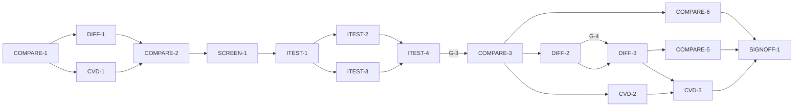

# Master Plan — Relative comparison (bs-03)

**Spec:** [bs-03-relative-comparison.feature](../bs-03-relative-comparison.feature)
**Status:** ⏸ Awaiting review — ITEST-4 packet assembled; **G-3 awaiting the human decision** before any behaviour is coded. ITEST-1/2/3 done (all 12 ACs have a pending, grade-A test). G-4 + G-5 resolved.
**Architecture:** [solution intent](../../docs/paint-color-app-solution-intent.md) (Comparison mode — flagship; Accessibility as an architectural concern — confusion warnings; NFR offline; D4 color-science, D10 CVD model) · [scope](../../docs/paint-color-app-scope.md) · [wireframe derivation](../wireframe-spec-derivation.md) · wireframe `Paint Color Assistant.dc.html` Comparison screen (S1.R1, E3–E8; sample picker E49), in `docs/Color blindness artist tool.zip`
**Code home:** `/Users/matthew.quirk/Nuance` · remote `https://github.com/meatsquirk/Nuance` · base `main` · **extends** the bs-01 Flutter foundation (same code home, confirmed by Matt 2026-10-05 for bs-01)

> The flagship feature. It builds the Comparison screen on bs-01's merged foundation (Flutter project,
> `Sample`/`ColorCoordinates`, `buildApp`/`AppScope`, `Speech`, the Readout screen, `AppRouter.toComparison`/
> `.toReadout`, color-science, coverage-gate tool, `integration_test`). It replaces bs-01's
> `ComparisonStubScreen` behind the existing `toComparison` route and adds three things of its own: the
> comparison difference math (CIEDE2000 ΔE00 + a decomposed LCh relational statement) in the color-science
> layer, a minimal `CvdProfile` + confusion-line detector in the accessibility layer, and a minimal injected
> `SampleSource` for the saved-sample picker. **bs-02 (capture) is not a prerequisite** (D-1).

## Gap analysis (against `main` @ c793839, bs-01 foundation)

bs-01 supplies the project, `Sample`/`ColorCoordinates`, `buildApp`/`AppScope`, the `Speech` seam + test
`FakeSpeech`, the Readout screen (renders a sample's name), `AppRouter.toComparison`/`.toReadout`,
color-science conversions (LCh via `labToCielch`), the coverage-gate tool and `integration_test`. Nothing
comparison-side exists beyond a render-only `ComparisonStubScreen`. ΔE00, the relational statement, any CVD/
confusion code, and a saved-sample source are all net-new.

| AC | Scenario | Exists today (bs-01 foundation) | Missing |
|---|---|---|---|
| AC-1 | Choose sample A from saved samples | `Sample`; stub renders a slot name | saved-sample `SampleSource`; picker (E3/E49); slot-A render with L/C/h |
| AC-2 | Choose sample B from saved samples | — | picker (E5/E49); slot-B render with L/C/h |
| AC-3 | Swap A and B, re-express the difference | — | swap (E4); recompute + re-express the statement from new A→B |
| AC-4 | Overall difference as ΔE00 + plain verdict | LCh conversion only | CIEDE2000 ΔE00 in color-science; plain-verdict bands; overall-difference region |
| AC-5 | Decompose into lightness, saturation, hue | single-sample `decompose` (bs-01) | **relational** LCh decomposition (ΔL*, ΔC*, Δh° + direction word); statement region |
| AC-6 | An unchanged dimension reads "Same hue" | — | unchanged-dimension wording in the decomposition |
| AC-7 | A confusable pair is flagged for the CVD type | — | `CvdProfile`; confusion-line detector; confusion-warning region |
| AC-8 | A clearly distinct pair is not flagged | — | the detector's negative path + off-line control |
| AC-9 | Speak the comparison incl. the confusion warning | `Speech` seam + `FakeSpeech` | build the spoken utterance (statement + warning); speak control (E6) |
| AC-10 | Open full readout for sample A | Readout screen; `AppRouter.toReadout` | open-readout control (E7) wired from the comparison |
| AC-11 | Open full readout for sample B | Readout screen; `AppRouter.toReadout` | open-readout control (E8) |
| AC-12 | With no second sample, invite one | stub renders empty slot | suppress the statement + show a choose-B invite when B is empty |

## Build order

| Stage | Phases |
|---|---|
| 1 Scaffold | COMPARE-1 |
| 2 Component shells | DIFF-1, CVD-1, COMPARE-2, SCREEN-1 |
| 3 Acceptance tests | ITEST-1, ITEST-2, ITEST-3, ITEST-4 (test review, G-3) |
| 4 Behavior | COMPARE-3, COMPARE-6, DIFF-2, CVD-2, DIFF-3, COMPARE-5, CVD-3 |
| 5 Sign-off | SIGNOFF-1 |

## Acceptance criteria coverage

| AC | Scenario | Integration test (ITEST) | Behavior phases | Status |
|---|---|---|---|---|
| AC-1 | The painter chooses sample A from the saved samples | ITEST-2 `TestAC01_ChooseA` | COMPARE-3 | ⬜ Todo |
| AC-2 | The painter chooses sample B from the saved samples | ITEST-2 `TestAC02_ChooseB` | COMPARE-3 | ⬜ Todo |
| AC-3 | Swapping exchanges the two samples and re-expresses the difference | ITEST-2 `TestAC03_Swap` | COMPARE-5 | ⬜ Todo |
| AC-4 | The overall difference is stated as a delta-E with a plain verdict | ITEST-3 `TestAC04_OverallDelta` | DIFF-2 | ⬜ Todo |
| AC-5 | The difference is decomposed into lightness, saturation and hue | ITEST-3 `TestAC05_Decompose` | DIFF-3 | ⬜ Todo |
| AC-6 | A dimension that does not change is stated as unchanged | ITEST-3 `TestAC06_SameHue` | DIFF-3 | ⬜ Todo |
| AC-7 | A confusable pair is flagged for the painter's CVD type | ITEST-3 `TestAC07_ConfusionFlagged` | CVD-2 | ⬜ Todo |
| AC-8 | A clearly distinct pair is not flagged as confusable | ITEST-3 `TestAC08_NotConfusable` | CVD-2 | ⬜ Todo |
| AC-9 | Speaking the comparison includes the confusion warning | ITEST-3 `TestAC09_SpeakIncludesWarning` | CVD-3 | ⬜ Todo |
| AC-10 | The painter opens the full readout for sample A | ITEST-2 `TestAC10_OpenReadoutA` | COMPARE-6 | ⬜ Todo |
| AC-11 | The painter opens the full readout for sample B | ITEST-2 `TestAC11_OpenReadoutB` | COMPARE-6 | ⬜ Todo |
| AC-12 | With no second sample chosen, the comparison invites one | ITEST-2 `TestAC12_InviteSecond` | COMPARE-3 | ⬜ Todo |

## Design decisions

| # | Decision | Why |
|---|---|---|
| D-1 | bs-03 **extends** bs-01's merged foundation and branches from `main` @ c793839. **bs-02 (capture) is not a prerequisite** — the comparison compares *saved* samples, needing only `Sample`/`ColorCoordinates`, the Readout screen, `Speech`, `AppRouter`, color-science and the test harness, all from bs-01. bs-03 replaces the render-only `ComparisonStubScreen` with the real screen behind the existing `AppRouter.toComparison` route; the file is net-new so bs-02 and bs-03 do not collide | avoids a false serial dependency on the capture build; keeps the flagship on the critical path. SI leads with comparison (Comparison mode is the design centre) |
| D-2 | The overall difference is **CIEDE2000 ΔE00**, added to the color-science layer (DIFF). Mirrors the verified private `_deltaE00` already in `integration_test/capture_test.dart` (CIEDE2000, verified against Sharma et al.); promoted to product code behind `ColorScience` | SI D4 (ΔE00 from a tested basis, no hand-rolled ad-hoc math). AC-4 shows a numeric ΔE00; the test needs a reference ΔE00 too |
| D-3 | The relational statement is computed in **LCh space**: ΔL\* → "Lighter/Darker by n", ΔC\*ab → "More/Less saturated by n", Δh° → "Hue shifted n degrees toward <family>", where the direction `<family>` is the `hueFamilyWord` of the hue being moved **toward**. A dimension whose rounded delta is 0 reads "Same lightness / saturation / hue". Distinct from bs-01's single-sample `decompose`, which is unchanged | the spec's deltas (12 / 9 / 18° toward yellow) are exactly ΔL\*/ΔC\*/Δh° of the stated LCh values (verified in plan mode); LCh is the space the painter's statement is phrased in |
| D-4 | A minimal `CvdProfile` { type ∈ protan/deutan/tritan, severity 0–1 } is **introduced here** and injected via `AppDependencies` (default deutan for the scenarios), behind a `ConfusionCheck` interface. The detector is a documented dichromat projection (Viénot 1999 / Brettel–Viénot–Mollon LMS). **bs-07** later populates the profile from self-assessment; **bs-08/bs-10** reuse the projection — all behind these seams (SI D10 open, model behind an interface) | bs-07 (which owns the profile) is unbuilt and later in the order; bs-03 needs the profile + detector now. Introducing them minimally behind interfaces makes bs-07 a *populate-the-profile* change, not a schema rebuild |
| D-5 | A pair is **confusable** when the ΔE00 between the two colours *after* the profile's dichromat projection is below a small threshold **while** their normal ΔE00 is clearly-different — i.e. "look identical to you but clearly different to others." Fixtures `SAMPLE_UMBER`/`SAMPLE_ULTRAMARINE` are constructed on the deutan confusion line; `SAMPLE_A_TERRACOTTA`/`SAMPLE_B_SIENNA` are the off-line control (AC-8) | makes the flag a real numeric collapse under simulation, not a hard-coded pair; AC-8 is the discriminating control for AC-7 |
| D-6 | Acceptance suite = Flutter `integration_test` driving the assembled app via `buildApp(deps)` with a new **comparison entry** (an injected `SampleSource` catalogue + `CvdProfile`). Faked (infrastructure only): bs-01's `Speech` sink (`FakeSpeech`). Difference math, decomposition, confusion detector, controller, screen and routing are all real. Observed via rendered text, a `ComparisonReadEndpoint` (numeric ΔE00, confusion bool, the decomposition), the `FakeSpeech` log and the current route | tests go through the real UI surface; only the platform TTS sink is faked. No colour/confusion math is faked |
| D-7 | The saved samples the picker lists come from a minimal injected **`SampleSource`** (in-memory catalogue). **bs-06** (palette & projects) later supplies the persistent store behind the same interface | keeps bs-03 independent of persistence; the picker needs only a list of named `Sample`s |
| D-8 | A `buildApp` **comparison entry** (analogous to bs-02's `captureSource`) opens the Comparison screen owning a `ComparisonController` over the injected `SampleSource`/`CvdProfile`, wrapped in a `ComparisonReadEndpoint`. "Open readout for A/B" reuses `AppRouter.toReadout`; the spoken comparison reuses the `Speech` seam | one production assembly entry (symmetric to bs-01 Readout / bs-02 Capture); the harness and `main.dart` build the app the same way |

## Acceptance integration test plan

Module plan: [modules/ITEST.md](modules/ITEST.md).

**Where it lives and how it runs:** `integration_test/comparison_test.dart` (Flutter `integration_test`),
harness `integration_test/comparison_harness.dart`. Default: `flutter test integration_test/comparison_test.dart`
(pending ACs skipped). Run-pending: `BS03_RUN_PENDING=1 flutter test integration_test/comparison_test.dart`.
Single lane (widget tests are not parallel-safe within a process).
**Where assertions look:** the rendered widget tree via `WidgetTester` (slot text + L/C/h, the overall-difference
and relational-statement text, the confusion-warning text, the choose-B invite, the speak control); the
`ComparisonController` **read endpoint** (`ComparisonReadEndpoint`: slot A/B samples, the computed `Comparison`
— `deltaE00`, verdict, the three decomposition lines, `confusable` bool); the `FakeSpeech` utterance log; the
current route + its rendered sample (the bs-01 Readout rendering a name).
**What is real and what is faked:** the whole app assembled through bs-01's production `buildApp(deps)` with the
comparison entry added (D-8); the `SampleSource` catalogue, `CvdProfile`, difference math, decomposition,
confusion detector, screen and routing are real. Faked (infrastructure only): bs-01's `FakeSpeech` sink. No
colour, ΔE00 or confusion math is faked.

**Fixtures:**

| Fixture | Shape |
|---|---|
| `CATALOGUE` | the injected `SampleSource` listing the named saved samples (Warm Terracotta, Raw Sienna Light, Mid Raw Umber, Terre Verte Shadow, and `SAMPLE_A_PRIME`). Drives the picker (AC-1, AC-2) and every selection Given |
| `SAMPLE_A_TERRACOTTA` | "Warm Terracotta", CIELAB from L 58 / C 34 / h 42° = (58, 25.27, 22.75). Drives AC-1, AC-3, AC-4, AC-5, AC-8, AC-10 |
| `SAMPLE_B_SIENNA` | "Raw Sienna Light", CIELAB from L 70 / C 25 / h 60° = (70, 12.50, 21.65). Drives AC-2, AC-3, AC-4, AC-5, AC-8, AC-11 |
| `SAMPLE_A_PRIME` | a partner for `SAMPLE_A_TERRACOTTA` sharing the **same hue angle 42°** but differing in L and/or C. **Control** for AC-6 ("Same hue" while other dimensions still differ, so a whole-statement suppression fails) |
| `SAMPLE_UMBER` / `SAMPLE_TERRE_VERTE` | "Mid Raw Umber" (40,18,16) / "Terre Verte Shadow" (40,−10,18) — a **verified** deutan confusion pair (ITEST-3): equal L, opposite-sign a\*, near-equal b\*, so normal ΔE00 ≈ 28 (clearly different) while the deutan-projected ΔE00 ≈ 1.4 (below threshold), checked against the independent `referenceDeutanProjected`. Drives AC-7, AC-9. (Renamed from the retired "Ultramarine Shadow" — blue↔yellow is confused by no dichromacy; ITEST-3 reconciliation, spec author.) |
| `CVD_DEUTAN` | the injected `CvdProfile` { deutan, moderate severity }. Drives AC-7, AC-8, AC-9 |

**Test catalogue:**

| AC | Given: built via public flows → checked by | When | Then: exact assertions (negative Thens: after <settle point>) | Rejects |
|---|---|---|---|---|
| AC-1 | Open Comparison on `CATALOGUE` → assert picker lists the saved samples; slot A empty (read endpoint) | choose "Warm Terracotta" as A (tap E3, pick in E49) | slot A shows "Warm Terracotta" **and** "L 58, C 34, h 42 degrees" (exact) | pick does not populate slot A; wrong sample; name shown without the L/C/h numbers (assert the numbers) |
| AC-2 | A = Warm Terracotta via AC-1 flow → assert slot A set (read endpoint) | choose "Raw Sienna Light" as B (tap E5, pick in E49) | slot B shows "Raw Sienna Light" **and** "L 70, C 25, h 60 degrees" | B pick lands in slot A; numbers wrong/absent |
| AC-3 | A=Terracotta, B=Sienna with the statement present (AC-5 flow) → assert slot A=Terracotta, slot B=Sienna and the statement reads A→B ("Lighter by 12") | swap A and B (tap E4) | slot A="Raw Sienna Light", slot B="Warm Terracotta"; the statement is re-expressed new-A→new-B ("Darker by 12") | swap relabels the slots but leaves the statement unchanged (assert a direction flips); swap no-ops |
| AC-4 | A=Terracotta, B=Sienna → assert both slots set | comparison shown | overall reads "delta-E00 13.1" (**G-4 resolved**: the stated coords compute to ΔE00 ≈ 13.05 → "13.1"; the spec's old 14.2 was the error) **and** verdict "clearly different" | a plain Euclidean/ΔE76 distance, not CIEDE2000 (control: a pair equal in ΔE76 but different in ΔE00); a constant verdict (augment: a near-identical pair must read a different verdict) |
| AC-5 | A=Terracotta, B=Sienna → assert both set | comparison shown | "Lighter by 12" (L 58→70), "Less saturated by 9" (C 34→25), "Hue shifted 18 degrees toward yellow" (h 42→60) | deltas taken from a\*/b\* Euclidean not LCh (control pair where they differ); wrong/absent direction word; inverted sign ("Darker"/"More saturated") |
| AC-6 | A, B = `SAMPLE_A_TERRACOTTA`, `SAMPLE_A_PRIME` (both h 42°) → assert both set | comparison shown | the hue dimension reads "Same hue" (while lightness/saturation still state their deltas) | reports a tiny non-zero hue shift; suppresses the entire statement instead of the one dimension |
| AC-7 | profile=`CVD_DEUTAN`; A=Mid Raw Umber, B=Terre Verte Shadow → assert profile deutan, both set, and the pair's normal ΔE00 is clearly-different (read endpoint) | comparison shown | a confusion warning is shown stating the two look identical to the painter but are clearly different to others | no warning for a genuinely confusable pair; a warning that fires for every pair (control: AC-8) |
| AC-8 | profile=`CVD_DEUTAN`; A=Terracotta, B=Sienna (off the confusion line) → assert profile deutan, both set | comparison shown | **no** confusion warning is shown (after the comparison settles) | flags a non-confusable pair (a detector hard-wired to always warn) |
| AC-9 | a confusion warning shown for A, B (AC-7 flow) → assert warning present; `FakeSpeech` log empty | ask to speak the whole comparison (tap E6) | `FakeSpeech` has exactly one utterance containing **both** the relational statement and the confusion-warning text | speaks the statement but omits the warning; speaks nothing; multiple utterances |
| AC-10 | A = Warm Terracotta selected → assert slot A set | open the readout for A (tap E7) | the Readout screen is shown for "Warm Terracotta" (bs-01 Readout rendering the name) | opens the readout for B / the wrong sample; no navigation |
| AC-11 | B = Raw Sienna Light selected → assert slot B set | open the readout for B (tap E8) | the Readout screen is shown for "Raw Sienna Light" | opens the readout for A / the wrong sample; no navigation |
| AC-12 | A = Warm Terracotta, **no** B chosen → assert slot A set, slot B empty (read endpoint) | the Comparison screen is shown | no relational statement is shown; the screen shows a findable, enabled choose-sample-B invite | shows a statement with only one sample (A vs empty/itself); no invite affordance |

**Red baseline** and **test augmentations:** tracked in [modules/ITEST.md](modules/ITEST.md).
Pre-seeded augmentations: `TestAC04` is *limited* at write time (one pair cannot show the verdict tracks
distance) — **DIFF-2** augments it with a near-identical control pair that reads a different verdict band.
`TestAC07`'s discriminating control is the separate `TestAC08` (off-line pair), not an augmentation.

## Modules

| Module | Plan | Purpose | Depends on | Status |
|---|---|---|---|---|
| DIFF | [modules/DIFF.md](modules/DIFF.md) | Color-science comparison: CIEDE2000 ΔE00, plain-verdict bands, the LCh relational decomposition (ΔL*/ΔC*/Δh° + direction, "Same …") | bs-01 color-science | 🔄 In progress |
| CVD | [modules/CVD.md](modules/CVD.md) | `CvdProfile` + `ConfusionCheck` dichromat-projection detector; confusion-warning text; the spoken utterance builder | bs-01 color-science, DIFF | 🔄 In progress (CVD-1 done) |
| COMPARE | [modules/COMPARE.md](modules/COMPARE.md) | Scaffold; `ComparisonController`/state; `SampleSource` + in-memory catalogue; `ComparisonReadEndpoint`; swap; open-readout; comparison entry in `buildApp` | bs-01 domain/router/Speech, DIFF, CVD | 🔄 In progress (COMPARE-2 done) |
| SCREEN | [modules/SCREEN.md](modules/SCREEN.md) | Comparison screen UI: slot A/B pickers (E3/E5/E49), swap (E4), overall-difference + relational-statement regions, confusion warning, speak (E6), open-readout (E7/E8), choose-B invite | COMPARE, DIFF, CVD | ✅ Done (SCREEN-1; regions filled by behaviour phases) |
| ITEST | [modules/ITEST.md](modules/ITEST.md) | Acceptance integration suite: one pending test per AC, and its review | all shell phases | 🔄 In progress (ITEST-1,2,3 done; ITEST-4 review next) |

## Dependency graph

**Parallel windows:** shells `{DIFF-1 ∥ CVD-1}` (disjoint dirs), then `COMPARE-2` → `SCREEN-1` (serial). AC
tests `{ITEST-2 ∥ ITEST-3}` (split file regions). SCREEN-1 splits the screen into **per-region widget files**
(slots / difference / statement / confusion / actions), so each behaviour phase edits its own region and the
windows below are file-disjoint. After G-3, **COMPARE-3** runs first alone (foundational selection + invite —
every other behaviour Given needs it; edits `slots_region`/`statement_region`), then
`{COMPARE-6 ∥ DIFF-2 ∥ CVD-2}` concurrently (`actions_bar` open-readout ∥ `difference_region` ∥
`confusion_region` — disjoint), then **DIFF-3** (`statement_region`), then `{COMPARE-5 ∥ CVD-3}`
(`slots_region` swap ∥ `actions_bar` speak — disjoint). **Merge-risky (serialize):** DIFF-2 → DIFF-3 both edit
`lib/compare/difference.dart`; CVD-2 → CVD-3 share the confusion/speech area; COMPARE-3/5/6 all edit
`comparison_controller.dart`. `statement_region` is touched by COMPARE-3 (invite) then DIFF-3 (lines) and
`actions_bar` by COMPARE-6 then CVD-3 — both pairs are already serial in the order above.

## Open gates

| Gate | Kind | Decision needed | Blocks | Status |
|---|---|---|---|---|
| G-1 | decision | Approve the spec (the `.feature` is marked "Draft: awaiting owner approval"; record approval as its first line) | COMPARE-1 | ✅ Resolved 2026-10-07 08:15 EDT: approved — Matt Quirk (owner). Spec first line records approval. COMPARE-1 unblocked |
| G-2 | dependency | bs-01 shared foundation merged to `main`: `Sample`/`ColorCoordinates`, `buildApp`/`AppScope`, `Speech` + `FakeSpeech`, the Readout screen rendering a name, `AppRouter.toComparison`/`.toReadout`, color-science (LCh), the coverage-gate tool and `integration_test`. Closed by bs-01 sign-off | COMPARE-1, all shells | ✅ Resolved 2026-10-06: bs-01 signed off and merged to `main` at c793839 (full foundation). bs-02 is **not** required (D-1) |
| G-3 | decision | Approve the acceptance tests (ITEST-4's packet) | every behavior phase | ⏳ Awaiting decision (packet assembled 2026-10-07, ITEST-4 — see `modules/ITEST.md` § *Phase 4*). 12 ACs, all pending, 24×A / 0×B. Record: `/feature-next-phase --gate bs-03-relative-comparison G-3 approved \| "<changes>"` |
| G-4 | decision | **Spec-data reconciliation (spec author).** AC-4's spec text said "delta-E00 14.2", but the stated LCh coords A (L 58, C 34, h 42°) / B (L 70, C 25, h 60°) compute to CIEDE2000 ΔE00 ≈ 13.05 (decomposition deltas 12 / 9 / 18° match). | ITEST-3 (AC-4 literal), DIFF-2 | ✅ Resolved 2026-10-07: option (a) — correct the overall to the computed value "delta-E00 13.1" — Matt Quirk (spec author). Spec line 48 amended; AC-4 pins "delta-E00 13.1". |
| G-5 | decision | **Confusion-pair reconciliation (spec author).** "Mid Raw Umber"+"Ultramarine Shadow" (brown+blue) is a blue↔yellow difference, which no dichromacy confuses (verified: it expands under deutan/protan/tritan). Decide the deutan confusion pair. | ITEST-3 (AC-7/AC-9 fixtures), CVD-2 | ✅ Resolved 2026-10-07: rename B to "Terre Verte Shadow" (green earth), keep deutan; ITEST-3 repinned SAMPLE_UMBER=(40,18,16)/SAMPLE_TERRE_VERTE=(40,−10,18), verified — Matt Quirk. Spec line 72 amended |

Resolved: `✅ Resolved <date time>: <decision, one line> — <who>`.

## Known flakes

| Test | Symptom | Rate (runs) | Measured at | Owner | Status |
|---|---|---|---|---|---|
| coverage_gate — a `const` constructor line in `lib/**` | Carried from bs-01: `flutter test --coverage` can intermittently record a const-folded constructor line as uncovered, so the gate may FAIL on a file the phase never touched | not quantified (bs-01) | — | any phase running the coverage gate | open — if the gate flags an untouched file, re-run `flutter test --coverage` once; green on re-run ⇒ ignore |

## Session log

| # | Phase | Target | Status | Tokens | Time | Notes |
|---|---|---|---|---|---|---|
| 1 | COMPARE-1 | scaffold: branch from main, baseline, confirm coverage gate, BS03 pending runner | ✅ Done | 2,185,042 | 9m 04s (42m 14s) | branch cut from c793839; analyze clean; unit 196 / integration 17 green; gate PASS clean / FAIL on planted gap; BS03 pending runner in place |
| 2 | DIFF-1 | shell: comparison color-science signatures (`Comparison`, ΔE00, verdict, decompose) | ✅ Done | 2,538,094 | 6m 48s | `Comparison` + pure `compare` + 5 stubs; unit 202 green; coverage 100% on touched file; integ 17 green |
| 3 | CVD-1 | shell: `CvdProfile` + `ConfusionCheck` signature + inject into deps | ✅ Done | 3,816,225 | 8m 30s | `CvdProfile`/`CvdType` + `ConfusionCheck`/`NoopConfusionCheck` + deps wiring; unit 215 green; coverage 100% on touched files; analyze + integ 17 green |
| 4 | COMPARE-2 | shell: `ComparisonController`/state + `SampleSource` + read endpoint + comparison entry/route | ✅ Done | 12,364,300 | 25m 01s | controller/state/source/read-endpoint + comparison entry + `toComparison`→real screen (replaced `compare_stub`); unit 241 green, 100% coverage on 9 touched files, integ 17 green (bs-01 AC-9/10 on the real screen); analyze clean; 1/3 fix passes |
| 5 | SCREEN-1 | shell: Comparison screen scaffold (E3–E8, E49 placeholders) bound to controller | ✅ Done | 6,544,654 | 12m 51s | `ComparisonScreen` + 5 region widgets (keyed, inert); unit 247 green / 100% cov on 6 new files; integ 17 green; analyze clean; 0/3 fix passes |
| 6 | ITEST-1 | acceptance-tests: harness, fixtures, pending gate (12 ACs), smoke | ✅ Done | 5,939,625 | 19m 08s | harness + 12-AC gate + smoke; acc 10/10, integ 27/27; grades 10×A; 0/3 fixes |
| 7 | ITEST-2 | acceptance-tests: AC-1,2,3,10,11,12 (pending) + red baseline | ✅ Done | 7,878,822 | 27m 54s | 6 pending AC tests + red baseline; acc 10 pass/6 pending, run-pending 6 fail clean; grades 6×A; 0/3 fixes |
| 8 | ITEST-3 | acceptance-tests: AC-4,5,6,7,8,9 (pending) + red baseline | ✅ Done | 15,032,038 | 29m 57s | 6 pending AC tests + red baseline; G-4 resolved (ΔE00 13.1) + confusion-pair renamed to Terre Verte (verified deutan pair); acc 14 pass/12 pending, run-pending 12 fail clean; grades 6×A; 0/3 fixes; ran in worktree |
| 9 | ITEST-4 | test-review: packet + G-3 | ⏸ Awaiting review | 3,360,351 | 10m 59s | packet assembled; regression green (unit 247, acc 14 pass/12 pending); 24×A grid; G-3 awaiting the human |
| 10 | COMPARE-3 | behavior: AC-1, AC-2, AC-12 — sample source + selection + pickers + slot render + invite | ⬜ Todo | | | first behaviour; unblocks all Givens |
| 11 | COMPARE-6 | behavior: AC-10, AC-11 — open readout for A / B | ⬜ Todo | | | ∥ DIFF-2, CVD-2 |
| 12 | DIFF-2 | behavior: AC-4 — ΔE00 + plain verdict + overall-difference region | ⬜ Todo | | | needs G-4; ∥ COMPARE-6, CVD-2 |
| 13 | CVD-2 | behavior: AC-7, AC-8 — confusion detector + warning region | ⬜ Todo | | | ∥ COMPARE-6, DIFF-2 |
| 14 | DIFF-3 | behavior: AC-5, AC-6 — relational decomposition + "Same …" + statement region | ⬜ Todo | | | after DIFF-2 |
| 15 | COMPARE-5 | behavior: AC-3 — swap A/B + re-express | ⬜ Todo | | | after DIFF-3 |
| 16 | CVD-3 | behavior: AC-9 — speak whole comparison incl. warning | ⬜ Todo | | | after DIFF-3, CVD-2 |
| 17 | SIGNOFF-1 | sign-off: packet + summary page + manual approval | ⬜ Todo | | | |

*Tokens* / *Time* = the phase totals from the *Token usage* ledger (Time = active, wall in brackets), filled
when the row is marked done.

## Next phase

**ITEST-4 packet assembled — the feature is paused on G-3 (human decision).** The full bs-03 acceptance
suite (12 ACs, all pending, 24×A / 0×B) is in `modules/ITEST.md` § *Phase 4* with a reviewer's "look here
first". Regression re-run green: analyze clean, unit 247, coverage gate PASS (review-only), acceptance 14
pass / 12 pending.
- **Blocked on G-3:** no behaviour phase is startable until the human records the gate —
  `/feature-next-phase --gate bs-03-relative-comparison G-3 approved | "<changes>"`.
- **On approve:** **COMPARE-3** (AC-1, AC-2, AC-12) is the first startable behaviour phase (unblocks all
  selection Givens); then {COMPARE-6 ∥ DIFF-2 ∥ CVD-2}, then DIFF-3, then {COMPARE-5 ∥ CVD-3}.
- **On changes requested:** each item becomes an `ITEST` change phase before the behaviour stage, then a
  fresh review.
- **CVD-2 note:** must make its real detector the app's **shipped default** `AppDependencies.confusionCheck` (the harness no longer forces `NoopConfusionCheck`).
- **⚠ Reconcile:** ITEST-3 ran in a worktree (primary checkout was on a live bs-02 session); this rollup is pending — apply from the primary once free.

Run next (fresh session, after `/clear`): `/feature-next-phase bs-03-relative-comparison` picks up ITEST-4.

## Token usage

<!-- One row per session, appended as that session's last edit (SKILL.md § Token usage). -->

| Phase / activity | Session | Start | End | Wall | Active | Model(s) | Input | Cache write | Cache read | Output | Total | Outcome |
|---|---|---|---|---|---|---|---|---|---|---|---|---|
| PLAN | _pending_ | | | | | claude-opus-4-8 | | | | | | plan written: 17 phases, 5 modules, 12 ACs; G-1/G-3 open, G-4 raised (ΔE00 14.2 vs 13.05) |
| PLAN | e128d86e | 2026-10-07 07:43 EDT | 07:56 | 13m 02s | 13m 02s | claude-opus-4-8 | 58 | 148,483 | 3,657,272 | 62,473 | 3,868,286 | plan written: 17 phases, 5 modules, 12 ACs; G-1/G-3 open; G-4 raised (overall ΔE00 14.2 vs computed 13.05) |
| GATE-DECISION | e128d86e | 2026-10-07 08:15 EDT | 08:15 | 0m 53s | 0m 53s | claude-opus-4-8 | 12 | 2,866 | 1,105,647 | 3,198 | 1,111,723 | G-1 approved (owner Matt Quirk); spec first line stamped; COMPARE-1 unblocked. G-4 still open |
| COMPARE-1 | ea5add91 | 2026-10-07 08:16 EDT | 08:59 | 42m 14s | 9m 04s | claude-opus-4-8 | 56 | 70,489 | 2,089,423 | 25,074 | 2,185,042 | scaffold complete — branch cut from c793839; analyze clean; unit 196 / integration 17 green; coverage gate PASS clean / FAIL on planted gap; BS03 pending runner in place |
| DIFF-1 | b1e7c329 | 2026-10-07 09:13 EDT | 09:19 | 6m 48s | 6m 48s | claude-opus-4-8 | 68 | 66,234 | 2,453,513 | 18,279 | 2,538,094 | shell: Comparison type + pure compare placeholder + 5 stubs; unit 202 green, 100% coverage on touched file, integration 17 green; fix passes 0/3 |
| CVD-1 | 14a0d9b4 | 2026-10-07 09:22 EDT | 09:31 | 8m 30s | 8m 30s | claude-opus-4-8 | 92 | 77,648 | 3,715,605 | 22,880 | 3,816,225 | shell done: CvdProfile/ConfusionCheck + deps wiring; unit 215 green; coverage 100% touched; analyze + integ 17 green; 0/3 fix passes |
| COMPARE-2 | 73fe7631 | 2026-10-07 10:20 EDT | 10:45 | 25m 01s | 25m 01s | claude-opus-4-8 | 158 | 196,228 | 12,070,968 | 96,946 | 12,364,300 | shell: ComparisonController/state + SampleSource + ComparisonReadEndpoint + comparison entry/route; replaced compare_stub; unit 241 green, 100% coverage on 9 touched files, integ 17 green (incl. bs-01 AC-9/10 on the real screen), analyze clean; 1/3 fix passes |
| RECONCILE | 646b2ffe | 2026-10-07 11:18 EDT | 11:22 | 3m 57s | 3m 57s | claude-opus-4-8 | 26 | 13,125 | 1,974,880 | 8,891 | 1,996,922 | fast-forwarded COMPARE-2 shell into feat/bs-03-relative-comparison (3279f0f), verified green (241 unit/100% cov/17 integ/analyze clean); applied COMPARE-2 rollup to master plan |
| SCREEN-1 | 5ba35b2c | 2026-10-07 11:35 EDT | 11:48 | 12m 51s | 12m 51s | claude-opus-4-8 | 126 | 118,748 | 6,385,337 | 40,443 | 6,544,654 | shell: ComparisonScreen + 5 keyed region widgets (inert E3-E8/E49); unit 247 green, 100% coverage on 6 new files; analyze + integration 17 green; 0/3 fix passes |
| ITEST-1 | 71c0654e | 2026-10-07 12:24 EDT | 12:43 | 19m 08s | 19m 08s | claude-opus-4-8 | 104 | 207,156 | 5,669,931 | 62,434 | 5,939,625 | harness + 12-AC pending gate + smoke; acc 10/10, integ 27/27; grades 10×A; 0/3 fix passes |
| ITEST-2 | b79f3e10 | 2026-10-07 13:25 EDT | 13:53 | 27m 54s | 27m 54s | claude-opus-4-8 | 122 | 280,162 | 7,515,695 | 82,843 | 7,878,822 | 6 pending AC tests (AC-1,2,3,10,11,12) + red baseline; acc 10 pass/6 pending, run-pending 6 fail clean; grades 6xA; 0/3 fixes |
| RECONCILE | 8d454f0e | 2026-10-07 13:56 EDT | 13:59 | 3m 29s | 3m 29s | claude-opus-4-8 | 28 | 58,077 | 897,585 | 14,053 | 969,743 | fast-forwarded ITEST-2 (02c7a3c) into feat/bs-03-relative-comparison; applied ITEST-2 rollup to master plan (session log 7 Done / 8 Next, status, Next-phase, ITEST module note) + added ITEST-2 ledger row; removed worktree + phase branch. Clean ff, tree identical to verified 02c7a3c (tests-only, no lib/** change) |
| ITEST-3 | 0970b39f | 2026-10-07 14:05 EDT | 22:14 | 8h 08m | 29m 57s | claude-opus-4-8 | 186 | 608,647 | 14,303,307 | 119,898 | 15,032,038 | 6 pending AC tests (AC-4..9) + red baseline; G-4 resolved (13.1), confusion pair renamed+verified; acc 14 pass/12 pending, run-pending 12 fail clean; grades 6×A+guards; 0/3 fixes |
| RECONCILE | 349b8b33 | 2026-10-07 22:36 EDT | 23:02 | 25m 20s | 6m 44s | claude-opus-4-8 | 54 | 77,930 | 2,141,418 | 29,792 | 2,249,194 | fast-forwarded ITEST-3 (4e0dacd) into feat/bs-03-relative-comparison in a worktree (primary was on bs-02); applied ITEST-3 rollup to master plan (status, G-4 resolved + G-5 added, fixtures/AC-4/AC-7 repinned to Terre Verte, session log, Next-phase) + added ITEST-3 ledger row; clean ff, tests-only, no lib/** change |
| ITEST-4 | 3e95fce2 | 2026-10-07 23:18 EDT | 23:29 | 10m 59s | 10m 59s | claude-opus-4-8 | 72 | 98,056 | 3,234,848 | 27,375 | 3,360,351 | test-review packet assembled; regression green (unit 247, acc 14 pass/12 pending); 24xA grid; awaiting G-3 |
| **Feature total** |  | **2026-10-07 07:43 EDT** | **2026-10-07 23:29** | **11h 28m** | **2h 58m** |  | **1,162** | **2,023,849** | **67,215,429** | **614,579** | **69,855,019** |  |

## Sign-off

| Round | Packet | At code | Grades | Decision |
|---|---|---|---|---|
| 1 | [signoff/round-1.md](signoff/round-1.md) | — | — | ⏸ Awaiting |
