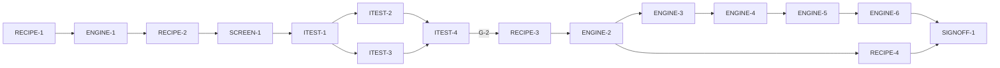

# Master Plan — Mixing recipes (bs-04)

**Spec:** [bs-04-mixing-recipes.feature](../bs-04-mixing-recipes.feature)
**Status:** In progress — SCREEN-1 (shell) done; next ITEST-1 (acceptance-tests)
**Architecture:** [solution intent](../../docs/paint-color-app-solution-intent.md) (*Mixing recipes* capability; *Mixing engine: options and the short-term choice* — **Spectral.js / subtractive KM for v1**, D3; NFR offline + recipe search ≤ ~1–2 s; honest out-of-gamut) · [custom mixing engine design](../../docs/custom-mixing-engine-design.md) (the deferred measured-pigment upgrade path behind the same `MixingEngine` interface) · [mixbox spec](../../docs/mixbox-spec.md) (reference-only, CC BY-NC) · [scope](../../docs/paint-color-app-scope.md) · [wireframe derivation](../wireframe-spec-derivation.md) · wireframe `Paint Color Assistant.dc.html` Recipes screen (S1.R1, E22–E25), in `docs/Color blindness artist tool.zip`
**Code home:** `/Users/matthew.quirk/Nuance` · remote `https://github.com/meatsquirk/Nuance` · base `main` @ `8518463` · **extends** the bs-01/02/03 foundation (same code home, confirmed by Matt across bs-01/02/03)

> Recipes is the third increment. It builds the Recipes screen on the merged foundation (Flutter project,
> `Sample`/`ColorCoordinates`, `buildApp`/`AppScope`/`AppDependencies`, `Speech`+`FakeSpeech`, `ColorScience`
> LCh conversions, the shipped CIEDE2000 `deltaE00` from bs-03's `lib/compare/difference.dart`,
> `SampleSource` + `InMemorySampleSource`, `AppRouter.toRecipes` + the Readout→recipes handoff, the coverage
> gate, `integration_test`). It adds three things of its own: a **`MixingEngine`** (forward predict + inverse
> solver) behind a swappable interface (SI D3), the **`Paint`/`PaintPalette`** domain and a minimal injected
> **`PaletteSource`** (bs-06 backs it later), and the **Recipes screen** (target selection, the recipe list,
> wet/dry, spoken output) behind the existing `toRecipes` route. **bs-02 (capture) and bs-06 (palette) are not
> prerequisites** (D-1, D-5): the target is a *saved* sample or a manual colour, and the palette is a minimal
> injected catalogue.

## Gap analysis (against `main` @ `8518463`)

The foundation supplies the project, `Sample`/`ColorCoordinates`/`Provenance`, `buildApp`/`AppScope`/
`AppDependencies` (with per-feature home entries), `Speech`+`FakeSpeech`, the shipped `deltaE00(a,b)`
(CIEDE2000, `lib/compare/difference.dart:138`) and its `_verdictBand` pattern, `ColorScience` LCh/Munsell/sRGB
conversions + the warm/cool `words.dart` model, `SampleSource`+`InMemorySampleSource`, `AppRouter.toRecipes`
(wired to the Readout "Find mixing recipes" handoff, bs-01 AC-11) rendering a render-only `RecipesStubScreen`,
the coverage gate and `integration_test`. **No mixing engine, no `Paint`/`Palette`/`Recipe` type, no gamut /
muddying / wet-dry / trace logic, and no real Recipes screen exist** — all net-new.

| AC | Scenario | Exists today | Missing |
|---|---|---|---|
| AC-1 | Chooses a saved sample as the target | `Sample`; `SampleSource`+`InMemorySampleSource` | the Recipes screen + target selector (E22) listing saved samples; set-target on the controller |
| AC-2 | Manual target entry; impossible value refused | `ColorCoordinates` (CIELAB) | manual-entry affordance + range validation (reject L 140); keep the previous target |
| AC-3 | Recipes use only paints from the selected palette | — | `Paint`/`PaintPalette`/`PaletteSource`; the solver constrained to the selected palette |
| AC-4 | Top 3–5 recipes with parts + predicted colour | `deltaE00` | `MixingEngine` forward model + inverse solver returning 3–5 `Recipe`s (parts-by-volume + predicted colour); the recipe list |
| AC-5 | Close recipe states a small ΔE + plain verdict | `deltaE00`, `_verdictBand` pattern | per-recipe ΔE00 + a plain verdict incl. a "very close" band |
| AC-6 | Cleaner 2-paint ranks above muddier 4-paint at similar ΔE | — | prefer-fewer-paints ranking / chroma tie-break in the solver |
| AC-7 | Component under ~2% → "a touch of" + technique note | — | trace detection on the `Recipe` + "a touch of" rendering with a technique note |
| AC-8 | Complementary-crossing mix flagged muddying | warm/cool model (`words.dart`) | complementary-hue-crossing detector → a muddying flag on the `Recipe` + its rendering |
| AC-9 | Out-of-gamut target identified without a false recipe | — | gamut threshold on the best ΔE00 → "OUT OF GAMUT" marker; nearest offered *as nearest* |
| AC-10 | View the predicted dry colour | — | per-medium wet→dry transform behind the E24 toggle; re-predict on toggle |
| AC-11 | Hear the target spoken (name + L, C, h) | `Speech`+`FakeSpeech` | build the target utterance; speak-target control (E23) |
| AC-12 | Hear a recipe spoken (each paint + parts) | `Speech`+`FakeSpeech` | build the recipe utterance; speak-recipe control (E25) |

## Build order

| Stage | Phases |
|---|---|
| 1 Scaffold | RECIPE-1 |
| 2 Component shells | ENGINE-1, RECIPE-2, SCREEN-1 |
| 3 Acceptance tests | ITEST-1, ITEST-2, ITEST-3, ITEST-4 (test review, G-2) |
| 4 Behavior | RECIPE-3, ENGINE-2, ENGINE-3, ENGINE-4, ENGINE-5, ENGINE-6, RECIPE-4 |
| 5 Sign-off | SIGNOFF-1 |

## Acceptance criteria coverage

| AC | Scenario | Integration test (ITEST) | Behavior phases | Status |
|---|---|---|---|---|
| AC-1 | The painter chooses a saved sample as the target | ITEST-2 `TestAC01_ChooseSavedTarget` | RECIPE-3 | ⬜ Todo |
| AC-2 | The painter enters a target colour manually and an impossible value is refused | ITEST-2 `TestAC02_ManualTargetRefused` | RECIPE-3 | ⬜ Todo |
| AC-3 | Recipes use only paints from the currently selected palette | ITEST-2 `TestAC03_PaletteConstrained` | ENGINE-2 | ⬜ Todo |
| AC-4 | The top three to five recipes are returned with parts and predicted colour | ITEST-3 `TestAC04_TopRecipes` | ENGINE-2 | ⬜ Todo |
| AC-5 | A close recipe states a small delta-E with a plain verdict | ITEST-3 `TestAC05_CloseVerdict` | ENGINE-3 | ⬜ Todo |
| AC-6 | A cleaner two-paint mix ranks above a muddier four-paint mix at a similar delta-E | ITEST-3 `TestAC06_PreferFewer` | ENGINE-3 | ⬜ Todo |
| AC-7 | A component under about two percent is expressed as a touch of | ITEST-3 `TestAC07_TraceTouchOf` | ENGINE-4 | ⬜ Todo |
| AC-8 | A complementary-crossing mix is flagged as muddying | ITEST-3 `TestAC08_MuddyingFlag` | ENGINE-4 | ⬜ Todo |
| AC-9 | An out-of-gamut target offers the nearest possible without claiming a match | ITEST-3 `TestAC09_OutOfGamut` | ENGINE-5 | ⬜ Todo |
| AC-10 | The painter views the predicted dry colour | ITEST-3 `TestAC10_WetDry` | ENGINE-6 | ⬜ Todo |
| AC-11 | The painter hears the target spoken | ITEST-2 `TestAC11_SpeakTarget` | RECIPE-4 | ⬜ Todo |
| AC-12 | The painter hears a recipe spoken | ITEST-2 `TestAC12_SpeakRecipe` | RECIPE-4 | ⬜ Todo |

## Design decisions

| # | Decision | Why |
|---|---|---|
| D-1 | bs-04 **extends** the merged bs-01/02/03 foundation and branches from `main` @ `8518463`. **bs-02 (capture) is not a prerequisite** — the recipe target is a *saved* `Sample` (via `SampleSource`) or a manually entered colour, not a fresh capture. It reuses `Sample`/`ColorCoordinates`, `SampleSource`, `buildApp`/`AppScope`/`AppDependencies`, `Speech`+`FakeSpeech`, `deltaE00`, `ColorScience`, `AppRouter.toRecipes` and the harness | avoids a false serial dependency on capture; keeps recipes on its own critical path |
| D-2 | The v1 **mixing engine** is a documented **subtractive-mixing `MixingEngine`** (SI D3: Spectral.js / Kubelka–Munk class, MIT, commercial-safe), behind a swappable `MixingEngine` interface. Forward: parts-by-volume → predicted CIELAB. Inverse: enumerate palette subsets by size, optimise volumes to minimise `deltaE00`. The measured-pigment engine (`docs/custom-mixing-engine-design.md`) is the SI-D3 upgrade *behind the same interface* — **deferred** | SI D3 is Confirmed (Spectral.js for v1; interface keeps the engine swappable). bs-04 needs a working forward+inverse now; shipping it behind the interface makes the later measured engine a drop-in, not a rebuild |
| D-3 | Each **`Paint`** carries a masstone CIELAB + `PaintMedium` in the seed palette; measured K/S data (licensing per `custom-mixing-engine-design.md` §13) is deferred. Seed "My paints": Titanium White, Yellow Ochre, Ivory Black (named in AC-3) + Ultramarine Blue + a warm red, so the AC-8 (complementary-crossing) and AC-9 (out-of-gamut) cases are constructible | the ACs name only three paints but need a palette that can also *fail* to reach a target and *cross* complements; the masstone-CIELAB paint is the minimum the v1 subtractive forward model needs |
| D-4 | The recipe **target** is a `Sample`: chosen from the existing `SampleSource` saved samples (AC-1) or a manually entered CIELAB with range validation (AC-2, reject L 140, keep the previous target). Reuses bs-03's `SampleSource` seam | no new target store; the saved-sample picker is the same seam the comparison picker uses |
| D-5 | The "owned paints" **palette** is a minimal injected `PaletteSource`/`InMemoryPaletteSource` (parallel to bs-03's `SampleSource`/`InMemorySampleSource`), seeded with the named palette. **bs-06** (palette & projects) later supplies the persistent store behind the same interface. **bs-06 is not a prerequisite** | keeps bs-04 independent of persistence; the solver needs only a list of owned `Paint`s and a selected palette |
| D-6 | A `buildApp` **recipes entry** (`recipesEntry` → `RecipesHomeScreen` owning a `RecipeController` over `sampleSource`/`paletteSource`/`mixingEngine`/`speech`/`router`, wrapped in a `RecipeReadEndpoint`), symmetric to bs-02's capture entry and bs-03's comparison entry. The real `RecipesHomeScreen` replaces `RecipesStubScreen` behind the existing `AppRouter.toRecipes` route — callers unchanged, and it **still renders the target name** so bs-01's AC-11 handoff test stays green | one production assembly entry per feature; the handoff route and `main.dart` build the app the same way |
| D-7 | Per-recipe **verdict** reuses the ΔE00→plain-language band pattern from `lib/compare/difference.dart` (`_verdictBand`), adding a "very close" band for small ΔE (AC-5) | one tested ΔE basis + band pattern across the app; no second ad-hoc verdict scale |
| D-8 | **Prefer fewer paints**: the inverse solver enumerates subsets by ascending size and tie-breaks toward fewer paints / lower added chroma (SI `chromaPenalty`), so a cleaner 2-paint mix ranks above a muddier 4-paint at similar ΔE (AC-6) | SI "prefers fewer paints"; enumerating by size gives it for free and the chroma tie-break breaks near-ties toward the cleaner mix |
| D-9 | **Muddying** = a recipe whose paints span a complementary hue pair (hue-angle opposition beyond a threshold), from each paint's masstone hue using the warm/cool model in `lib/color_science/words.dart` (AC-8) | SI "flags muddying"; complement-crossing is the physical cause of real muddy mixes and is computable from masstone hue |
| D-10 | **Out-of-gamut** = the best achievable recipe's ΔE00 exceeds the gamut threshold (SI NFR in-gamut ΔE00 ≤ 5) → mark "OUT OF GAMUT" and present the nearest mix labelled *as nearest*, never a match (AC-9). Threshold value confirmed by **G-4** | SI fixed intent: never a false recipe; out-of-gamut is stated, not hidden |
| D-11 | **Wet/dry**: a per-medium drying transform applied behind the E24 toggle; AC-10's recipe is **oil** (small first-shot shift). Exact dry values are illustrative → **G-4** | SI Open decision #6 (wet vs dry default) + the per-medium drying model in the engine design |
| D-12 | **Trace "a touch of"**: a component under ~2% by volume renders as "a touch of" + a **static** technique note (LLM-sourced technique notes are a later build-time-pipeline data concern), not a measured part (AC-7) | SI build-time pipeline / offline-at-runtime: no live LLM; a static note satisfies the AC |
| D-13 | **Acceptance** drives the real assembled app via `buildApp` with the recipes entry; real engine/solver/`deltaE00`/controller/screen/routing. Faked (infrastructure only): bs-01's `FakeSpeech`. A scenario's ΔE00 is graded against an **independent** in-harness CIEDE2000 reference, never the product metric. The spec's pinned predicted L/C/h are **illustrative fixtures**; the ACs assert behavioural properties (**G-4**) | matches bs-03 D-6/D-13: real math, infra-only fakes, references independent so an AC never grades the impl against itself |

## Acceptance integration test plan

Module plan: [modules/ITEST.md](modules/ITEST.md).

**Where it lives and how it runs:** `integration_test/recipes_test.dart` (Flutter `integration_test`), harness
`integration_test/recipes_harness.dart`, pending gate `integration_test/bs04/pending.dart`. Default:
`flutter test integration_test/recipes_test.dart -d <udid>` (pending ACs skipped — a device/sim udid is
**required**, or the run is a false green). Run-pending:
`flutter test integration_test/recipes_test.dart -d <udid> --dart-define=BS04_RUN_PENDING=true`. Single
exclusive lane (widget tests aren't parallel-safe in a process) — `coord.sh with-lock` in parallel sessions.
**Where assertions look:** the rendered widget tree via `WidgetTester` (target region E22/E23, the recipe list
with per-recipe parts / predicted colour / ΔE00 / verdict / "a touch of" / muddying, the wet/dry toggle E24,
the "OUT OF GAMUT" marker, the speak controls); the `RecipeController` **read endpoint**
(`RecipeReadEndpoint`: the target, the selected palette, the ordered `List<Recipe>`, the wet/dry mode, the
manual-entry validation error); the `FakeSpeech` utterance log (AC-11, AC-12).
**What is real and what is faked:** the whole app assembled through `buildApp(deps)` with the recipes entry
(D-6); the `PaletteSource`, `SampleSource`, `MixingEngine` (forward + inverse + gamut + muddying + trace +
wet/dry), the controller, the screen and routing are real. Faked (infrastructure only): bs-01's `FakeSpeech`.
No colour, mixing or ΔE00 math is faked; ΔE00 is graded against the harness's independent `referenceDeltaE00`.

**Fixtures:**

| Fixture | Shape |
|---|---|
| `CATALOGUE` | the injected `SampleSource` saved samples the target picker lists — `SAMPLE_DEEP_OLIVE` + a couple of others. Drives AC-1 |
| `SAMPLE_DEEP_OLIVE` | saved "Deep Olive Green", CIELAB from L 42 / C 28 / h 108° = (42, −8.65, 26.63). The primary target. Drives AC-1, AC-4, AC-5, AC-6, AC-11 |
| `PALETTE_MY_PAINTS` | the injected `PaletteSource` "My paints" = Titanium White, Yellow Ochre, Ivory Black (named in AC-3), Ultramarine Blue, Venetian Red — each a `Paint` with masstone CIELAB + medium. Drives AC-3, AC-4, AC-5, AC-6, AC-7, AC-8 |
| `SAMPLE_VIVID_TURQUOISE` | saved "Vivid Turquoise", a high-chroma cyan unreachable from the earthy `PALETTE_MY_PAINTS`. **Out-of-gamut control.** Drives AC-9 |
| `PALETTE_OIL` / `SAMPLE_OIL_TARGET` | an oil-medium palette + a target whose best recipe is an oil mix, so the wet→dry transform (D-11) applies. Drives AC-10 |
| `referenceDeltaE00` | an **independent** in-harness CIEDE2000 (Sharma–Wu–Dalal), so AC-5's ΔE is checked against it, not the product `deltaE00` |

**Test catalogue:**

| AC | Given: built via public flows → checked by | When | Then: exact assertions (negative Thens: after <settle point>) | Rejects |
|---|---|---|---|---|
| AC-1 | Open Recipes on `CATALOGUE`/`PALETTE_MY_PAINTS` → assert target null (read endpoint), target picker (E22) lists `CATALOGUE` | choose "Deep Olive Green" as the target | `state.target` = Deep Olive Green **and** E22 renders "Deep Olive Green" + "L 42, C 28, h 108 degrees" | pick doesn't set the target; wrong sample; name shown without the L/C/h numbers |
| AC-2 | A target already set (AC-1 flow) → assert `state.target` present; open manual entry | enter a lightness of 140 | the entry is refused as out of range (a validation error on the endpoint / rendered) **and** `state.target` is **unchanged** (after settle) | accepts L 140; clears / overwrites the previous target; no error surfaced |
| AC-3 | target = Deep Olive Green, selected palette = "My paints" (3+ paints) → assert `state.selectedPalette` set | recipes are solved | **every** returned recipe's components reference only paints in `PALETTE_MY_PAINTS` | a recipe uses a paint outside the palette; empty palette still returns recipes |
| AC-4 | target set, palette can mix it → assert both set | recipes are solved | `3 ≤ state.recipes.length ≤ 5`; each recipe has ≥1 component with parts-by-volume **and** a non-null predicted colour, rendered in the list | returns 0 or >5; a recipe with no parts or no predicted colour; the list renders nothing |
| AC-5 | a near-target recipe is in the results (target set; `PALETTE_MY_PAINTS`) → assert a recipe with small ΔE exists | the recipe is shown | the recipe states its `deltaE00` (`closeTo(referenceDeltaE00(predicted,target), 0.1)`) **and** carries the plain verdict "very close" | verdict constant / not tracking distance (control: ENGINE-3 augments with a farther recipe reading a worse band); ΔE absent |
| AC-6 | a 2-paint mix and a 4-paint mix reach the target at a similar ΔE (constructed) → assert both present with `|Δ(ΔE00)|` small | the recipes are ordered | the 2-paint mix is ranked above the 4-paint mix in `state.recipes` | ordered by ΔE only (ties ignore paint count); ordered by *more* paints |
| AC-7 | a recipe with a Titanium White component under ~2% by volume (constructed) → assert that component's fraction < 0.02 | the recipe is shown | that component renders "a touch of" + a technique note, **not** a measured part | a numeric part shown for the trace; no technique note; trace silently dropped |
| AC-8 | a candidate recipe crossing a complementary hue pair (e.g. Venetian Red + a green mix) → assert the pair's masstone hues oppose | the recipe is shown | the recipe is flagged "liable to muddy" (`muddying` true + rendered). **Control:** a non-crossing recipe is **not** flagged | always-flag (control fails) / never-flag; flag not rendered |
| AC-9 | target = "Vivid Turquoise", `PALETTE_MY_PAINTS` (earthy) → assert target set | recipes are solved | the target is marked "OUT OF GAMUT" **and** the nearest mix is presented labelled *as nearest*, not as a match (no "very close"/match verdict on it) | fabricates a matching recipe; no marker; the nearest is labelled a match |
| AC-10 | an oil recipe with a predicted wet colour (`PALETTE_OIL`/`SAMPLE_OIL_TARGET`) → assert a recipe + its wet prediction; wet/dry mode = wet | switch to the dry prediction (E24; oil after 7 days) | the recipe's predicted colour **changes** (dry ≠ wet, in the drying direction; the endpoint's dry prediction differs from wet) | the toggle no-ops (dry == wet); the prediction doesn't update |
| AC-11 | target = Deep Olive Green (AC-1 flow); `FakeSpeech` empty → assert target set, no utterance | ask to speak the target (E23) | `FakeSpeech` has exactly one utterance stating the name **and** its L, C and hue | speaks nothing; omits the L/C/h; multiple utterances |
| AC-12 | a recipe shown (Yellow Ochre + Ivory Black for the target); `FakeSpeech` empty → assert a recipe present | ask to speak the recipe (E25) | `FakeSpeech` has exactly one utterance stating each paint **and** its parts | speaks nothing; omits the parts; names paints without parts |

**Red baseline** and **test augmentations:** tracked in [modules/ITEST.md](modules/ITEST.md).
Pre-seeded augmentations: `TestAC05` is *limited* at write time (one near recipe cannot show the verdict
tracks distance) — **ENGINE-3** augments it with a farther recipe reading a worse band. `TestAC08`'s
discriminating control is an in-test non-crossing recipe (not an augmentation); `TestAC09`'s is the in-gamut
`PALETTE_MY_PAINTS`/`SAMPLE_DEEP_OLIVE` path already exercised by AC-4.

## Modules

| Module | Plan | Purpose | Depends on | Status |
|---|---|---|---|---|
| ENGINE | [modules/ENGINE.md](modules/ENGINE.md) | The mixing engine: `Paint`/`PaintMedium`, `MixingEngine` interface + `Recipe`/`RecipeComponent`, the v1 subtractive forward model and inverse solver (top 3–5, prefer fewer), per-recipe ΔE00+verdict, trace "a touch of", muddying flag, out-of-gamut, wet/dry transform | bs-03 color-science (`deltaE00`, `ColorScience`) | 🔄 In progress |
| RECIPE | [modules/RECIPE.md](modules/RECIPE.md) | Scaffold; `PaintPalette`/`PaletteSource`; `RecipeController`/state (target, selected palette, recipes, wet/dry mode); target selection (saved sample + manual entry/validation); `RecipeReadEndpoint`; recipes entry in `buildApp`; spoken target & recipe | bs-03 domain/router/Speech/SampleSource, ENGINE | 🔄 In progress |
| SCREEN | [modules/SCREEN.md](modules/SCREEN.md) | Recipes screen UI: target selector (E22) + speak-target (E23), wet/dry toggle (E24), the recipe list body (parts, predicted colour, ΔE00, verdict, "a touch of", muddying) + speak-recipe (E25), the "OUT OF GAMUT" banner | RECIPE, ENGINE | ✅ Done |
| ITEST | [modules/ITEST.md](modules/ITEST.md) | Acceptance integration suite: one pending test per AC, and its review | all shell phases | ⬜ Todo |

## Dependency graph

**Parallel windows:** shells are serial (`ENGINE-1` defines the types `RECIPE-2`'s controller needs;
`SCREEN-1` needs that controller). AC tests `{ITEST-2 ∥ ITEST-3}` (disjoint catalogue rows in the same file —
coordinate the shared `recipes_test.dart`/harness edits). After G-2, **RECIPE-3** runs first alone
(target selection — every recipe Given needs a target), then **ENGINE-2** (the solver — every recipe-detail
Given needs it). Then `{ENGINE-3 → ENGINE-4 → ENGINE-5 → ENGINE-6}` **serialize** (all edit
`lib/recipes/engine/subtractive_engine.dart` — merge-risky) **∥ RECIPE-4** (speak — edits
`recipe_speech.dart`/controller/actions, file-disjoint from the engine). **SCREEN-1** splits the screen into
per-region widget files so each behaviour phase edits its own region (target / list / gamut banner / wet-dry),
keeping the screen side file-disjoint across the windows above.

## Open gates

| Gate | Kind | Decision needed | Blocks | Status |
|---|---|---|---|---|
| G-1 | decision | Approve the spec (the `.feature` is "Draft: awaiting owner approval"; record approval as its first line) | RECIPE-1 | ✅ Resolved 2026-10-08 12:57 EDT: spec approved as-is; `.feature` first line stamped "Approved 2026-10-08 by Matt Quirk" — Matt Quirk |
| G-2 | decision | Approve the acceptance tests (ITEST-4's packet) | every behavior phase | Open |
| G-3 | dependency | bs-01/02/03 shared foundation merged to `main` (`Sample`/`ColorCoordinates`, `buildApp`/`AppScope`/`AppDependencies`, `Speech`+`FakeSpeech`, `deltaE00`, `ColorScience`, `SampleSource`, `AppRouter.toRecipes` + the handoff, coverage gate, `integration_test`) | RECIPE-1, all shells | ✅ Resolved 2026-10-08: bs-01, bs-02 and bs-03 are signed off and merged to `main` @ `8518463` (full foundation present) |
| G-4 | decision | **Spec-data / engine reconciliation (spec author).** The spec pins predicted colours (AC-5 "predicts L 42.6, C 27.1, h 106"; AC-10 "shifts to L 41.2, C 26.4, h 107") that a general v1 engine (D-2) will not reproduce exactly. Confirm: (a) the pinned L/C/h are **illustrative** and the ACs assert behavioural properties (D-13) — or a literal is binding and its authoritative value; (b) the v1 subtractive forward approach (D-2); (c) the gamut threshold (D-10) and the ~2% trace threshold (D-12) | ITEST-3, ENGINE-2, ENGINE-3, ENGINE-4, ENGINE-5, ENGINE-6 | Open |

Resolved: `✅ Resolved <date time>: <decision, one line> — <who>`.

## Known flakes

| Test | Symptom | Rate (runs) | Measured at | Owner | Status |
|---|---|---|---|---|---|
| coverage_gate — a `const` constructor line in `lib/**` | Carried from bs-01/02/03: `flutter test --coverage` can intermittently record a const-folded constructor line as uncovered, so the gate may FAIL on a file the phase never touched | not quantified | — | any phase running the coverage gate | open — if the gate flags an untouched file, re-run `flutter test --coverage` once; green on re-run ⇒ ignore |
| recipes integration — no `-d <udid>` | Carried: `flutter test integration_test/…` **without** a booted device runs **zero** tests and still exits 0 (false green) | — | — | every phase running the acceptance suite | open — always pass `-d <booted-udid>` |

## Session log

| # | Phase | Target | Status | Tokens | Time | Notes |
|---|---|---|---|---|---|---|
| 1 | RECIPE-1 | scaffold: branch from main, baseline, confirm coverage gate, BS04 pending runner | ✅ Done | 3,103,321 | 16m 10s | branch @ `ac3bd09`; unit 430 / integ 62 green; gate proven both ways |
| 2 | ENGINE-1 | shell: `Paint`/`PaintMedium` + `MixingEngine` interface + `Recipe`/`RecipeComponent` + stub engine wired into deps | ✅ Done | 6,408,543 | 21m 15s | analyze clean; unit 480 / integ 62 green; 100% cov on 5 touched files; introduced minimal `PaintPalette` as the interface enabler |
| 3 | RECIPE-2 | shell: `PaletteSource`/`InMemoryPaletteSource` over the existing `PaintPalette` + `RecipeController`/state + read endpoint + recipes entry/route (replace stub) | ✅ Done | 14,660,317 | 44m 03s | analyze clean; unit 510 / integ 62 green; 100% cov on 10 touched files; stub removed; bs-01 AC-11 green on the real screen |
| 4 | SCREEN-1 | shell: Recipes screen scaffold (E22–E25 + list + gamut banner placeholders) bound to controller | ✅ Done | 7,144,050 | 15m 26s (15m 26s) | analyze clean; unit 517 / integ 62 green; 100% cov on 15 touched files; bs-01 AC-11 green; last shell |
| 5 | ITEST-1 | acceptance-tests: harness, fixtures, pending gate (12 ACs), smoke | ⬜ Next | | | |
| 6 | ITEST-2 | acceptance-tests: AC-1,2,3,11,12 (pending) + red baseline | ⬜ Todo | | | ∥ ITEST-3 |
| 7 | ITEST-3 | acceptance-tests: AC-4,5,6,7,8,9,10 (pending) + red baseline | ⬜ Todo | | | ∥ ITEST-2; needs G-4 for pinned values |
| 8 | ITEST-4 | test-review: packet; G-2 | ⬜ Todo | | | |
| 9 | RECIPE-3 | behavior: AC-1, AC-2 — target selection (saved sample + manual/validation) | ⬜ Todo | | | foundational |
| 10 | ENGINE-2 | behavior: AC-3, AC-4 — palette-constrained solver + top 3–5 w/ parts + predicted colour | ⬜ Todo | | | foundational |
| 11 | ENGINE-3 | behavior: AC-5, AC-6 — per-recipe ΔE00+verdict; prefer fewer paints | ⬜ Todo | | | serial on engine |
| 12 | ENGINE-4 | behavior: AC-7, AC-8 — trace "a touch of"; muddying flag | ⬜ Todo | | | serial on engine |
| 13 | ENGINE-5 | behavior: AC-9 — out-of-gamut + nearest-not-a-match | ⬜ Todo | | | serial on engine |
| 14 | ENGINE-6 | behavior: AC-10 — wet/dry toggle + dry prediction | ⬜ Todo | | | serial on engine |
| 15 | RECIPE-4 | behavior: AC-11, AC-12 — speak target; speak recipe | ⬜ Todo | | | ∥ ENGINE-3..6 |
| 16 | SIGNOFF-1 | sign-off: packet + summary page + manual approval | ⬜ Todo | | | |

*Tokens* / *Time* = the phase totals from the *Token usage* ledger (Time = active, wall in brackets), filled
when the row is marked done.

## Next phase

**ITEST-1 (acceptance-tests)** is next and **startable** — SCREEN-1 (the last shell) is done, so the
acceptance stage opens. ITEST-1 builds the harness `integration_test/recipes_harness.dart` over the wired
shells, the fixtures (`CATALOGUE`, `SAMPLE_DEEP_OLIVE`, `PALETTE_MY_PAINTS`, the out-of-gamut and oil
controls, the independent `referenceDeltaE00`), seeds the 12-AC pending gate in
`integration_test/bs04/pending.dart`, and adds a smoke test. Then **{ITEST-2 ∥ ITEST-3}** (disjoint
catalogue rows in the shared `recipes_test.dart` — coordinate the harness edits), then the **ITEST-4**
test review (**G-2**). **G-4** (engine / pinned-value reconciliation) is decided before ITEST-3; **G-2**
(approve the acceptance tests) at the ITEST-4 review. Run it:
`/feature-next-phase bs-04-mixing-recipes` (or `--parallel …` for a worktree run).

## Token usage

<!-- One row per session, appended as that session's last edit (SKILL.md § Token usage). -->

| Phase / activity | Session | Start | End | Wall | Active | Model(s) | Input | Cache write | Cache read | Output | Total | Outcome |
|---|---|---|---|---|---|---|---|---|---|---|---|---|
| PLAN | cfdec5dc | 2026-10-08 11:52 EDT | 12:06 | 14m 38s | 14m 38s | claude-opus-4-8 | 88 | 332,779 | 4,592,359 | 67,713 | 4,992,939 | plan written: 16 phases, 4 modules, 12 ACs; G-1/G-2/G-4 open, G-3 resolved |
| GATE-DECISION | ac0ae3b2 | 2026-10-08 12:55 EDT | 12:58 | 2m 29s | 2m 29s | claude-opus-4-8 | 24 | 41,638 | 696,302 | 4,385 | 742,349 | G-1 approved: spec approved as-is by Matt Quirk; .feature stamped |
| RECIPE-1 | 65dff7c4 | 2026-10-08 13:14 EDT | 13:30 | 16m 10s | 16m 10s | claude-opus-4-8 | 78 | 80,020 | 3,001,598 | 21,625 | 3,103,321 | scaffold: branch @ ac3bd09; baseline unit 430 / integ 62 green; coverage gate PASS clean + FAIL planted; BS04 pending runner in place; no product code |
| ENGINE-1 | ca13c9a4 | 2026-10-08 13:37 EDT | 13:58 | 21m 13s | 21m 15s | claude-opus-4-8 | 108 | 124,126 | 6,240,318 | 43,991 | 6,408,543 | shell: Paint/PaintMedium + MixingEngine interface + Recipe/RecipeComponent/MixOptions + stub SubtractiveMixingEngine wired into AppDependencies.mixingEngine; unit 480 / integ 62 green; 100% coverage on 5 touched files; introduced minimal PaintPalette as the interface enabler |
| RECIPE-2 | f71955f4 | 2026-10-08 14:24 EDT | 15:08 | 44m 05s | 44m 03s | claude-opus-4-8 | 224 | 168,724 | 14,424,481 | 66,888 | 14,660,317 | shell: PaletteSource/InMemoryPaletteSource + RecipeState/MixMode + inert RecipeController + RecipeReadEndpoint + RecipesEntry/RecipesHomeScreen wired into buildApp; AppRouter.toRecipes → real screen (stub removed); analyze clean; unit 510 / integ 62 green; 100% coverage on 10 touched files; bs-01 AC-11 green on the real screen; fix passes 1/3 |
| SCREEN-1 | a4f0dbfb | 2026-10-08 15:23 EDT | 15:38 | 15m 26s | 15m 26s | claude-opus-4-8 | 138 | 132,834 | 6,971,588 | 39,490 | 7,144,050 | shell: RecipesScreen + 4 keyed region widgets (E22-E25 + gamut banner) over the owned controller, all inert; analyze clean; unit 517 / integ 62 green; 100% coverage on 15 touched files; bs-01 AC-11 green on the real screen; fix passes 1/3 |
| RECONCILE | 3959e60d | 2026-10-08 15:43 EDT | 15:46 | 3m 21s | 3m 21s | claude-opus-4-8 | 28 | 58,058 | 938,083 | 13,366 | 1,009,535 | applied SCREEN-1 rollup: master status/SCREEN cell/session log rows 4-5/Next-phase updated, SCREEN-1 ledger row added; phase branch fast-forwarded into feat |
| **Feature total** |  | **2026-10-08 11:52 EDT** | **2026-10-08 15:46** | **1h 57m** | **1h 57m** |  | **688** | **938,179** | **36,864,729** | **257,458** | **38,061,054** |  |

## Sign-off

| Round | Packet | At code | Grades | Decision |
|---|---|---|---|---|
| 1 | [signoff/round-1.md](signoff/round-1.md) | `<commit>` | — | ⏸ Awaiting |
