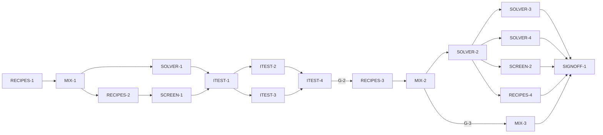

# Master Plan — Mixing recipes (bs-04)

**Spec:** [bs-04-mixing-recipes.feature](../bs-04-mixing-recipes.feature)
**Status:** Not started — next RECIPES-1 (blocked on G-1: approve the spec)
**Architecture:** [solution intent](../../docs/paint-color-app-solution-intent.md) (*Mixing recipes*; *Mixing engine: options and the short-term choice* — Spectral.js is the v1 engine; D3 swappable engine, D4 one color library, D7 solver-not-LLM, D9 provenance) · [custom mixing engine design](../../docs/custom-mixing-engine-design.md) (the forward KM math §3, the inverse solver §6, wet/dry §7 — v1 ships Spectral.js, this is the later upgrade) · [scope](../../docs/paint-color-app-scope.md) · [wireframe derivation](../wireframe-spec-derivation.md) · wireframe `Paint Color Assistant.dc.html` Recipes screen (S1.R1, E22–E25), in `docs/Color blindness artist tool.zip`
**Code home:** `/Users/matthew.quirk/Nuance` · remote `https://github.com/meatsquirk/Nuance` · base `main` @ `b3bcc38` · **extends** the bs-01 Flutter foundation (confirmed by Matt 2026-10-08)

> The recipe-solving feature. On bs-01's merged foundation (Flutter project, `Sample`/`ColorCoordinates`,
> `buildApp`/`AppScope`, `Speech` + `FakeSpeech`, color-science conversions, `AppRouter.toRecipes`,
> `RecipesStubScreen`, the coverage-gate tool, `integration_test`) it builds the Recipes screen and its
> engine. It replaces bs-01's `RecipesStubScreen` behind the existing `toRecipes` route and adds, of its
> own: an in-house **Spectral.js Kubelka–Munk `MixingEngine`** (forward: paints+ratios→colour; inverse:
> target→top recipes under the palette), a canonical **`deltaE00`** in the color-science layer, the
> recipe presentation (parts incl. "a touch of", predicted colour, ΔE00 + plain verdict, muddying flag,
> OUT OF GAMUT, wet/dry), a minimal injected **`PaletteSource`** and target source, and the Recipes
> controller/screen. **bs-02 (capture) and bs-03 (comparison) are not prerequisites** (D-1): the target is
> a *saved* sample or a manual entry.

## Gap analysis (against `main` @ b3bcc38, bs-01 foundation)

bs-01 supplies the project, `Sample`/`ColorCoordinates`, `buildApp`/`AppScope`, the `Speech` seam + test
`FakeSpeech`, color-science conversions (`labToCielch`, `toSRGB`), `AppRouter.toRecipes(Sample)` routing to
a render-only `RecipesStubScreen`, the `tool/coverage_gate.dart` gate and `integration_test`. **No** mixing
engine, solver, `deltaE00`, palette source, recipe presentation or real Recipes screen exists. `deltaE00`
is present only as a *private* test helper in bs-03's unmerged `lib/compare/difference.dart` (`_deltaE00`,
still stubbed) — not on `main`; bs-04 promotes a canonical CIEDE2000 into the color-science layer (D-5).

| AC | Scenario | Exists today (bs-01 foundation) | Missing |
|---|---|---|---|
| AC-1 | Choose a saved sample as the target | `Sample`; stub renders the target name | target `TargetSource`; target selector (E22); set-target with L/C/h readback |
| AC-2 | Manual target entry; impossible value refused | `labToCielch` | manual LCh entry (E22); range validation (L∈[0,100]); keep previous target on reject |
| AC-3 | Recipes use only the selected palette | — | `PaletteSource`; palette-constrained inverse search |
| AC-4 | Top 3–5 recipes with parts + predicted colour | — | inverse solver (top-K); forward predicts each colour; recipe-list render |
| AC-5 | A close recipe states ΔE00 + plain verdict | — | `deltaE00` in color-science; recipe verdict bands; ΔE00 + verdict render |
| AC-6 | A cleaner 2-paint ranks above a muddier 4-paint | — | prefer-fewer-paints ranking (ΔE tolerance + paint-count tie-break) |
| AC-7 | Trace component expressed as "a touch of" | — | trace identification (~2% by volume); "a touch of" + technique-note render |
| AC-8 | A complementary-crossing mix flagged as muddying | color-science hue angle | muddying detector (complementary-hue crossing); muddying flag render |
| AC-9 | Out-of-gamut target; nearest offered, not a match | — | gamut threshold; OUT OF GAMUT mark; nearest-not-match render |
| AC-10 | Predicted colour shown wet or dry | — | per-medium wet→dry transform; wet/dry toggle (E24) |
| AC-11 | Speak the target | `Speech` + `FakeSpeech` | build + speak the target utterance (name + L/C/hue); speak-target control (E23) |
| AC-12 | Speak a recipe | `Speech` + `FakeSpeech` | build + speak the recipe utterance (each paint + parts); speak-recipe control (E25) |

## Build order

| Stage | Phases |
|---|---|
| 1 Scaffold | RECIPES-1 |
| 2 Component shells | MIX-1, SOLVER-1, RECIPES-2, SCREEN-1 |
| 3 Acceptance tests | ITEST-1, ITEST-2, ITEST-3, ITEST-4 (test review, G-2) |
| 4 Behavior | RECIPES-3, MIX-2, SOLVER-2, SOLVER-3, SOLVER-4, SCREEN-2, RECIPES-4, MIX-3 |
| 5 Sign-off | SIGNOFF-1 |

## Acceptance criteria coverage

| AC | Scenario | Integration test (ITEST) | Behavior phases | Status |
|---|---|---|---|---|
| AC-1 | The painter chooses a saved sample as the target | ITEST-2 `TestAC01_ChooseSavedTarget` | RECIPES-3 | ⬜ Todo |
| AC-2 | The painter enters a target manually and an impossible value is refused | ITEST-2 `TestAC02_ManualTargetRefused` | RECIPES-3 | ⬜ Todo |
| AC-3 | Recipes use only paints from the currently selected palette | ITEST-3 `TestAC03_PaletteOnly` | SOLVER-2 | ⬜ Todo |
| AC-4 | The top three to five recipes are returned with parts and predicted colour | ITEST-3 `TestAC04_TopRecipes` | SOLVER-2 | ⬜ Todo |
| AC-5 | A close recipe states a small delta-E with a plain verdict | ITEST-2 `TestAC05_CloseVerdict` | MIX-2 | ⬜ Todo |
| AC-6 | A cleaner two-paint mix ranks above a muddier four-paint mix at a similar delta-E | ITEST-3 `TestAC06_PreferFewer` | SOLVER-2 | ⬜ Todo |
| AC-7 | A component under about two percent is expressed as a touch of | ITEST-3 `TestAC07_TraceTouchOf` | SCREEN-2 | ⬜ Todo |
| AC-8 | A complementary-crossing mix is flagged as muddying | ITEST-3 `TestAC08_MuddyingFlag` | SOLVER-4 | ⬜ Todo |
| AC-9 | An out-of-gamut target offers the nearest possible without claiming a match | ITEST-3 `TestAC09_OutOfGamut` | SOLVER-3 | ⬜ Todo |
| AC-10 | The painter views the predicted dry colour | ITEST-2 `TestAC10_WetDry` | MIX-3 | ⬜ Todo |
| AC-11 | The painter hears the target spoken | ITEST-2 `TestAC11_SpeakTarget` | RECIPES-4 | ⬜ Todo |
| AC-12 | The painter hears a recipe spoken | ITEST-2 `TestAC12_SpeakRecipe` | RECIPES-4 | ⬜ Todo |

## Design decisions

| # | Decision | Why |
|---|---|---|
| D-1 | bs-04 **extends** bs-01's merged foundation and branches from `main` @ b3bcc38. **bs-02 (capture) and bs-03 (comparison) are not prerequisites** — the target is a *saved* sample or a manual entry, so only `Sample`/`ColorCoordinates`, color-science, `Speech`, `AppRouter.toRecipes`, the coverage tool and `integration_test` (all bs-01) are needed. bs-04 replaces the render-only `RecipesStubScreen` behind the existing `toRecipes` route; the file is net-new so bs-02/bs-03 don't collide | avoids a false serial dependency; keeps recipes off the flagship's critical path. The spec's own "Builds on: bs-01" (confirmed by Matt 2026-10-08) |
| D-2 | v1 mixing engine = **Spectral.js Kubelka–Munk, ported in-house to Dart**, behind a `MixingEngine` interface (SI *short-term choice*; MIT, commercial-safe). **Forward:** RGB→38-bin reflectance (Scott Burns LHTSS)→mix in K/S→sRGB with OKLab gamut mapping. **Inverse:** palette-constrained subset enumeration (sizes 1..maxPaints) + per-subset bounded volume optimizer, top-K by ΔE00, tie-break fewer paints (§6 of the engine design). The measured-pigment KM engine stays a later upgrade behind the same interface (D3) | SI picks Spectral.js for v1 (no measured data, commercial-safe); the interface keeps it swappable. Recipes genuinely need forward + inverse (AC-3/4/6/9), confirmed by Matt 2026-10-08 |
| D-3 | Recipes are solved only against an injected **`PaletteSource`** (`InMemoryPaletteSource` for v1); **bs-06** supplies the persistent "My paints" store behind the same interface. The **target** is a saved sample (via an injected `TargetSource`, the bs-03 `SampleSource` pattern) **or** a manual CIELCh entry validated to L∈[0,100], C≥0, h∈[0,360); an out-of-range entry is refused and the previous target kept | keeps bs-04 independent of persistence (bs-06) and capture (bs-02); the spec's Rule 1 (target is a saved sample or a manual colour) |
| D-4 | Every recipe carries **provenance = Estimated** (SI D9): Spectral.js is a model prediction over placeholder/owner K/S, not measured data, so no v1 recipe claims *Calculated* | SI D9 — nothing displays as verified that isn't; Spectral.js path is *Estimated* until instrument data exists |
| D-5 | **`deltaE00`** (CIEDE2000) is added to the **color-science layer** as the one canonical implementation (`lib/color_science/`), consumed by the engine and the verdict bands (SI D4 "conversions from one tested library"). Mirrors the verified private `_deltaE00` in bs-03/bs-01 tests, promoted to product code here. Recipe **verdict bands** ("very close" … ) are defined over ΔE00 | SI D4; bs-03's ΔE00 is compare-local and unmerged, so bs-04 owns the canonical one. When bs-03 merges, its compare code may later consume this (a future reconciliation, not a bs-04 blocker) |
| D-6 | **Muddying** = a recipe whose constituent paints **cross a complementary hue pair** (paint hue families ≈180° apart on the wheel), detected from the paints' hue angles and flagged "liable to muddy" | the spec's Rule (complementary-crossing muddies); detectable from paint hue geometry without measured chroma-drop data |
| D-7 | A **trace component** is a paint under **~2% by volume**, rendered as "a touch of <paint>" with a technique note rather than a measured part | the spec's Rule (trace → "a touch of"); 2% is the stated threshold |
| D-8 | **Prefer fewer paints** = the top-K ranking sorts by ΔE00, and when two recipes' ΔE00s are within a small tolerance, the one with **fewer paints** ranks higher (an optional small chroma penalty breaks remaining ties toward naturalness, engine design §7) | the spec's Rule and SI (prefer fewer paints); "similar ΔE" needs a tolerance band |
| D-9 | **Wet/dry** = a per-medium **wet→dry transform** behind the E24 toggle. v1 applies a documented offset (oil: the small 7-day shift, SI Open-decision #6 still open); the exact dry values the tests pin are reconciled via G-3 | SI Open-decision #6 (wet vs dry) is unset; the spec gives one illustrative oil example |
| D-10 | Acceptance suite = Flutter `integration_test` driving `buildApp(deps)` with a new **recipes entry** (injected `PaletteSource` + `TargetSource` + `MixingEngine`), mirroring bs-03's comparison entry. Faked (infrastructure only): bs-01's `Speech` sink (`FakeSpeech`). The engine (forward KM, inverse solver, muddying, gamut, wet/dry), controller, screen and routing are all **real**. Observed via rendered text, a `RecipesReadEndpoint` (target, the solved recipe list, each recipe's parts/predicted colour/ΔE00/verdict/flags, the wet/dry mode), the `FakeSpeech` log, and the current route | tests go through the real UI surface; only the platform TTS sink is faked. No colour, ΔE00, mixing or solver math is faked |
| D-11 | **Out-of-gamut** = when the solver's best ΔE00 exceeds a gamut threshold, the target is marked "OUT OF GAMUT" and the nearest mix is offered **labelled as nearest, never as a match** (SI fixed intent; never fabricate a recipe) | the spec's Rule and SI risk response (out-of-gamut invites a false recipe) |

## Acceptance integration test plan

Module plan: [modules/ITEST.md](modules/ITEST.md).

**Where it lives and how it runs:** `integration_test/recipes_test.dart` (Flutter `integration_test`),
harness `integration_test/recipes_harness.dart`, pending gate `integration_test/bs04/pending.dart` (keyed to
`BS04_RUN_PENDING`, mirroring bs-01/03). Default: `flutter test integration_test/recipes_test.dart` (pending
ACs skipped). Run-pending: `BS04_RUN_PENDING=1 flutter test integration_test/recipes_test.dart` (or
`--dart-define=BS04_RUN_PENDING=true` on-device). Single lane (widget tests are not parallel-safe in a
process).
**Where assertions look:** the rendered widget tree via `WidgetTester` (the target readback with L/C/h, each
recipe's parts text incl. "a touch of", predicted-colour swatch label, the ΔE00 + verdict text, the muddying
flag, the "OUT OF GAMUT" + nearest text, the wet/dry toggle E24); the `RecipesReadEndpoint` (the set target,
the solved recipe list — each recipe's `parts`, predicted `ColorCoordinates`, `deltaE00`, `verdict`,
`muddying`, `outOfGamut`, and the current wet/dry mode); the `FakeSpeech` utterance log; the current route.
**What is real and what is faked:** the whole app assembled through bs-01's production `buildApp(deps)` with
the recipes entry added (D-10); the `MixingEngine` (forward KM, inverse solver, muddying, gamut, wet/dry),
`PaletteSource`, `TargetSource`, `deltaE00`, verdict bands, controller, screen and routing are all real.
Faked (infrastructure only): bs-01's `FakeSpeech` sink. No colour, ΔE00, mixing or solver math is faked.

**Fixtures:**

| Fixture | Shape |
|---|---|
| `PALETTE_MY_PAINTS` | the injected `InMemoryPaletteSource` named "My paints": Titanium White, Yellow Ochre, Ivory Black (AC-3 scenario) + Raw Umber + Ultramarine, each a `Paint` with placeholder/owner `K`,`S` at *Estimated* provenance (G-4). ≥4 paints so a 2-paint and a 4-paint candidate both exist (AC-6) and a complementary (yellow↔blue) pair exists (AC-8). Drives AC-3,4,5,6,8 |
| `TARGET_DEEP_OLIVE` | saved `Sample` "Deep Olive Green", CIELAB from L 42 / C 28 / h 108° = (42, −8.65, 26.63). The in-gamut target; the palette can mix it (AC-1,3,4,5) |
| `TARGET_VIVID_TURQUOISE` | saved `Sample` "Vivid Turquoise", a high-chroma cyan the muted palette cannot reach (best ΔE00 > gamut threshold). Drives AC-9 |
| `RECIPE_YO_IB` | the recipe Yellow Ochre 6 parts + Ivory Black 3 parts for `TARGET_DEEP_OLIVE`; the engine's `forward` predicts its colour (value pinned in ITEST-3, G-3) and it reads "very close". Drives AC-5 |
| `TRACE_RECIPE` | a solved recipe whose Titanium White component is under 2% by volume (AC-7). Confirmed/finalized when the solver exists (augmentation owned by SCREEN-2 / SOLVER-2) |
| `WETDRY_RECIPE` | a recipe predicting a wet colour; medium = oil; the dry-after-7-days colour = the oil wet→dry transform of the wet (values pinned via G-3). Drives AC-10 |
| `FakeSpeech` | bs-01's spoken-output sink; its utterance log is asserted for AC-11, AC-12 |

**Test catalogue:**

| AC | Given: built via public flows → checked by | When | Then: exact assertions (negative Thens: after <settle point>) | Rejects |
|---|---|---|---|---|
| AC-1 | Open Recipes on `PALETTE_MY_PAINTS` + a `TargetSource` listing `TARGET_DEEP_OLIVE` → assert the target selector offers "Deep Olive Green"; no target set (read endpoint) | choose "Deep Olive Green" as the target (E22) | the target is "Deep Olive Green" **and** reads "L 42, C 28, h 108 degrees" (exact) | choice does not set the target; wrong sample; name set without the L/C/h numbers (assert the numbers) |
| AC-2 | A target already set to `TARGET_DEEP_OLIVE` (AC-1 flow) → assert the target is Deep Olive Green (read endpoint) | begin a manual entry and enter a lightness of 140 (E22) | the entry is refused as out of range (a findable rejection) **and** the target is still "Deep Olive Green" (unchanged) | 140 accepted as a target; the previous target cleared/overwritten on reject; no rejection shown |
| AC-3 | target = `TARGET_DEEP_OLIVE`, palette = `PALETTE_MY_PAINTS` → assert the target set and the palette's paint set (read endpoint) | the recipes are solved | **every** returned recipe uses only paint ids drawn from `PALETTE_MY_PAINTS` (assert each paint of each recipe ∈ palette) | a recipe naming a paint outside the palette (control: a paint the solver would prefer but that is not in "My paints") |
| AC-4 | target = `TARGET_DEEP_OLIVE` the palette can mix → assert the target set (read endpoint) | the recipes are solved | between **3 and 5** recipes are listed; **each** shows its paints as parts by volume **and** a predicted colour (read endpoint: list length ∈ [3,5]; each recipe non-empty parts + non-null predicted `ColorCoordinates`) | fewer than 3 / more than 5; a recipe missing parts or a predicted colour (*limited until the solver exists — owning phase SOLVER-2*) |
| AC-5 | target = `TARGET_DEEP_OLIVE`; `RECIPE_YO_IB` present for it (predicted colour pinned, G-3) → assert the recipe present with its predicted colour | the recipe is shown | it states its **ΔE00** from the target (the engine-computed value, pinned) **and** carries the verdict "very close" | ΔE76/Euclidean instead of CIEDE2000 (control: a pair equal in ΔE76 but different in ΔE00); a constant verdict (augment: a clearly-distant recipe reads a different verdict band) |
| AC-6 | target + palette engineered so a clean 2-paint and a muddier 4-paint recipe both reach it at similar ΔE00 → assert both present and |ΔE00(2-paint) − ΔE00(4-paint)| ≤ tolerance (read endpoint) | the recipes are ordered | the 2-paint recipe is ranked **above** the 4-paint recipe (its list index is lower) | order by ΔE00 only, ignoring paint count (control: the 4-paint is marginally closer yet must still rank below); order by paint count ignoring ΔE (a far-off 2-paint must not outrank a close 4-paint) — *limited until the solver exists — owning phase SOLVER-2* |
| AC-7 | a solved recipe whose Titanium White is under 2% by volume (`TRACE_RECIPE`) → assert that component's volume < 0.02 (read endpoint) | the recipe is shown | Titanium White is expressed as "a touch of" **with a technique note**, not as a measured part (assert the "a touch of" + note text and the absence of a numeric part for it) | a trace rendered as a tiny numeric part (e.g. "0.3 parts"); the "a touch of" wording applied to a non-trace component (control: a >2% component still shows a numeric part) — *limited until the solver exists — owning phase SOLVER-2* |
| AC-8 | a solved recipe crossing a complementary hue pair (Yellow Ochre + Ultramarine present) → assert the recipe contains a complementary pair (read endpoint) | the recipe is shown | the recipe is flagged **liable to muddy** (findable flag; read endpoint `muddying == true`) | no flag for a genuinely complementary-crossing mix; a flag on a non-crossing mix (control: a same-family recipe reads `muddying == false`) — *limited until the solver exists — owning phase SOLVER-4* |
| AC-9 | target = `TARGET_VIVID_TURQUOISE` the palette cannot mix → assert target set; best achievable ΔE00 > gamut threshold (read endpoint) | the recipes are solved | the target is marked "OUT OF GAMUT" **and** the nearest mix is offered **as the nearest possible, not as a match** (findable "nearest"/"not a match" wording; read endpoint `outOfGamut == true`) | a recipe claimed as a match for an unreachable target; no out-of-gamut mark; no nearest offered at all |
| AC-10 | a recipe predicting a wet colour; medium = oil (`WETDRY_RECIPE`) → assert the wet predicted colour and the wet/dry mode = wet (read endpoint) | switch to the dry prediction for oil after 7 days (E24) | the predicted colour shifts to the oil wet→dry transform of the wet (values pinned, G-3) (read endpoint predicted colour changes to the dry value; mode = dry) | the dry equals the wet (no transform applied); the transform applied in the wrong direction/medium — *dry value pinned via G-3* |
| AC-11 | target = `TARGET_DEEP_OLIVE` set (AC-1 flow); `FakeSpeech` log empty → assert target set, log empty | ask to speak the target (E23) | `FakeSpeech` has exactly one utterance stating the target **name** and its **L, C and hue** (assert name + the three values present) | speaks nothing; omits the L/C/hue; multiple utterances |
| AC-12 | a solved recipe present (Yellow Ochre 6 + Ivory Black 3 for the target); `FakeSpeech` log empty → assert the recipe present, log empty | ask to speak the recipe (E25) | `FakeSpeech` has exactly one utterance stating **each paint and its parts** (assert each paint name + its part value present) | speaks the target instead; omits a paint or its parts; multiple utterances |

**Red baseline** and **test augmentations:** tracked in [modules/ITEST.md](modules/ITEST.md).
Pre-seeded augmentations: `TestAC04`, `TestAC06`, `TestAC07` are *limited* at write time (the solver does
not yet exist, so the recipes they inspect can't be produced through public flows) — **SOLVER-2** finalizes
their fixtures and closes them; `TestAC08` likewise closed by **SOLVER-4**. `TestAC05`'s verdict-discrimination
control (a clearly-distant recipe reading a different band) is augmented by **MIX-2**.

## Modules

| Module | Plan | Purpose | Depends on | Status |
|---|---|---|---|---|
| MIX | [modules/MIX.md](modules/MIX.md) | The `MixingEngine` interface + `Paint`/`Recipe`/`Medium` types; Spectral.js KM **forward**; canonical `deltaE00` (color-science); recipe verdict bands; the per-medium **wet→dry** transform | bs-01 color-science | ⬜ Todo |
| SOLVER | [modules/SOLVER.md](modules/SOLVER.md) | The **inverse** solver (palette-constrained subset enumeration + optimizer, top-K, prefer fewer paints); out-of-gamut detection; the muddying detector; trace-component identification | MIX | ⬜ Todo |
| RECIPES | [modules/RECIPES.md](modules/RECIPES.md) | Scaffold; `RecipesController`/state; `PaletteSource` + `TargetSource`; manual-entry validation; `RecipesReadEndpoint`; speak target/recipe; recipes entry in `buildApp` (replaces the stub route) | bs-01 domain/router/Speech, MIX | ⬜ Todo |
| SCREEN | [modules/SCREEN.md](modules/SCREEN.md) | Recipes screen UI: target selector (E22), recipe list (parts incl. "a touch of", predicted colour, ΔE00 + verdict, muddying flag, OUT OF GAMUT), wet/dry toggle (E24), speak target (E23), speak recipe (E25) | RECIPES, MIX, SOLVER | ⬜ Todo |
| ITEST | [modules/ITEST.md](modules/ITEST.md) | Acceptance integration suite: one pending test per AC, and its review | all shell phases | ⬜ Todo |

## Dependency graph

**Parallel windows:** shells — RECIPES-1 → MIX-1 → `{SOLVER-1 ∥ RECIPES-2}` (disjoint: solver files vs
controller/sources/wiring) → SCREEN-1 (binds the controller). AC tests `{ITEST-2 ∥ ITEST-3}` (split file
regions: ITEST-2 = target/selection/verdict/wet-dry/speak; ITEST-3 = solver/engine). After G-2: **RECIPES-3**
first alone (target selection — every recipe Given needs a target), then **MIX-2** (forward + deltaE00 +
verdict — every predicted colour needs it), then **SOLVER-2** (inverse — produces the recipe list the rest
inspect), then `{SOLVER-3 ∥ SOLVER-4 ∥ SCREEN-2 ∥ RECIPES-4 ∥ MIX-3}`. **Merge-risky (serialize):**
SOLVER-3 and SOLVER-4 both live under `lib/recipes/solver*` — split into `gamut.dart` (SOLVER-3) vs
`muddying.dart` (SOLVER-4) to keep them file-disjoint, else serialize; MIX-3 edits `wet_dry.dart` +
`wet_dry_toggle.dart`; RECIPES-4 edits `recipes_controller.dart` + `actions_bar.dart`; SCREEN-2 edits the
recipe-list region. MIX-3 needs **G-3** (wet/dry values).

## Open gates

| Gate | Kind | Decision needed | Blocks | Status |
|---|---|---|---|---|
| G-1 | decision | Approve the spec (the `.feature` is marked "Draft: awaiting owner approval"; record approval as its first line) | RECIPES-1 | Open |
| G-2 | decision | Approve the acceptance tests (ITEST-4's packet) | every behavior phase | Open |
| G-3 | decision | **Spec-data reconciliation (spec author).** AC-4/AC-5/AC-10 give illustrative predicted-colour / ΔE00 / oil wet→dry numbers (wireframe-derived). The in-house Spectral.js engine computes its own predicted colours, and the oil 7-day wet→dry transform is SI Open-decision #6 (unset). Decide: pin the tests to engine-computed values (recorded at ITEST-3, as bs-03 G-4 did for ΔE00) and treat the oil wet→dry as a documented v1 offset — **or** supply authoritative measured values | ITEST-3 (AC-4/5/10 literals), MIX-2 (AC-5 ΔE00), MIX-3 (AC-10 wet/dry) | Open |
| G-4 | decision | **Paint optical-data source (owner / data).** The forward KM model needs per-paint `K`,`S` for the fixture + default palette (Titanium White, Yellow Ochre, Ivory Black, Raw Umber, Ultramarine). SI: MPI oil (CC BY 4.0) is clear; Golden/RIT acrylic needs permission. Decide the v1 source: documented placeholder/owner-measured `K`,`S` at *Estimated* provenance (recommended — engine math real, data placeholder) **or** a licensed dataset subset | MIX-1 (Paint type's data), MIX-2 (forward), ITEST-1 (palette fixture) | Open |

Resolved: `✅ Resolved <date time>: <decision, one line> — <who>`.

## Known flakes

| Test | Symptom | Rate (runs) | Measured at | Owner | Status |
|---|---|---|---|---|---|
| coverage_gate — a `const` constructor line in `lib/**` | Carried from bs-01: `flutter test --coverage` can intermittently record a const-folded constructor line as uncovered, so the gate may FAIL on a file the phase never touched | not quantified (bs-01) | — | any phase running the coverage gate | open — if the gate flags an untouched file, re-run `flutter test --coverage` once; green on re-run ⇒ ignore |

## Session log

| # | Phase | Target | Status | Tokens | Time | Notes |
|---|---|---|---|---|---|---|
| 1 | RECIPES-1 | scaffold: branch from main, baseline, confirm coverage gate, BS04 pending runner | ⬜ Next | | | blocked on G-1 |
| 2 | MIX-1 | shell: `MixingEngine` interface + `Paint`/`Recipe`/`Medium` types + `SpectralEngine` stubs; `deltaE00` + verdict + wet/dry signatures | ⬜ Todo | | | after RECIPES-1 |
| 3 | SOLVER-1 | shell: inverse-solver skeleton + ranking/gamut/muddying/trace stubs | ⬜ Todo | | | ∥ RECIPES-2 |
| 4 | RECIPES-2 | shell: `RecipesController`/state + `PaletteSource` + `TargetSource` + read endpoint + recipes entry/route (replace stub) | ⬜ Todo | | | ∥ SOLVER-1 |
| 5 | SCREEN-1 | shell: Recipes screen scaffold (E22–E25 placeholders) bound to controller | ⬜ Todo | | | after RECIPES-2 |
| 6 | ITEST-1 | acceptance-tests: harness, fixtures, pending gate (12 ACs), smoke | ⬜ Todo | | | needs G-4 (palette fixture) |
| 7 | ITEST-2 | acceptance-tests: AC-1,2,5,10,11,12 (pending) + red baseline | ⬜ Todo | | | ∥ ITEST-3 |
| 8 | ITEST-3 | acceptance-tests: AC-3,4,6,7,8,9 (pending) + red baseline | ⬜ Todo | | | ∥ ITEST-2; needs G-3 (AC-4 literals) |
| 9 | ITEST-4 | test-review: packet; G-2 | ⬜ Todo | | | |
| 10 | RECIPES-3 | behavior: AC-1, AC-2 — target selection (saved + manual + validation) | ⬜ Todo | | | first behavior phase |
| 11 | MIX-2 | behavior: AC-5 — real forward KM + `deltaE00` + verdict bands | ⬜ Todo | | | needs G-3; after RECIPES-3 |
| 12 | SOLVER-2 | behavior: AC-3, AC-4, AC-6 — inverse solver, top-K, prefer fewer paints | ⬜ Todo | | | after MIX-2 |
| 13 | SOLVER-3 | behavior: AC-9 — out-of-gamut + nearest | ⬜ Todo | | | ∥ SOLVER-4, SCREEN-2, RECIPES-4, MIX-3 |
| 14 | SOLVER-4 | behavior: AC-8 — muddying (complementary-crossing) detector | ⬜ Todo | | | ∥ SOLVER-3, SCREEN-2, RECIPES-4, MIX-3 |
| 15 | SCREEN-2 | behavior: AC-7 — trace "a touch of" + technique note | ⬜ Todo | | | ∥ SOLVER-3/4, RECIPES-4, MIX-3 |
| 16 | RECIPES-4 | behavior: AC-11, AC-12 — speak target / speak recipe | ⬜ Todo | | | ∥ SOLVER-3/4, SCREEN-2, MIX-3 |
| 17 | MIX-3 | behavior: AC-10 — wet/dry transform + toggle wiring | ⬜ Todo | | | needs G-3; ∥ SOLVER-3/4, SCREEN-2, RECIPES-4 |
| 18 | SIGNOFF-1 | sign-off: packet + summary page + manual approval | ⬜ Todo | | | |

*Tokens* / *Time* = the phase totals from the *Token usage* ledger (Time = active, wall in brackets), filled
when the row is marked done.

## Next phase

**Plan written — nothing implemented.** The first phase is **RECIPES-1** (scaffold), **blocked on G-1**
(approve the draft spec). Before any build:
- **G-1** (approve the spec) — blocks RECIPES-1. Record approval as the spec's first line.
- **G-4** (paint K/S data source) — needed by MIX-1/MIX-2 and the ITEST-1 palette fixture; decide before the
  engine shell.
- **G-3** (illustrative AC-4/5/10 numbers + oil wet/dry) — needed by ITEST-3 and MIX-2/MIX-3; can wait until
  the acceptance-test stage, but decide by then.
- **G-2** (approve the acceptance tests) — the ITEST-4 gate, blocks every behavior phase.

Run next (fresh session, after `/clear`): resolve G-1 via
`/feature-next-phase --gate bs-04-mixing-recipes G-1 approved`, then
`/feature-next-phase bs-04-mixing-recipes` (auto-picks RECIPES-1).

## Token usage

<!-- One row per session, appended as that session's last edit (SKILL.md § Token usage). -->

| Phase / activity | Session | Start | End | Wall | Active | Model(s) | Input | Cache write | Cache read | Output | Total | Outcome |
|---|---|---|---|---|---|---|---|---|---|---|---|---|
| PLAN | 421e65c9 | 2026-10-08 06:04 EDT | 06:39 | 34m 30s | 14m 05s | claude-opus-4-8 | 60 | 157,633 | 3,305,750 | 62,903 | 3,526,346 | plan written: 18 phases, 5 modules, 12 ACs; G-1/G-2/G-3/G-4 open |
| **Feature total** |  | **2026-10-08 06:04 EDT** | **2026-10-08 06:39** | **34m 30s** | **14m 05s** |  | **60** | **157,633** | **3,305,750** | **62,903** | **3,526,346** |  |

## Sign-off

| Round | Packet | At code | Grades | Decision |
|---|---|---|---|---|
| 1 | [signoff/round-1.md](signoff/round-1.md) | — | — | ⏸ Awaiting |
