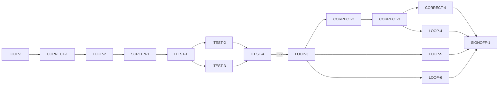

# Master Plan — Mix-correction loop (bs-05)

**Spec:** [bs-05-mix-correction-loop.feature](../bs-05-mix-correction-loop.feature)
**Status:** In progress — next LOOP-2 (shell; needs no gate. CORRECT-1 done; G-2 gates the behavior stage, G-4 gates ITEST-3/CORRECT-2/3/4/LOOP-6)
**Architecture:** [solution intent](../../docs/paint-color-app-solution-intent.md) (*Mix-correction loop* capability = **Capture + Mixing Engine**, line 208; the private loop is the single-user replacement for community refinement, D8; provenance promotion rule — only the painter's own photographic evidence graduates a value to **Confirmed (you measured this)**, lines 257–268, D9) · [custom mixing engine design](../../docs/custom-mixing-engine-design.md) (the forward model the correction search rides) · [scope](../../docs/paint-color-app-scope.md) (Phase-2 feature) · [wireframe derivation](../wireframe-spec-derivation.md) (bs-05 §4.3/§6.5; fact **F8** — single-user "Confirmed · you" from the painter's own swatch; community "Confirmed by N" stays Phase 2) · wireframe `Paint Color Assistant.dc.html` **Correction screen** (S1.R1, E26–E29), in `docs/Color blindness artist tool.zip`
**Code home:** `/Users/matthew.quirk/Nuance` · remote `https://github.com/meatsquirk/Nuance` · base `main` **@ the bs-04 merge (G-3)** · **extends** the bs-01/02/03/04 foundation (confirmed by Matt 2026-10-10: bs-05 branches from `main` after bs-04 is merged, not from the bs-04 feature branch)

> The correction loop is the fourth-increment companion to recipes. It adds **no new reading or mixing math**: it
> photographs the painter's actual swatch through the bs-02 capture seam (`CaptureController`/`CaptureSource` →
> a *measured* `Sample`), measures the gap to the target with the shipped `deltaE00` (bs-03), and rides the
> bs-04 `MixingEngine.forward` model to search for the one paint that, added to the current mix, most closes
> that gap. Its own net-new parts are three: a **`CorrectionEngine`** (difference decomposition that leads with
> value + a concrete "add paint X" suggestion) behind a swappable interface; the **Correction screen** and its
> loop controller (check → read difference/correction → speak → re-photograph → save); and the first product
> writer of the **`ProvenanceTier.confirmed`** promotion — the painter's own swatch moves the target value to
> "Confirmed — you measured this" with an append-only evidence note. **bs-06 (palette & projects) is not a
> prerequisite** (the palette is the same injected `PaletteSource` bs-04 uses).

## Gap analysis (against the bs-04 tip `28cbf04`, the foundation bs-05 extends)

The foundation supplies everything the loop reuses: `CaptureController`/`CaptureSource`/`SoftwareCaptureSource`
+ `FakeCaptureSource` (photograph a swatch → a `Sample` stamped `Provenance(ProvenanceTier.measured)`), the
shipped `deltaE00(ColorCoordinates,ColorCoordinates)` (`lib/compare/difference.dart`) and `compare()`,
`MixingEngine.forward(partsByVolume,{dry})` + `SubtractiveMixingEngine` + `Paint`/`PaintMedium`/`PaintPalette`/
`PaletteSource` + `Recipe`/`RecipeComponent` (bs-04), `Provenance`/`ProvenanceTier.confirmed` + `Sample.copyWith`
+ `EvidencePoint` + `ProvenanceBadge`, `SampleSource`/`InMemorySampleSource`, `Speech`+`FakeSpeech`,
`ColorScience`/`labToCielch`/`hueFamilyWord`/`temperatureWord`, `buildApp`/`AppScope`/`AppDependencies` (entry
pattern) + `AppRouter`, the read-endpoint + pending-gate + coverage-gate patterns. **No Correction screen,
route (`toCorrection`), controller, `CorrectionEngine`, or `bs05/` suite exist — all net-new.**

| AC | Scenario | Exists today | Missing |
|---|---|---|---|
| AC-1 | Checking the mix photographs the swatch and compares it to the target | `CaptureController` (photo → measured `Sample`); `deltaE00`/`compare`; `SAMPLE_DEEP_OLIVE` | Correction screen + **E26 "Check my mix"**; `CorrectionController` wiring capture → compare against the target; the difference landing in state |
| AC-2 | The difference is stated as a ΔE00 with a plain verdict | `deltaE00` | a **correction verdict band** yielding "noticeably off"; rendering ΔE00 + verdict on the difference body |
| AC-3 | The difference is decomposed and leads with value for a CVD painter | `labToCielch`, `hueFamilyWord`, signed-hue-delta logic (private in `difference.dart`), `words.dart` | **value-leading** decomposition "too dark by N" + "shifted toward green"; rendered value-first |
| AC-4 | A concrete correction names the paint and the amount | `MixingEngine.forward` (perturb parts → predict), `PALETTE_MY_PAINTS` (Titanium White) | the **`CorrectionEngine`**: search the palette for the addition that most reduces ΔE00; "add ~1 part more Titanium White"; rendered |
| AC-5 | A small correction is expressed as "a touch of" | bs-04 trace concept (`RecipeComponent.isTrace`/`techniqueNote`) | the engine emits a sub-threshold addition → "a touch of Yellow Ochre" + technique note, not a measured part |
| AC-6 | A mix within tolerance needs no correction | bs-04 engine band "very close" (≤5) | a **tolerance** (ΔE00 ≤ 2) → verdict "very close" + **suppress** the correction |
| AC-7 | The painter hears the correction spoken | `Speech`+`FakeSpeech`; `comparisonSpeech`/`recipeSpeech` templates | a `correctionSpeech` builder (difference + paints to add) + **E27 Speak correction** |
| AC-8 | Re-photographing the swatch re-checks it | `CaptureController.importPhoto`/`commit`; the AC-1 check flow | **E28 Re-photograph** → re-measure + re-compare; difference/verdict updated |
| AC-9 | Saving a satisfactory mix promotes it to Confirmed | `ProvenanceTier.confirmed` (label `'Confirmed'`), `Sample.copyWith`, `EvidencePoint`, `SampleSource` | **E29 Save confirmed mix**: promote the target to "Confirmed — you measured this" + append-only note/evidence; persist the promoted sample |
| AC-10 | A confirmed value shows its Confirmed provenance in later readouts | `ProvenanceBadge` (label + note); `ReadoutScreen` | the saved confirmed sample reaches a later readout and the badge renders "Confirmed — you measured this" |

## Build order

| Stage | Phases |
|---|---|
| 1 Scaffold | LOOP-1 |
| 2 Component shells | CORRECT-1, LOOP-2, SCREEN-1 |
| 3 Acceptance tests | ITEST-1, ITEST-2, ITEST-3, ITEST-4 (test review, G-2) |
| 4 Behavior | LOOP-3 (*enabler*: the checked mix), CORRECT-2, CORRECT-3, CORRECT-4, LOOP-4, LOOP-5, LOOP-6 |
| 5 Sign-off | SIGNOFF-1 |

## Acceptance criteria coverage

| AC | Scenario | Integration test (ITEST) | Behavior phases | Status |
|---|---|---|---|---|
| AC-1 | Checking the mix photographs the swatch and compares it to the target | ITEST-2 `TestAC01_CheckPhotographsAndCompares` | LOOP-3 | ⬜ Todo |
| AC-2 | The difference from the target is stated as a delta-E with a plain verdict | ITEST-3 `TestAC02_DeltaEAndVerdict` | CORRECT-2 | ⬜ Todo |
| AC-3 | The difference is decomposed and leads with value for a CVD painter | ITEST-3 `TestAC03_ValueLeadingDecomposition` | CORRECT-2 | ⬜ Todo |
| AC-4 | A concrete correction names the paint and the amount to add | ITEST-3 `TestAC04_ConcreteCorrection` | CORRECT-3 | ⬜ Todo |
| AC-5 | A small correction is expressed as a touch of | ITEST-3 `TestAC05_TouchOf` | CORRECT-3 | ⬜ Todo |
| AC-6 | A mix already within tolerance needs no correction | ITEST-3 `TestAC06_WithinTolerance` | CORRECT-4 | ⬜ Todo |
| AC-7 | The painter hears the correction spoken | ITEST-2 `TestAC07_SpeakCorrection` | LOOP-4 | ⬜ Todo |
| AC-8 | Re-photographing the swatch re-checks it against the target | ITEST-2 `TestAC08_RephotographRechecks` | LOOP-5 | ⬜ Todo |
| AC-9 | Saving a satisfactory mix promotes it to Confirmed by the painter | ITEST-2 `TestAC09_SaveConfirmed` | LOOP-6 | ⬜ Todo |
| AC-10 | A value confirmed by the painter shows its Confirmed provenance in later readouts | ITEST-2 `TestAC10_ConfirmedInReadout` | LOOP-6 | ⬜ Todo |

## Design decisions

| # | Decision | Why |
|---|---|---|
| D-1 | bs-05 **extends** the bs-01/02/03/04 foundation and branches from `main` **after bs-04 is merged** (G-3; Matt 2026-10-10). It reuses capture, `deltaE00`, `MixingEngine.forward`, `Provenance`/`Sample`, `SampleSource`/`PaletteSource`, `Speech`+`FakeSpeech`, `ColorScience`, the harness/pending/coverage patterns — adding no reading or mixing math of its own | the spec's boundary fixes capture (bs-02) and recipe-solving (bs-04) as reused; the loop is new orchestration + a correction suggestion, not new science |
| D-2 | **Photographing the swatch reuses the bs-02 capture seam.** The `CorrectionController` owns a `CaptureSource`/`CaptureController`; "Check my mix" (E26) drives a capture to a *measured* `Sample`, then compares its `coordinates` to the target with the shipped `deltaE00`. No new camera path | spec boundary: "photographing the swatch reuses capture (bs-02)"; the measured provenance is exactly what the honest-provenance promotion (D-8) needs |
| D-3 | A net-new **`CorrectionEngine`** behind a swappable interface (mirrors SI D3's engine-interface rule). It takes the measured swatch, the target, the current mix (`Recipe`) and the palette, and returns a **`Difference`** (ΔE00 + verdict + a value-leading decomposition) and a **`Correction`** (the palette paint(s) to add, each with an amount, a trace flag and an optional note). The suggestion is found by perturbing the current mix's parts and re-running `MixingEngine.forward` to pick the single addition that most reduces ΔE00 toward the target — never an invented number | SI D7 "the solver produces ratios, never a hallucinated number"; riding the existing forward model keeps the correction physical and swappable with the measured engine later |
| D-4 | A bs-05 **correction verdict band** ("very close" ≤ tolerance; "noticeably off" beyond), authored in the correction layer — **not** bs-03's private `_verdictBands` (different words: "barely different"…) nor bs-04's engine bands ("far off"). The spec pins the exact words "noticeably off"/"very close" | the two existing band sets are `private const` with different vocabularies; the spec fixes bs-05's words, so bs-05 owns its band — no cross-feature coupling to a private list |
| D-5 | **Value-leading decomposition** authored fresh: lightness first ("too dark by N" / "too light by N"), then hue ("shifted toward <family>"), from `labToCielch` ΔL* and the signed hue delta + `hueFamilyWord`. bs-03's `_lightnessLine` ("Darker by N") is private and not value-first | the spec leads with value *for a CVD painter*; the CVD-first ordering is a bs-05 presentation rule, so it lives in the correction layer over the shared conversions |
| D-6 | **Tolerance = ΔE00 ≤ 2** (AC-6) → verdict "very close" and **no correction** suggested. The literal `2` and the "noticeably off" boundary are from the scenarios — confirmed illustrative-vs-binding via **G-4** | the spec names ΔE 2 as the no-correction tolerance; keeping it an explicit named constant keeps the suppression testable |
| D-7 | **"A touch of"** reuses bs-04's trace concept: a correction addition below a **trace threshold** renders "a touch of <paint>" + a static technique note, not a measured part (AC-5). Threshold confirmed via **G-4** | one "a touch of" rendering idiom across recipes and corrections; no second trace scale |
| D-8 | **Provenance promotion (AC-9/AC-10).** Saving a satisfactory mix promotes the **target** value to `ProvenanceTier.confirmed` with the label **"Confirmed — you measured this"** and a `note` recording it was confirmed after the painter photographed their own swatch, appending the measured swatch as an `EvidencePoint` (append-only, D9). The confirmed-tier label string is reconciled via **G-4(d)** (change the shared `Provenance.label` for the confirmed tier, vs. carry the phrase in `note`). The promotion is **gated on the painter's own measured swatch** — the honest-provenance rule: no value graduates to Confirmed without it | SI lines 257–268 + wireframe F8: the private loop is the *only* path to Confirmed, and only on the painter's own photographic evidence; evidence is stored append-only so bs-14 can merge it later |
| D-9 | The loop is entered with a **target + the current mix** (`CorrectionEntry{target, currentMix}`): a `RecipesEntry`-symmetric marker driving a `CorrectionHomeScreen` that owns the `CorrectionController` over `captureSource`/`sampleSource`/`paletteSource`/`mixingEngine`/`correctionEngine`/`speech`/`router`, wrapped in a `CorrectionReadEndpoint`. A new `AppRouter.toCorrection(target, currentMix)` route; the recipes screen's "check my mix" handoff (later) targets it | one production-assembly entry per feature (symmetric to capture/comparison/recipes); the correction search needs the current mix to perturb |
| D-10 | **Acceptance** drives the real assembled app via `buildApp` with the correction entry: real capture (through `FakeCaptureSource`'s configured ground-truth scene — infrastructure only), real `CorrectionEngine`/`deltaE00`/`MixingEngine.forward`/controller/screen/routing/`Provenance`/`SampleSource`. Faked (infrastructure only): `FakeCaptureSource` (camera), `FakeSpeech` (TTS), `FakeHaptics`. A scenario's ΔE00 is graded against an **independent** in-harness CIEDE2000 (`referenceDeltaE00`), never the product metric. The spec's pinned amounts ("about one part more", "a touch of") and verdict words are reconciled via **G-4** as illustrative with behavioural-property assertions | matches bs-04 D-13: real math, infra-only fakes, the reference independent so an AC never grades the impl against itself |

## Acceptance integration test plan

Module plan: [modules/ITEST.md](modules/ITEST.md).

**Where it lives and how it runs:** `integration_test/correction_test.dart` (Flutter `integration_test`), harness
`integration_test/correction_harness.dart`, pending gate `integration_test/bs05/pending.dart` (flag
**`BS05_RUN_PENDING`**). Default: `flutter test integration_test/correction_test.dart -d <udid>` (pending ACs
skipped — a booted device/sim udid is **required**, or the run is a false green). Run-pending:
`… -d <udid> --dart-define=BS05_RUN_PENDING=true`. Single exclusive lane (widget tests aren't parallel-safe in
one process) — `coord.sh with-lock` in parallel sessions.
**Where assertions look:** the rendered widget tree via `WidgetTester` (E26 check, the difference body = ΔE00 +
verdict + value-leading decomposition, the correction body = paint + amount / "a touch of", E27 speak, E28
re-photograph, E29 save, the within-tolerance no-correction state, and a later `ReadoutScreen`'s
`ProvenanceBadge`); the `CorrectionController` **read endpoint** (`CorrectionReadEndpoint`: target, mixed
swatch `Sample`, `Difference`, `Correction`, within-tolerance flag, the saved/promoted provenance); the
`FakeSpeech` utterance log (AC-7); the `SampleSource` saved sample's provenance (AC-9/AC-10).
**What is real and what is faked:** the whole app assembled through `buildApp(deps)` with the correction entry
(D-9); the capture path, `CorrectionEngine`, `MixingEngine.forward`, `deltaE00`, controller, screen, routing,
`Provenance`, `SampleSource` are real. Faked (infrastructure only): `FakeCaptureSource` (camera scene),
`FakeSpeech`, `FakeHaptics`. No colour/mixing/ΔE00 math is faked; ΔE00 is graded against the harness's
independent `referenceDeltaE00`.

**Fixtures:**

| Fixture | Shape |
|---|---|
| `SAMPLE_DEEP_OLIVE` | the target "Deep Olive Green", CIELAB `(42, −1.2561, 23.9671)` (reused from bs-04's retargeted olive). The primary target. Drives AC-1, AC-2, AC-3, AC-4, AC-7, AC-9, AC-10 |
| `RECIPE_DEEP_OLIVE` | the current mix the painter made for the target (a bs-04 `Recipe` over `PALETTE_MY_PAINTS`) — the parts the correction search perturbs. Drives AC-4, AC-5 |
| `PALETTE_MY_PAINTS` | the injected `PaletteSource` "My paints" = Titanium White, Yellow Ochre, Ivory Black, Ultramarine Blue, Venetian Red (reused from bs-04) — the paints a correction can add. Drives AC-4, AC-5 |
| `SCENE_OFF` | a `FakeCaptureSource` ground-truth scene whose photographed swatch reads ~L 36 / C 30 / h 114 (too dark by ~6, hue toward green vs the target). Drives AC-1, AC-2, AC-3, AC-4, AC-7 |
| `SCENE_CLOSE` | a scene whose swatch reads within ΔE00 2 of the target (within tolerance). Drives AC-6; the discriminating control for AC-2's verdict |
| `SCENE_CLOSER` | a scene one correction-step better than `SCENE_OFF` (the painter applied the correction), for the re-photograph update. Drives AC-8 |
| `SCENE_OCHRE_TRACE` | a scene whose best correction needs a sub-trace amount of Yellow Ochre. Drives AC-5 |
| `referenceDeltaE00` | an **independent** in-harness CIEDE2000 (Sharma–Wu–Dalal), so AC-2's ΔE is checked against it, not the product `deltaE00` |

**Test catalogue:**

| AC | Given: built via public flows → checked by | When | Then: exact assertions (negative Thens: after <settle point>) | Rejects |
|---|---|---|---|---|
| AC-1 | Open Correction on `SAMPLE_DEEP_OLIVE` + `RECIPE_DEEP_OLIVE`, scene `SCENE_OFF` → assert `state.target` set, `state.mixedSwatch` null, `state.difference` null (endpoint); E26 present | choose "Check my mix" (E26) | `state.mixedSwatch` is a `Sample` with `Provenance(measured)` **and** `state.difference` is non-null with `deltaE00` to the target (after settle) | check doesn't photograph (mixedSwatch null); photographs but no comparison (difference null); compares the target to itself |
| AC-2 | A checked mix on `SCENE_OFF` (AC-1 flow) → assert `state.difference` present | the comparison is shown | `difference.deltaE00` `closeTo(referenceDeltaE00(mixedSwatch,target), 0.1)` **and** verdict "noticeably off" rendered | verdict constant (**control:** AC-6 within-tolerance reads "very close"); ΔE absent |
| AC-3 | The `SCENE_OFF` checked mix (measured L≈36 vs target L 42; hue toward green) → assert difference present | the comparison is shown | the **leading** reading states "too dark by 6" (value first) **and** states hue "shifted toward green" | leads with hue not value; wrong sign ("too light"); wrong hue family |
| AC-4 | The `SCENE_OFF` checked mix + `RECIPE_DEEP_OLIVE` + `PALETTE_MY_PAINTS` → assert difference present (too dark + green-shifted) | the correction is shown | `state.correction` names **Titanium White** as a paint to add with a positive amount (≈ "one part more"), rendered **and** adding it reduces the forward-predicted ΔE00 (in-test control) | suggests no white / a darkening paint; a paint outside the palette; an addition that increases ΔE00 |
| AC-5 | A checked mix on `SCENE_OCHRE_TRACE` whose best correction includes a sub-trace Yellow Ochre addition → assert that addition's fraction < trace threshold | the correction is shown | the Yellow Ochre adjustment renders "a touch of" + a technique note, **not** a measured part | a numeric part for the trace; no "a touch of"; the trace silently dropped |
| AC-6 | A checked mix on `SCENE_CLOSE` → assert `difference.deltaE00 ≤ 2` | the comparison is shown | verdict "very close" **and** `state.correction` is empty / no-correction (the screen shows no correction, after settle) | suggests a correction anyway; verdict not "very close"; tolerance ignored |
| AC-7 | The `SCENE_OFF` checked mix with a computed correction; `FakeSpeech` empty → assert correction present, no utterance | ask to speak the correction (E27) | `FakeSpeech` has exactly one utterance stating the **difference** **and** the **paints to add** | speaks nothing; omits the paints; omits the difference; multiple utterances |
| AC-8 | The `SCENE_OFF` checked mix showing a difference/verdict → assert difference present; reconfigure to `SCENE_CLOSER` (correction applied) | re-photograph the swatch (E28) | a new measured swatch is compared **and** `state.difference.deltaE00` and verdict **update** (smaller ΔE / better verdict than before) | re-photograph no-ops (difference unchanged); doesn't re-measure; verdict stale |
| AC-9 | A checked, satisfactory mix for Deep Olive (`SCENE_CLOSE`, within tolerance; a measured swatch) → assert `mixedSwatch` measured and within tolerance | save the mix as confirmed (E29) | the target value's provenance is promoted to tier `confirmed`, label "Confirmed — you measured this" **and** a `note` records it was confirmed after the painter photographed their own swatch **and** the measured swatch is appended as evidence (`SampleSource` now holds it) | stays `measured`/`estimated`; no note; promotes **without** the painter's photographed swatch (honest-provenance rule) |
| AC-10 | A saved confirmed mix for Deep Olive (AC-9 flow) → assert `SampleSource` holds the confirmed sample | the value is shown in a later readout (`router.toReadout`) | the readout's `ProvenanceBadge` carries "Confirmed — you measured this" | the readout shows the old provenance; label not the confirmed phrasing; the note lost |

**Red baseline** and **test augmentations:** tracked in [modules/ITEST.md](modules/ITEST.md).
Pre-seeded augmentations: `TestAC02` is *limited* at write time (one off-reading cannot show the verdict
tracks distance) — **CORRECT-4** augments it with a within-tolerance reading reading "very close". `TestAC04`'s
discriminator is an in-test forward-model control (the suggested addition must reduce the predicted ΔE00);
`TestAC08`'s is the two-scene update already in the row.

## Modules

| Module | Plan | Purpose | Depends on | Status |
|---|---|---|---|---|
| CORRECT | [modules/CORRECT.md](modules/CORRECT.md) | The `CorrectionEngine` interface + impl: `Difference` (ΔE00 + verdict band + value-leading decomposition) and `Correction` (paint(s) to add via forward-model perturbation; trace "a touch of"; tolerance → no-correction) | bs-04 `MixingEngine`/`Paint`/palette, bs-03 `deltaE00`, color-science | 🔄 In progress |
| LOOP | [modules/LOOP.md](modules/LOOP.md) | Scaffold; `CorrectionController`/state; capture wiring (check → measured `Sample` → compare); re-photograph re-check; save-confirmed → provenance promotion + persist; `CorrectionReadEndpoint`; `CorrectionEntry`/route in `buildApp`; spoken correction | bs-02 capture, bs-03 compare/`SampleSource`, domain `Provenance`, `Speech`, CORRECT | 🔄 In progress |
| SCREEN | [modules/SCREEN.md](modules/SCREEN.md) | The Correction screen UI: E26 Check my mix, the difference body (ΔE00 + verdict + decomposition), the correction body (paint + amount / "a touch of"), E27 Speak, E28 Re-photograph, E29 Save confirmed, the within-tolerance no-correction state, and the later-readout provenance | LOOP, CORRECT | ⬜ Todo |
| ITEST | [modules/ITEST.md](modules/ITEST.md) | Acceptance integration suite: one pending test per AC, and its review | all shell phases | ⬜ Todo |

## Dependency graph

**Parallel windows:** shells serialize (`CORRECT-1` defines the `Difference`/`Correction` types `LOOP-2`'s
controller/state need; `SCREEN-1` needs that controller). AC tests `{ITEST-2 ∥ ITEST-3}` (disjoint catalogue
rows in the same file — coordinate the shared `correction_test.dart`/harness edits). After G-2, **LOOP-3** runs
first alone — it is the **enabler**: every other behaviour phase's Given ("a checked mix") needs the check flow.
Then the engine phases `{CORRECT-2 → CORRECT-3 → CORRECT-4}` **serialize** (all edit
`lib/correction/engine/correction_engine_impl.dart` — merge-risky) **∥** `{LOOP-5, LOOP-6}` (both edit
`correction_controller.dart`, so they serialize with *each other*) **∥ LOOP-4** (speak — edits
`correction_speech.dart`, file-disjoint from engine and from LOOP-5/6). **SCREEN-1** splits the screen into
per-region keyed widgets so each behaviour phase renders into its own region (difference / correction / save /
re-photograph), keeping the screen side file-disjoint across the windows above.

## Open gates

| Gate | Kind | Decision needed | Blocks | Status |
|---|---|---|---|---|
| G-1 | decision | Approve the spec (the `.feature` is "Draft: awaiting owner approval"; record approval as its first line, as bs-01..bs-04 did) | LOOP-1 | ✅ Resolved 2026-10-10 09:20 EDT: spec approved as-is; `.feature` first line stamped "Approved 2026-10-10 by Matt Quirk" — Matt Quirk |
| G-2 | decision | Approve the acceptance tests (ITEST-4's packet) | every behavior phase (LOOP-3, CORRECT-2/3/4, LOOP-4/5/6) | Open |
| G-3 | dependency | **bs-04 (with its bs-01/02/03 foundation) merged to `main`.** bs-04 is signed off at `ca877e4` but lives only on `feat/bs-04-mixing-recipes`; `main` lacks its `lib/` code. bs-05 branches from `main` at that merge (Matt 2026-10-10). Closed by: a human merges bs-04 → `main` | LOOP-1, all shells | ✅ Resolved 2026-10-10 09:20 EDT: bs-04 (signed off at `28cbf04`) merged into local `main` at merge commit `2684ac6` (`--no-ff`), by Matt Quirk's direction — **not yet pushed**; bs-05 branches from this `main` — Matt Quirk |
| G-4 | decision | **Spec-data / engine / domain reconciliation (spec author).** Confirm: **(a)** the pinned correction amounts ("about one part more Titanium White", "a touch of Yellow Ochre") are **illustrative** and the ACs assert behavioural properties (names the right paint; direction reduces ΔE00; sub-trace → "a touch of") — or a literal is binding and its authoritative value; **(b)** the verdict words "noticeably off" / "very close" (D-4) and the **tolerance ΔE00 ≤ 2** (D-6); **(c)** the **trace threshold** for "a touch of" (D-7); **(d)** the confirmed-tier label string **"Confirmed — you measured this"** — change the shared `Provenance.label` for `ProvenanceTier.confirmed`, or carry the phrase via `note` (D-8), and whether changing the shared label is acceptable given bs-04's existing `confirmed` usage | ITEST-3, CORRECT-2, CORRECT-3, CORRECT-4, LOOP-6 | Open |

Resolved: `✅ Resolved <date time>: <decision, one line> — <who>`.

## Known flakes

| Test | Symptom | Rate (runs) | Measured at | Owner | Status |
|---|---|---|---|---|---|
| coverage_gate — a `const` constructor line in `lib/**` | Carried from bs-01..bs-04: `flutter test --coverage` can intermittently record a const-folded constructor line as uncovered, so the gate may FAIL on a file the phase never touched | not quantified | — | any phase running the coverage gate | open — if the gate flags an untouched file, re-run `flutter test --coverage` once; green on re-run ⇒ ignore |
| correction integration — no `-d <udid>` | Carried: `flutter test integration_test/…` **without** a booted device runs **zero** tests and still exits 0 (false green) | — | — | every phase running the acceptance suite | open — always pass `-d <booted-udid>` |

## Session log

| # | Phase | Target | Status | Tokens | Time | Notes |
|---|---|---|---|---|---|---|
| 1 | LOOP-1 | scaffold: branch from main @ bs-04 merge, baseline, confirm coverage gate, BS05 pending runner | ✅ Done | 2,465,803 | 11m 57s | analyze clean; unit 579 + integ 86 green; gate PASS clean / FAIL planted; bs05/pending.dart seeded (10 ACs); no `lib/` |
| 2 | CORRECT-1 | shell: `CorrectionEngine` interface + `Difference`/`Correction` types + stub engine wired into deps | ✅ Done | 5,968,811 | 11m 31s | analyze clean; unit 598 + integ 86 green; gate 100% on 3 touched files; types + stub + `AppDependencies.correctionEngine` |
| 3 | LOOP-2 | shell: `CorrectionController`/`CorrectionState` + `CorrectionReadEndpoint` + `CorrectionEntry`/`toCorrection` route wired into buildApp | ⬜ Next | | | needs CORRECT-1 types (now frozen) |
| 4 | SCREEN-1 | shell: Correction screen scaffold (E26–E29 + difference/correction/provenance regions) bound to controller | ⬜ Todo | | | needs LOOP-2 |
| 5 | ITEST-1 | acceptance-tests: harness, fixtures + scenes, pending gate (10 ACs), smoke | ⬜ Todo | | | |
| 6 | ITEST-2 | acceptance-tests: AC-1,7,8,9,10 (pending) + red baseline | ⬜ Todo | | | ∥ ITEST-3 |
| 7 | ITEST-3 | acceptance-tests: AC-2,3,4,5,6 (pending) + red baseline | ⬜ Todo | | | ∥ ITEST-2 |
| 8 | ITEST-4 | test-review: packet; G-2 | ⬜ Todo | | | |
| 9 | LOOP-3 | behavior AC-1 (*enabler*): check photographs the swatch + compares to target | ⬜ Todo | | | first after G-2; enables every other Given |
| 10 | CORRECT-2 | behavior AC-2, AC-3: ΔE00 + verdict; value-leading decomposition | ⬜ Todo | | | ∥ LOOP-4/5/6 |
| 11 | CORRECT-3 | behavior AC-4, AC-5: concrete correction (paint + amount); "a touch of" | ⬜ Todo | | | after CORRECT-2 |
| 12 | CORRECT-4 | behavior AC-6: within tolerance → "very close" + no correction | ⬜ Todo | | | after CORRECT-3 |
| 13 | LOOP-4 | behavior AC-7: speak the correction (E27) | ⬜ Todo | | | after CORRECT-3; ∥ CORRECT, LOOP-5/6 |
| 14 | LOOP-5 | behavior AC-8: re-photograph re-checks (E28) | ⬜ Todo | | | after LOOP-3; serial w/ LOOP-6 |
| 15 | LOOP-6 | behavior AC-9, AC-10: save confirmed → promote provenance; later readout shows it | ⬜ Todo | | | after LOOP-3; serial w/ LOOP-5 |
| 16 | SIGNOFF-1 | sign-off: packet + summary page + manual approval | ⬜ Todo | | | |

*Tokens* / *Time* = the phase totals from the *Token usage* ledger (Time = active, wall in brackets), filled
when the row is marked done.

## Next phase

**LOOP-2 (shell)** — **startable now** (no gate): build `CorrectionController`/`CorrectionState` over the
frozen CORRECT-1 seams, a `CorrectionReadEndpoint`, and the `CorrectionEntry`/`toCorrection` route wired into
`buildApp` — consuming `AppDependencies.correctionEngine` (do not compute math in the controller). 100%
coverage on touched files; existing suite stays green. Worktree `Nuance-bs05` on `feat/bs-05-mix-correction-loop`.
Then SCREEN-1 (needs LOOP-2's controller) closes the shell stage. The acceptance stage (ITEST-1/2/3) follows,
then the ITEST-4 test review (G-2). G-2 gates the whole behavior stage; G-4 gates ITEST-3 and CORRECT-2/3/4/LOOP-6.

## Token usage

<!-- One row per session, appended as that session's last edit (SKILL.md § Token usage). -->

| Phase / activity | Session | Start | End | Wall | Active | Model(s) | Input | Cache write | Cache read | Output | Total | Outcome |
|---|---|---|---|---|---|---|---|---|---|---|---|---|
| PLAN | eeb3127a | 2026-10-10 04:37 EDT | 05:20 | 43m 21s | 13m 49s | claude-opus-4-8 | 106 | 256,812 | 5,917,039 | 64,934 | 6,238,891 | plan written: 17 phases (16 session-log rows + the enabler), 4 modules, 10 ACs; G-1/G-3/G-4 open, G-2 open |
| GATE-DECISION | 58107723 | 2026-10-10 06:47 EDT | 09:22 | 2h 34m | 12m 22s | claude-opus-4-8 | 68 | 178,708 | 3,062,238 | 50,088 | 3,291,102 | G-1 approved (spec stamped) + G-3 closed: bs-04 merged to local main @ 2684ac6 (not pushed); LOOP-1 now startable |
| LOOP-1 | 844dae14 | 2026-10-10 09:30 EDT | 09:42 | 11m 57s | 11m 57s | claude-opus-4-8 | 56 | 82,799 | 2,356,905 | 26,043 | 2,465,803 | scaffold complete; analyze clean, unit 579 + integ 86 green, coverage gate PASS clean / FAIL planted, bs05/pending.dart seeded (10 ACs); no lib/ touched; fix passes 0/3 |
| CORRECT-1 | 5dfe5431 | 2026-10-10 13:57 EDT | 14:08 | 11m 31s | 11m 31s | claude-opus-4-8 | 120 | 101,590 | 5,834,232 | 32,869 | 5,968,811 | shell done: CorrectionEngine interface + Difference/Correction/CorrectionAddition types + stub wired into AppDependencies; analyze clean, unit 598 + integ 86 green, gate 100% on 3 touched files |
| **Feature total** |  | **2026-10-10 04:37 EDT** | **2026-10-10 14:08** | **3h 40m** | **49m 39s** |  | **350** | **619,909** | **17,170,414** | **173,934** | **17,964,607** |  |

## Sign-off

| Round | Packet | At code | Grades | Decision |
|---|---|---|---|---|
| 1 | [signoff/round-1.md](signoff/round-1.md) | `<commit>` | | ⏸ Awaiting |
