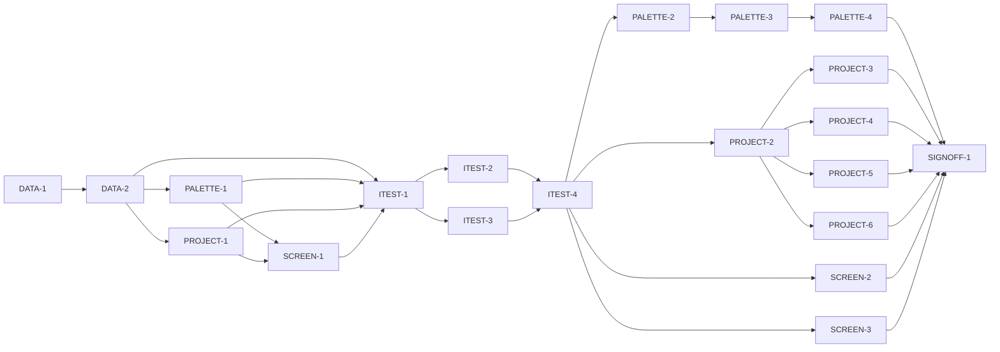

# Master Plan — Palette and projects (bs-06)

**Spec:** [bs-06-palette-and-projects.feature](../bs-06-palette-and-projects.feature)
**Status:** In progress — stage 3 (acceptance tests): ITEST-1 ✅ (harness + fixtures + smoke, 12/12 green). Next: ITEST-2 ∥ ITEST-3 (one pending test per AC + red baseline) → ITEST-4 test review (**G-2**).
**Architecture:** `docs/paint-color-app-solution-intent.md` (data layer "Local data store (on-device DB)" line 209; provenance tiers + D9 append-only evidence; D6 reviewed-dataset build artifact); wireframe `Paint Color Assistant.dc.html` (in `docs/Color blindness artist tool.zip`), Palette screen S1.R1, elements E30–E34.
**Code home:** /Users/matthew.quirk/Nuance · remote https://github.com/meatsquirk/Nuance · base `main` · extends the bs-01/04 foundation (same code home, confirmed by Matt across bs-01/02/03/04; this plan confirmed by Matt 2026-10-10)

> Branch point: bs-06 branches from `main` **after bs-04 is merged** (G-3). bs-04's code (RecipeController, PaletteSource/SampleSource seams, Paint, ConfusionCheck, Sample) currently lives only on `feat/bs-04-mixing-recipes` @ `28cbf04`; `main` still has the bs-01 recipes stub. Gap analysis below is against that bs-04 foundation.

## Gap analysis (against bs-04 `28cbf04`)

| AC | Exists today | Missing |
|---|---|---|
| AC-1 switch views | `buildApp` home-screen selection by entry marker; no Palette screen | Palette screen with a My-paints ↔ Projects view toggle (E31) |
| AC-2 paint identity + provenance | `Paint{id,name,medium,masstone,pigmentIndex?,opacity?}`; `ProvenanceTier` enum exists (on `Sample`, not `Paint`) | `brand`, `line`, `provenance` on `Paint`; paint-row rendering with a provenance badge |
| AC-3 provenance legend | `ProvenanceTier{measured,calculated,estimated,confirmed}` + `Provenance.label` | A legend widget explaining the four tiers with the spec's exact strings |
| AC-4 add paint from dataset | `PaletteSource`/`InMemoryPaletteSource` read-only seam (doc-comment names bs-06) | Shipped reviewed paint dataset asset + loader; write-side add-paint; dataset provenance preserved |
| AC-5 selected palette drives recipes | `RecipeController.selectPalette` + `_solve(…,palette)` already solve only against the selected palette; `PaletteSource` seam | Multiple named palettes surfaced on the Palette screen; selecting one on this screen re-points recipe search |
| AC-6 projects list summary | nothing | `Project` model (size, samples, recipes, last-edited); `ProjectSource`; projects-list rendering with counts |
| AC-7 open project note+photo | nothing | Project note + source-photo storage; open-project view |
| AC-8 note retained on reopen | nothing | Persistent note write/read round-trip |
| AC-9 confusion pair flagged | `DichromatConfusionCheck.confusable(a,b,profile)` (bs-03) + injected `CvdProfile` | Project-scoped pair iteration + a `confusionPair` flag surfaced in the project |
| AC-10 export PDF | nothing (no pdf/printing package) | PDF studio-sheet generation of samples + recipes; a produced-artifact observable |
| AC-11 vision-profile card | `CvdProfile{type,severity}` injected app-wide | A vision-profile card reading the estimate + routing to a bs-07 self-assessment entry (bs-07 not built) |

**No persistence exists at all.** `SampleSource` and `PaletteSource` are read-only in-memory seams whose own doc-comments nominate bs-06 to add the first on-device store; bs-06 introduces it (write-side) behind those same interfaces plus a new `ProjectSource`.

## Build order

| Stage | Phases |
|---|---|
| 1 Scaffold | DATA-1 |
| 2 Component shells | DATA-2, PALETTE-1, PROJECT-1, SCREEN-1 |
| 3 Acceptance tests | ITEST-1, ITEST-2, ITEST-3, ITEST-4 (test review, G-2) |
| 4 Behavior | PALETTE-2, PALETTE-3, PALETTE-4, PROJECT-2 *(enabler)*, PROJECT-3, PROJECT-4, PROJECT-5, PROJECT-6, SCREEN-2, SCREEN-3 |
| 5 Sign-off | SIGNOFF-1 |

## Acceptance criteria coverage

| AC | Scenario | Integration test (ITEST) | Behavior phases | Status |
|---|---|---|---|---|
| AC-1 | The painter switches between the My paints and Projects views | ITEST-2 `TestAC01_SwitchViews` | SCREEN-2 | ⬜ Todo |
| AC-2 | Each paint is listed with its identity and provenance badge | ITEST-2 `TestAC02_PaintIdentityProvenance` | PALETTE-3 | ⬜ Todo |
| AC-3 | The provenance legend explains the four confidence tiers | ITEST-2 `TestAC03_ProvenanceLegend` | PALETTE-3 | ⬜ Todo |
| AC-4 | The painter adds a paint by choosing from the shipped dataset | ITEST-2 `TestAC04_AddPaintFromDataset` | PALETTE-2 | ⬜ Todo |
| AC-5 | Selecting a palette makes recipes solve against it | ITEST-2 `TestAC05_SelectedPaletteDrivesRecipes` | PALETTE-4 | ⬜ Todo |
| AC-6 | The projects list shows each project's size, counts and last edit | ITEST-3 `TestAC06_ProjectsListSummary` | PROJECT-3 | ⬜ Todo |
| AC-7 | Opening a project shows its notes and source photo | ITEST-3 `TestAC07_OpenProjectNotePhoto` | PROJECT-4 | ⬜ Todo |
| AC-8 | A note kept with a project is retained when it is reopened | ITEST-3 `TestAC08_NoteRetainedOnReopen` | PROJECT-4 | ⬜ Todo |
| AC-9 | A confusable pair of saved samples is flagged within a project | ITEST-3 `TestAC09_ConfusionPairFlagged` | PROJECT-5 | ⬜ Todo |
| AC-10 | The painter exports a project as a PDF studio sheet | ITEST-3 `TestAC10_ExportPdfStudioSheet` | PROJECT-6 | ⬜ Todo |
| AC-11 | The vision-profile card shows the current estimate and opens the self-assessment | ITEST-2 `TestAC11_VisionCardEstimateAndOpen` | SCREEN-3 | ⬜ Todo |

*(PROJECT-2 is an enabler — no AC of its own; it makes the Givens of AC-6/7/8/9/10 real: create a project and attach samples, recipes, a note and a source photo through public flows.)*

## Design decisions

| # | Decision | Why |
|---|---|---|
| D-1 | First on-device persistent store added behind the existing read-only `PaletteSource`/`SampleSource` seams + a new `ProjectSource`; write-side (add/save/create/edit) added, recipes code untouched | Both seams' doc-comments nominate bs-06 for exactly this; keeps bs-04 solve code frozen (G-3 merge) |
| D-2 | Extend `Paint` with `brand`, `line`, `provenance` (`ProvenanceTier`) as **additive** fields with safe defaults; measured optical K/S data stays deferred | bs-06 needs identity + provenance badge (AC-2); defaults keep bs-04 value-equality + green suite |
| D-3 | Shipped **reviewed paint dataset** as a bundled read-only asset (like `assets/color/*.csv`) + a loader; painter adds only from it (no free-hand, per spec boundary) | SI D6 "reviewed build artifact, generated offline"; spec v1 boundary |
| D-4 | Reuse `DichromatConfusionCheck` + injected `CvdProfile` for project confusion-pairs by iterating a project's saved-sample pairs; no new CVD math | AC-9 is the bs-03 detector applied at project scope (G4/G5 graded against an independent reference) |
| D-5 | AC-5 reuses `RecipeController.selectPalette` + the `PaletteSource` seam; the Palette screen selection just re-points the active palette the existing solver already consumes | Behaviour already green in bs-04; bs-06 only surfaces palette selection on this screen |
| D-6 | PDF studio sheet via a project-local pdf package; acceptance tests assert a **produced-artifact signal** (`lastExport` on the project controller — bytes/path), not a real file on disk | Deterministic observation per sibling read-endpoint convention; infrastructure (file write) stays faked in tests |
| D-7 | E30 vision-profile card reads the injected `CvdProfile` and routes to a **bs-07 entry placeholder** (bs-07 unbuilt); the card never writes the profile | AC-11 is read + navigate only; avoids coupling bs-06 to unbuilt bs-07 |
| D-8 | Projects own saved samples + recipes + a note + a source photo; "create project and attach" is the PROJECT-2 **enabler** (no AC) | No spec scenario creates a project, yet AC-6/7/8/9/10 Givens need one — avoids a Given cycle |
| D-9 | Per-feature pending gate `integration_test/bs06/pending.dart` + `--dart-define=BS06_RUN_PENDING=true`, mirroring bs01–bs04 | Sibling convention; host env isn't inherited by the on-sim test process |
| D-10 | Source photo stored on-device as a file reference held by the project; tests assert presence/round-trip via the read endpoint, never pixel content | Photo pixels are out of scope for these ACs; keeps tests deterministic |

> D-1, D-3, D-6 add project-local dependencies (an on-device DB package; a pdf package) and pin the reviewed-dataset shape — gathered into **G-4** for owner confirmation before DATA-2/PALETTE-1.

## Acceptance integration test plan

Module plan: [modules/ITEST.md](modules/ITEST.md).

**Where it lives and how it runs:** `integration_test/palette_harness.dart` + `integration_test/palette_test.dart`, pending gate `integration_test/bs06/pending.dart`. Default run (pending skipped): `flutter test integration_test/palette_test.dart -d <booted-udid>`. Run-pending / red baseline: add `--dart-define=BS06_RUN_PENDING=true`. Single exclusive lane via the harness `with-lock` helper (widget/integration tests aren't parallel-safe in one process). **A booted sim udid is mandatory** — without `-d` the run executes zero tests and still exits 0 (false green; carried flake).
**Where assertions look:** the real app assembled through `buildApp(deps)` — rendered widget tree via keyed region finders, plus two new read endpoints (`PaletteReadEndpoint`, `ProjectReadEndpoint`) exposing live controller state for Thens the UI doesn't surface; AC-5 reuses `RecipeReadEndpoint`.
**What is real and what is faked:** everything real except infrastructure sinks — `FakeSpeech`/`FakeHaptics` (existing), a fake file sink for the source-photo + PDF export (no real disk I/O), and an in-memory-backed persistent store test double exercising the **same write-side interface** as production. No colour/ΔE/confusion math is faked (graded against an independent in-harness reference).

**Fixtures:**

| Fixture | Shape |
|---|---|
| `reviewedDataset` | ≥3 reviewed paints incl. "Titanium White" (Winsor & Newton, Artists' Oil, PW6, Measured) and "Ultramarine Blue"; each with brand/line/medium/pigment index + masstone + provenance tier. Used by AC-2, AC-4 |
| `twoPalettes` | "My paints" and "Travel set" with **disjoint** paint sets so a solve reveals which palette was used. Used by AC-5 |
| `harborProject` | Project "Harbor at Dusk": size 24×30 in, 6 saved samples (incl. "Mid Raw Umber" + "Ultramarine Shadow" on the painter's confusion line), 3 recipes, note "Keep the hull and wall values 2 steps apart.", a source photo. Built via PROJECT-2 flows. Used by AC-6/7/8/9/10 |
| `deutanModerate` / `deutanDichromat` | **Two** profiles (ITEST-1 amendment): `deutanModerate` = `CvdProfile(deutan, severity 0.6)` for AC-11's "deutan-type, moderate" estimate (also the suite default); `deutanDichromat` = full deutan for AC-9. One moderate profile cannot serve both — the shipped `DichromatConfusionCheck` fires only near full dichromacy (post-projection ΔE00 < 3.0, D-5), and AC-9's spec names only "the painter's confusion line" (no severity). Confirm at the G-2 review |

**Test catalogue:**

| AC | Given: built via public flows → checked by | When | Then: exact assertions | Rejects |
|---|---|---|---|---|
| AC-1 | Palette screen open showing My paints → assert My-paints region visible, Projects region absent | tap E31 selector to Projects | projects region shown, paints region gone → `find.byKey(ProjectsRegion.regionKey)` present AND `find.byKey(PaintListRegion.regionKey)` absent | a toggle that shows both, or a no-op |
| AC-2 | add "Titanium White" (W&N, Artists' Oil, PW6, Measured) from `reviewedDataset` via E32 flow → assert it is in `PaletteReadEndpoint.myPaints` with those fields *(precondition: add-paint → PALETTE-2)* | render the My-paints list | the row shows brand "Winsor & Newton", line "Artists' Oil", medium "Oil", pigment "PW6" AND a provenance badge "Measured" (not colour only) → exact text asserts on the paint row by key | a row showing only a colour swatch/name; a missing or wrong-tier badge |
| AC-3 | My-paints list shown with the provenance legend region present | render the legend | legend contains all four exact strings: "Measured", "Calculated", "Estimated — not yet verified", "Confirmed — you measured this" → four `find.textContaining` within the legend region | a legend missing a tier or using paraphrased labels |
| AC-4 | adding a paint to My paints (flow open) → assert the dataset picker lists "Ultramarine Blue" | choose "Ultramarine Blue" from the reviewed dataset | it is added to My paints with its **dataset provenance preserved** → `PaletteReadEndpoint.myPaints` contains it with the dataset's tier, not a default/blank | an add that drops provenance or invents a free-hand value |
| AC-5 | palettes "My paints" + "Travel set" (disjoint paints) loaded; a target set → assert `RecipeReadEndpoint.selectedPalette == "My paints"` and recipes use only My-paints paints | select "Travel set" as active | recipe search now solves only against Travel set → `RecipeReadEndpoint.selectedPalette == "Travel set"` AND every returned recipe's paints ⊆ Travel set | an impl ignoring selection (solves against all paints or stays on My paints) — disjoint palettes make this discriminate |
| AC-6 | `harborProject` created with size 24×30, 6 samples, 3 recipes, edited today via PROJECT-2 flows → assert those counts in `ProjectReadEndpoint.projects` *(precondition: create/attach → PROJECT-2)* | render the Projects list | the "Harbor at Dusk" row shows "24×30 in", "6 samples", "3 recipes", "edited today" → exact text on the project row | a row missing a count, or showing total/wrong counts (seed 6≠3 so a swap is caught) |
| AC-7 | `harborProject` has a note and a source photo attached via PROJECT-2 → assert note text + photo ref present in `ProjectReadEndpoint` | open "Harbor at Dusk" (E33) | the note text is shown AND the source photo is shown → note `find.textContaining` + a photo widget by key present | an open view that omits the note or the photo |
| AC-8 | note "Keep the hull and wall values 2 steps apart." saved on "Harbor at Dusk" via PROJECT-2 → assert stored | reopen "Harbor at Dusk" (navigate away, return) | the exact note string is shown after reopen → `find.text("Keep the hull and wall values 2 steps apart.")` | a note held only in memory/lost on reopen (control: a different project shows no note) |
| AC-9 | `harborProject` holds "Mid Raw Umber" + "Ultramarine Shadow" on the painter's confusion line (`deutanModerate`) via PROJECT-2 → assert both samples present AND an independent `DichromatConfusionCheck` says the pair is confusable | open "Harbor at Dusk" | the pair is flagged as a confusion pair to check by value → `ProjectReadEndpoint.confusionPairs` contains {Mid Raw Umber, Ultramarine Shadow} AND the flag text is rendered | an impl flagging nothing, flagging every pair, or using a fixed list (control: a clearly-distinct pair is **not** flagged) |
| AC-10 | `harborProject` opened (samples + recipes present) → assert opened in `ProjectReadEndpoint` | export the project to the device (E34) | a PDF studio sheet of the project's samples and recipes is produced → `ProjectReadEndpoint.lastExport` is a PDF whose content references each sample + each recipe (assert on the produced bytes/model, not a disk file) | an export producing nothing, a non-PDF, or a PDF omitting samples/recipes |
| AC-11 | `deutanModerate` injected; Palette screen open → assert vision-profile card present | choose "retake the self-assessment" on the card (E30) | the current estimate "deutan-type, moderate" is shown on the card AND the CVD self-assessment is opened → card text asserts the estimate AND navigation observed (route to the bs-07 entry) | a card showing no/wrong estimate, or a button that doesn't navigate |

**Red baseline** and **test augmentations:** tracked in [modules/ITEST.md](modules/ITEST.md).
Pre-seeded augmentations: AC-2's badge assertion is limited until PALETTE-3 renders the real tier (strengthened by PALETTE-3); AC-5's "⊆ Travel set" is limited until PALETTE-4 wires selection (strengthened by PALETTE-4); AC-9's non-flag control is limited until PROJECT-5 computes real pairs (strengthened by PROJECT-5); AC-10's content assertion is limited until PROJECT-6 produces a real PDF model (strengthened by PROJECT-6).

## Modules

| Module | Plan | Purpose | Depends on | Status |
|---|---|---|---|---|
| DATA | [modules/DATA.md](modules/DATA.md) | Scaffold + first on-device persistent store, wiring, source-photo storage | — | ✅ Done |
| PALETTE | [modules/PALETTE.md](modules/PALETTE.md) | Paints/palettes: schema, reviewed dataset, controller, add-from-dataset, selection → recipes | DATA | 🔄 In progress (PALETTE-1 ✅) |
| PROJECT | [modules/PROJECT.md](modules/PROJECT.md) | Projects: model, controller, list/open/note/photo, confusion flag, PDF export | DATA | 🔄 In progress (PROJECT-1 ✅) |
| SCREEN | [modules/SCREEN.md](modules/SCREEN.md) | Palette screen & regions, nav, read endpoints, view toggle, vision-profile card | PALETTE, PROJECT | 🔄 In progress (SCREEN-1 ✅) |
| ITEST | [modules/ITEST.md](modules/ITEST.md) | Acceptance integration suite: one pending test per AC, and its review | all shell phases | 🔄 In progress (ITEST-1 ✅) |

## Dependency graph

**Parallel windows:** shells PALETTE-1 ∥ PROJECT-1 (disjoint: `lib/palette/` vs `lib/projects/`), then SCREEN-1. After G-2: the PALETTE chain (PALETTE-2→3→4) ∥ the PROJECT chain (PROJECT-2→3/4/5/6) ∥ SCREEN-2 ∥ SCREEN-3. **Merge-risky:** PALETTE-1 edits `lib/domain/paint.dart` (bs-04-owned) and `lib/recipes/palette_source.dart` (bs-04 seam) — serialize against any concurrent bs-04/bs-05 work on those files. ITEST-2 (palette ACs) ∥ ITEST-3 (project ACs) — disjoint test files.

## Open gates

| Gate | Kind | Decision needed | Blocks | Status |
|---|---|---|---|---|
| G-1 | decision | Approve the spec (record the approval as its first line, replacing the "Draft: awaiting owner approval" banner) | DATA-1 | ✅ Resolved 2026-10-10: spec approved as-is; `.feature` first line stamped "Approved 2026-10-10 by Matt Quirk" — Matt Quirk |
| G-2 | decision | Approve the acceptance tests (ITEST-4's packet) | every behavior phase | Open |
| G-3 | dependency | bs-04 merged to `main` (bs-06 branches from `main` and needs bs-04 code) — closed by merging `feat/bs-04-mixing-recipes` → `main` | DATA-1 | ✅ Resolved 2026-10-10: `feat/bs-04-mixing-recipes` (@ `28cbf04`, signed off) merged to `main` @ `2684ac6`; bs-04 foundation now present on `main`. DATA-1 can branch from `main` |
| G-4 | decision | Pin bs-06 data contracts + confirm new project-local deps: (a) on-device DB package (D-1), (b) pdf package (D-6), (c) reviewed paint-dataset shape & provenance defaults (D-3), (d) project "size" field semantics (free text "24×30 in" vs structured units) | DATA-2, PALETTE-1 | ✅ Resolved 2026-10-10: (a) **drift** (SQLite, typed); (b) **pdf + printing** (added by PROJECT-6 for AC-10); (c) reviewed dataset = CSV asset (`assets/color/*.csv` convention) with default provenance tier **measured**; (d) project size = **free text** (e.g. `24×30 in`) — Matt Quirk |

Resolved: `✅ Resolved <date time>: <decision, one line> — <who>`.

## Known flakes

| Test | Symptom | Rate (runs) | Measured at | Owner | Status |
|---|---|---|---|---|---|
| coverage_gate (const-ctor line) | Carried from bs-01/03/04: `flutter test --coverage` can record a const-folded constructor line in `lib/**` as uncovered, so the gate may FAIL on a file the phase never touched | not quantified | bs-01 `88c5add` | any phase running the coverage gate | Open — re-run `flutter test --coverage` once; green on re-run ⇒ ignore (untouched pre-existing line) |
| palette integration (no `-d <udid>`) | Carried from bs-04: `flutter test integration_test/…` with no booted device runs zero tests and still exits 0 (false green) | — | bs-04 | every phase running the acceptance suite | Open — always pass `-d <booted-udid>` |

## Session log

| # | Phase | Target | Status | Tokens | Time | Notes |
|---|---|---|---|---|---|---|
| 1 | DATA-1 | scaffold: branch from main, baseline, gate sanity, BS06_RUN_PENDING + bs06/pending.dart + runner target | ✅ Done | 4,537,759 | 11m 44s | branch @ `bfd4289`; unit 579 green; gate proven both ways; 11 ACs pending |
| 2 | DATA-2 | shell: on-device persistent store + wiring into AppDependencies/buildApp + source-photo storage seam | ✅ Done | 7,998,582 | 17m 03s (18m 14s) | drift store behind `PersistentStore`; `SourcePhotoStore`; seams on AppDependencies; unit 617 green; coverage 100% on 5 touched files; G-4 resolved |
| 3 | PALETTE-1 | shell: extend Paint (brand/line/provenance); PaletteController + persistent PaletteSource; reviewed dataset + loader; PaletteReadEndpoint | ✅ Done | 8,841,030 | 14m 46s | Paint +brand/line/provenance (default measured); PersistentPaletteSource; kReviewedPaints + loader; unit 647 green; coverage 100% on 10 touched; bs-04 suite green on-sim; prod wiring deferred to SCREEN-1 |
| 4 | PROJECT-1 | shell: Project model + ProjectSource (persistent) + ProjectController + persistent SampleSource write-side + ProjectReadEndpoint | ✅ Done | 6,635,157 | 11m 41s | both shells done; SCREEN-1 now startable |
| 5 | SCREEN-1 | shell: Palette screen + keyed regions + E30–E34 controls + nav + mount read endpoints | ✅ Done | 12,251,452 | 17m 44s | carried deferred prod store wiring (async main + path_provider + sqlite3_flutter_libs); unit 688 green (+15); coverage 100% on 24 touched; both read endpoints mounted; opens on Capture (paletteEntry null) |
| 6 | ITEST-1 | acceptance-tests: harness over wired shells, fixtures, pending gate (all ACs pending), smoke test | ✅ Done | 11,716,367 | 29m 01s | harness + 2 smoke + 6 fixture guards; 12/12 green on sim; graded 15×A |
| 7 | ITEST-2 | acceptance-tests: AC-1,2,3,4,5,11 (pending) + red baseline | ⬜ Next | | | ∥ ITEST-3 |
| 8 | ITEST-3 | acceptance-tests: AC-6,7,8,9,10 (pending) + red baseline | ⬜ Todo | | | ∥ ITEST-2 |
| 9 | ITEST-4 | test-review: packet; G-2 | ⬜ Todo | | | |
| 10 | PALETTE-2 | AC-4 add paint from reviewed dataset | ⬜ Todo | | | |
| 11 | PALETTE-3 | AC-2 + AC-3 paint identity/provenance badge + legend | ⬜ Todo | | | after PALETTE-2 |
| 12 | PALETTE-4 | AC-5 selected palette drives recipes | ⬜ Todo | | | |
| 13 | PROJECT-2 | enabler: create project + attach samples/recipes/note/photo | ⬜ Todo | | | |
| 14 | PROJECT-3 | AC-6 projects list size/counts/last-edit | ⬜ Todo | | | after PROJECT-2 |
| 15 | PROJECT-4 | AC-7 + AC-8 open note+photo; note retained on reopen | ⬜ Todo | | | after PROJECT-2 |
| 16 | PROJECT-5 | AC-9 confusion pair flagged within project | ⬜ Todo | | | after PROJECT-2 |
| 17 | PROJECT-6 | AC-10 export PDF studio sheet | ⬜ Todo | | | after PROJECT-2 |
| 18 | SCREEN-2 | AC-1 switch My paints / Projects views | ⬜ Todo | | | |
| 19 | SCREEN-3 | AC-11 vision-profile card estimate + opens self-assessment | ⬜ Todo | | | |
| 20 | SIGNOFF-1 | sign-off: packet + summary page + manual approval | ⬜ Todo | | | |

*Tokens* / *Time* = the phase totals from the *Token usage* ledger (Time = active, wall in brackets), filled when the row is marked done.

## Next phase

**ITEST-1 ✅ done** (acceptance-tests, harness): `palette_harness.dart` (Given/When/Then vocabulary over the SCREEN-1 shells via `buildApp` + a `PaletteEntry`; the four fixtures; an independent deutan confusion reference reused from bs-03; `givenPalette` seeds persistent sources over an in-memory store via their save flows), `fakes/fake_file_sink.dart` (recording `SourcePhotoStore`), and in `palette_test.dart` 2 never-pending smoke tests + 6 fixture guards (the DATA-1 pending-gate guards stay). Fixture amendment: two vision profiles (`deutanModerate` 0.6 for AC-11, `deutanDichromat` full for AC-9) — see the Fixtures table. Analyze clean; unit 688 green (no `lib/` touched); acceptance 12/12 green on the iPhone-17 sim via the verify lock; graded **15×A, 0×B — PASS**.

Startable now (∥, disjoint groups in the same `palette_test.dart` but separable by AC set):
- **ITEST-2** — pending `acTestWidgets` for AC-1,2,3,4,5,11 + run-pending red baseline + grade.
- **ITEST-3** — pending `acTestWidgets` for AC-6,7,8,9,10 + red baseline + grade. (AC-9 injects `deutanDichromat`; builds project Givens through PROJECT-2 flows with preconditions naming PROJECT-2.)
- Then **ITEST-4** test review assembles the packet and opens **G-2**.

All behavior phases (PALETTE-2→4, PROJECT-2→6, SCREEN-2/3) remain blocked on **G-2** (approve the acceptance tests at ITEST-4).

## Token usage

<!-- One row per session, appended as that session's last edit (SKILL.md § Token usage). -->

| Phase / activity | Session | Start | End | Wall | Active | Model(s) | Input | Cache write | Cache read | Output | Total | Outcome |
|---|---|---|---|---|---|---|---|---|---|---|---|---|
| PLAN | — | — | — | — | — | claude-opus-4-8 | — | — | — | — | — | plan written |
| PLAN | 6be62965 | 2026-10-10 06:10 EDT | 06:55 | 45m 09s | 15m 59s | claude-opus-4-8 | 68 | 204,942 | 2,521,965 | 60,117 | 2,787,092 | plan written |
| GATE-DECISION | 5f1f02a8 | 2026-10-10 07:28 EDT | 13:58 | 6h 29m | 10m 45s | claude-opus-4-8 | 78 | 183,442 | 2,815,515 | 31,337 | 3,030,372 | G-1 approved (spec approved as-is by Matt Quirk; .feature stamped) + G-3 resolved (bs-04 merged to main @ 2684ac6; DATA-1 startable) |
| DATA-1 | 3816a462 | 2026-10-10 14:13 EDT | 14:25 | 11m 44s | 11m 44s | claude-opus-4-8 | 78 | 122,747 | 4,374,719 | 40,215 | 4,537,759 | scaffold: branch @ bfd4289; baseline analyze clean / unit 579 / coverage gate PASS; bs06/pending.dart seeded 11 ACs + palette_test.dart runner (3 guards green on sim); gate proven fail-on-gap + pass-on-clean; no product code |
| DATA-2 | ad757ac6 | 2026-10-10 14:47 EDT | 15:05 | 18m 14s | 17m 03s | claude-opus-4-8 | 128 | 132,804 | 7,802,103 | 63,547 | 7,998,582 | shell: on-device persistent store (drift) + source-photo store behind AppDependencies seams; G-4 resolved; unit+coverage gate PASS (617 tests, 100% on 5 touched files) |
| PALETTE-1 | 7fe936a4 | 2026-10-10 15:21 EDT | 15:36 | 14m 46s | 14m 46s | claude-opus-4-8 | 142 | 144,495 | 8,637,439 | 58,954 | 8,841,030 | shell: Paint +brand/line/provenance (default measured, additive); PaletteController + PaletteReadEndpoint; PersistentPaletteSource over DATA store; reviewed CSV dataset + parseReviewedPaints loader + kReviewedPaints; unit 647 green (+30); coverage 100% on 10 touched lib files; bs-04 acceptance suite 24/24 green on-sim; prod store wiring deferred to SCREEN-1 |
| PROJECT-1 | 0ac74fa0 | 2026-10-10 15:41 EDT | 15:52 | 11m 41s | 11m 41s | claude-opus-4-8 | 98 | 149,926 | 6,432,815 | 52,318 | 6,635,157 | shell: Project model + ProjectSource/PersistentProjectSource + ProjectController + ProjectReadEndpoint (lib/projects/); PersistentSampleSource write-side + public sample JSON mapping (lib/compare/sample_source.dart); unit 673 green (+26); coverage 100% on all touched files; no buildApp/main/pubspec change |
| SCREEN-1 | 71851d57 | 2026-10-10 16:20 EDT | 16:37 | 17m 44s | 17m 44s | claude-opus-4-8 | 166 | 175,618 | 12,002,233 | 73,435 | 12,251,452 | shell: PaletteScreen + keyed region widgets (E30-E34 inert) + PaletteHomeScreen mounting PaletteReadEndpoint/ProjectReadEndpoint; PaletteEntry marker + projectSource on AppDependencies + buildApp branch; toSelfAssessment() route + bs-07 placeholder; deferred prod store wiring in main.dart (async main + path_provider + sqlite3_flutter_libs, file-backed DriftPersistentStore + FileSourcePhotoStore, loaded persistent sources); unit 688 green (+15); coverage 100% on 24 touched; app still opens on Capture |
| ITEST-1 | caea7679 | 2026-10-10 17:34 EDT | 18:03 | 29m 01s | 29m 01s | claude-opus-4-8 | 150 | 328,281 | 11,292,734 | 95,202 | 11,716,367 | harness over wired shells: palette_harness.dart (G/W/T vocabulary + 4 fixtures + independent deutan reference + givenPalette) + fakes/fake_file_sink.dart + 2 smoke + 6 fixture guards; analyze clean, unit 688 green, acceptance 12/12 on sim via verify lock; graded 15xA 0xB PASS; fixture amendment: two profiles (deutanModerate 0.6 AC-11, deutanDichromat full AC-9) |
| **Feature total** |  | **2026-10-10 06:10 EDT** | **2026-10-10 18:03** | **8h 57m** | **2h 08m** |  | **908** | **1,442,255** | **55,879,523** | **475,125** | **57,797,811** |  |

## Sign-off

| Round | Packet | At code | Grades | Decision |
|---|---|---|---|---|
| 1 | [signoff/round-1.md](signoff/round-1.md) | `<commit>` | — | ⬜ Not yet reached |
