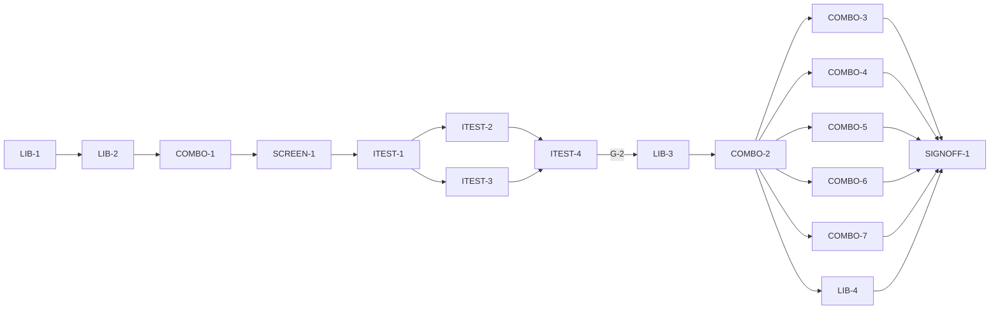

# Master Plan — Colour-combination suggestions (bs-15)

**Spec:** [bs-15-color-combinations.feature](../bs-15-color-combinations.feature)
**Status:** Not started — next LIB-1 (scaffold)
**Architecture:** [solution intent](../../docs/paint-color-app-solution-intent.md) (*Colour-combination suggestions (Sanzo Wada reference set)*; D11; D9 provenance; SI accessibility — meaning in numbers/words/sound; SI Phase 3 breadth) · source dataset [docs/ColorCombinations/sanzo-wada-swatch-catalog.html](../../docs/ColorCombinations/sanzo-wada-swatch-catalog.html) (159 colours + 348 combinations, MIT) · [scope](../../docs/paint-color-app-scope.md)
**Code home:** `/Users/matthew.quirk/Nuance` · remote `https://github.com/meatsquirk/Nuance` · base `main` @ `ac3bd09` · **extends** the bs-01 foundation (same code home, confirmed by Matt across bs-01/02/03/04)

> Combinations is a Phase-3 *breadth* increment that builds on the bs-01 foundation only. It adds a shipped,
> bounded **Wada reference set** (`assets/combinations/sanzo_wada.json`, extracted from the reviewed catalogue),
> a **`CombinationLibrary`** behind an interface (suggest-by-ΔE00 / browse / search), a **`CombinationController`**
> + Combinations screen behind a new `AppRouter.toCombinations` route, and reuses the accessibility spine
> (`ColorScience` L/C/h + warm/cool, `Speech`, `ConfusionCheck`) to read, speak and confusion-flag a combination.
> **bs-02/bs-03 screens are not prerequisites** (anchor = a saved `Sample` or an owned `Paint`), and **bs-06 is
> not a prerequisite** (save-to-project goes through an injected `ProjectSink`). Only the **owned-paint anchor**
> (AC-2) needs bs-04's `Paint`/`PaintPalette` on `main` (**G-3**); every other AC is unblocked.

## Gap analysis (against `main` @ `ac3bd09`)

The foundation supplies the Flutter project, `Sample`/`ColorCoordinates`/`Provenance`, `SampleSource`+
`InMemorySampleSource` (`lib/compare/sample_source.dart`), the shipped `deltaE00` (CIEDE2000,
`lib/compare/difference.dart`) + `_verdictBand`, `ColorScience` L/C/h + ISCC-NBS naming + warm/cool
(`lib/color_science/…`, `words.dart`), `ConfusionCheck`+`CvdProfile` (`lib/a11y/cvd/…`), `Speech`+`FakeSpeech`
(`lib/a11y/speech.dart`), `buildApp`/`AppScope`/`AppDependencies` (per-feature home entries), `AppRouter`
(`lib/app/router.dart`), the coverage gate (`tool/coverage_gate.dart`) and `integration_test`. **No Wada
dataset, no `WadaColor`/`ColorCombination`/`CombinationLibrary`, no suggestion/browse/search query, no
Combinations screen, no `ProjectSink` and no reference-provenance label exist** — all net-new. `Paint`/
`PaintPalette` are **not yet on `main`** (bs-04 shell work) — the owned-paint anchor (AC-2) waits on them (G-3).

| AC | Scenario | Exists today | Missing |
|---|---|---|---|
| AC-1 | Anchor on a saved sample → suggestions | `Sample`; `SampleSource` | Combinations screen + anchor selector; wire a saved sample as the anchor into the suggest query |
| AC-2 | Anchor on an owned paint → suggestions | — (needs `Paint`/`PaintPalette`, G-3) | the owned-paint anchor path; a `PaletteSource` seam to list owned paints |
| AC-3 | Every suggestion is one of the 348 shipped combinations | — | the shipped Wada asset + loader; the suggest query drawing only from it |
| AC-4 | Rank by how closely a combination contains the anchor | `deltaE00` | nearest-colour ΔE00 ranking + a near-match inclusion threshold (G-4) |
| AC-5 | Each colour named with L/C/h + warm/cool, not a swatch alone | `ColorScience`, `words.dart`, ISCC-NBS | per-colour readout row binding the dictionary name + derived L/C/h + warm/cool word |
| AC-6 | Speak a combination | `Speech`+`FakeSpeech` | build the combination utterance; speak control |
| AC-7 | A confusable pair within a combination is flagged | `ConfusionCheck`+`CvdProfile` | run the check over each pair of a combination's colours → a flag + its rendering |
| AC-8 | A combination with no confusable pair is not flagged | `ConfusionCheck` | the discriminating control (flag only when a pair is confusable) |
| AC-9 | Browse combinations by number of colours | — | size filter (2/3/4) over the library |
| AC-10 | Search a colour and see combinations that use it | — | colour search (name/hue) → its combinations |
| AC-11 | A combination carries its Wada reference provenance | `Provenance` (paint tiers) | a distinct `CombinationReference` marker + its rendering, separate from the D9 paint tiers |
| AC-12 | Save a combination to a project | — | injected `ProjectSink`/`InMemoryProjectSink`; save action retaining colours + reference provenance |

## Build order

| Stage | Phases |
|---|---|
| 1 Scaffold | LIB-1 |
| 2 Component shells | LIB-2, COMBO-1, SCREEN-1 |
| 3 Acceptance tests | ITEST-1, ITEST-2, ITEST-3, ITEST-4 (test review, G-2) |
| 4 Behavior | LIB-3, COMBO-2, COMBO-4, COMBO-5, COMBO-6, COMBO-7, LIB-4, COMBO-3 (enabler-gated by G-3) |
| 5 Sign-off | SIGNOFF-1 |

## Acceptance criteria coverage

| AC | Scenario | Integration test (ITEST) | Behavior phases | Status |
|---|---|---|---|---|
| AC-1 | Anchoring on a saved sample suggests combinations that contain it | ITEST-2 `TestAC01_SampleAnchor` | COMBO-2 | ⬜ Todo |
| AC-2 | Anchoring on an owned paint suggests combinations that contain it | ITEST-2 `TestAC02_PaintAnchor` | COMBO-3 | ⬜ Todo |
| AC-3 | Every suggested combination is one of the 348 dictionary combinations | ITEST-3 `TestAC03_BoundedToDictionary` | LIB-3 | ⬜ Todo |
| AC-4 | A combination whose nearest colour is closer to the anchor ranks higher | ITEST-3 `TestAC04_RankByCloseness` | LIB-3 | ⬜ Todo |
| AC-5 | Each colour shows its name, L/C/h and a warm/cool word | ITEST-2 `TestAC05_NamedWithValues` | COMBO-4 | ⬜ Todo |
| AC-6 | The painter hears a combination spoken | ITEST-2 `TestAC06_SpeakCombination` | COMBO-5 | ⬜ Todo |
| AC-7 | A combination holding a confusable pair is flagged | ITEST-3 `TestAC07_ConfusionFlagged` | COMBO-6 | ⬜ Todo |
| AC-8 | A combination with no confusable pair is not flagged | ITEST-3 `TestAC08_NoConfusionNotFlagged` | COMBO-6 | ⬜ Todo |
| AC-9 | The painter browses combinations by the number of colours | ITEST-3 `TestAC09_BrowseBySize` | LIB-4 | ⬜ Todo |
| AC-10 | The painter searches a colour and sees the combinations that use it | ITEST-3 `TestAC10_SearchColour` | LIB-4 | ⬜ Todo |
| AC-11 | A combination carries its Wada reference provenance | ITEST-2 `TestAC11_ReferenceProvenance` | COMBO-4 | ⬜ Todo |
| AC-12 | A suggested combination is saved to a project and kept | ITEST-2 `TestAC12_SaveToProject` | COMBO-7 | ⬜ Todo |

## Design decisions

| # | Decision | Why |
|---|---|---|
| D-1 | bs-15 **extends** the bs-01 foundation and branches from `main` @ `ac3bd09`. Reuses `Sample`/`ColorCoordinates`, `SampleSource`, `deltaE00`, `ColorScience`+`words.dart`+ISCC-NBS, `ConfusionCheck`+`CvdProfile`, `Speech`+`FakeSpeech`, `buildApp`/`AppScope`/`AppDependencies`, `AppRouter`, coverage gate, `integration_test`. **bs-02/bs-03 screens are not prerequisites** | keeps combinations on its own critical path; the anchor is a *saved* sample or an owned paint, not a fresh capture |
| D-2 | The Wada dictionary ships as a **read-only offline asset** `assets/combinations/sanzo_wada.json`, extracted at **LIB-2** from the reviewed `docs/ColorCombinations/sanzo-wada-swatch-catalog.html` `DATA` block: 159 colours (name, CIELAB, hex, group 0–5) + 348 combinations (ordered colour-index lists) + the 6 group labels, plus the MIT licence/attribution. Parallel to `assets/color/*.csv`. **No runtime generation** (AC-3) | SI D11: a bounded, attributable, offline, MIT-licensed source; honest provenance forbids inventing combinations |
| D-3 | `WadaColor` = name + CIELAB `ColorCoordinates` + hex + group; `ColorCombination` = id + size + ordered `List<WadaColor>`. Value-equal, `const`-friendly. A combination is an **aesthetic reference**, not a `Sample`/`Paint` | the atoms the library, readout and confusion check operate over; keeping them distinct from `Sample`/`Paint` keeps the reference/measured provenance split (D-8) honest |
| D-4 | A **`CombinationLibrary`** interface (like `ColorScience`/`MixingEngine`): `suggestFor(anchor)` (ranked), `search(query)`, `browse(size)`, `all()`. The v1 impl is asset-backed; tests inject a small fixture library | one seam; swappable loader; deterministic fixtures for ranking/confusion |
| D-5 | **Ranking** (AC-4): a combination's distance to the anchor = **min `deltaE00` over its colours** (its nearest colour); suggestions sorted ascending. A **near-match inclusion threshold** (AC-1/AC-2 "within a small ΔE00") bounds the list. Threshold value → **G-4** | SI "relate by ΔE00"; nearest-colour is the natural "contains this colour" measure; reuses the one tested ΔE basis |
| D-6 | The **anchor** is a `CombinationAnchor` = `ColorCoordinates` + a display label, built from a saved `Sample` (AC-1, via `SampleSource` — unblocked) or an owned `Paint`'s masstone (AC-2, via bs-04 `PaintPalette`/`PaletteSource` — **G-3**). The query is source-agnostic | one query, two sources; isolates the only bs-04 dependency to AC-2 |
| D-7 | **Per-colour readout** (AC-5) reuses `ColorScience` for L/C/h and the warm/cool `words.dart` model; the dictionary's **historical name** is the primary name (ISCC-NBS available as the plain-language cross-check). No new colour math | SI accessibility; one colour-math library across the app |
| D-8 | **Reference provenance** (AC-11): a combination carries a distinct `CombinationReference` marker ("Sanzo Wada — *A Dictionary of Color Combinations*"), rendered **separately** from the D9 paint tiers (Measured/Calculated/Estimated/Confirmed), which it must not borrow. Label text → **G-4** | SI D9: a reference is not a measured paint value; the UI must never conflate them |
| D-9 | **Confusion flagging** (AC-7/8) runs `ConfusionCheck` over each unordered pair of a combination's colours against the injected `CvdProfile`; flag the combination when any pair is confusable. **Control** (AC-8): a combination with no confusable pair is not flagged. A **default `CvdProfile`** is injected for v1 (**bs-07** self-assessment sets it later); default acceptability → **G-4** | SI confusion warnings; reuses the existing detector; the control proves the flag discriminates |
| D-10 | **Save to a project** (AC-12) writes through an injected `ProjectSink`/`InMemoryProjectSink` seam (parallel to bs-04's injected `PaletteSource`). **bs-06** supplies the persistent project store behind the same seam later; **bs-06 is not a prerequisite**. The saved record keeps the combination's colours + its `CombinationReference` | keeps bs-15 independent of persistence; the seam is the bs-06 integration point |
| D-11 | A `buildApp` **combinations entry** (`combinationsEntry` → `CombinationsHomeScreen` owning a `CombinationController` over `sampleSource`/(`paletteSource`)/`combinationLibrary`/`confusionCheck`/`cvdProfile`/`speech`/`projectSink`/`router`, wrapped in a `CombinationReadEndpoint`), behind a new `AppRouter.toCombinations` route — symmetric to bs-02/03/04 entries | one production assembly entry per feature; the read endpoint lets acceptance observe anchor/suggestions/selection/flags |
| D-12 | **Acceptance** drives the real assembled app via `buildApp` with the combinations entry; real library/query/`ColorScience`/`deltaE00`/`ConfusionCheck`/controller/screen/routing. Faked (infrastructure only): `FakeSpeech`; a small **fixture `CombinationLibrary`** (a handful of real-shape colours/combinations) so ranking/confusion cases are deterministic — the data is faked, the math is not. ΔE00 is graded against an independent in-harness CIEDE2000 (`referenceDeltaE00`), and AC-3's "one of 348" / AC-9 counts load the **real shipped asset** | matches bs-03/bs-04 D-13: real math, infra-only fakes, an independent ΔE reference, real data where the AC is about the real data |

## Acceptance integration test plan

Module plan: [modules/ITEST.md](modules/ITEST.md).

**Where it lives and how it runs:** `integration_test/combinations_test.dart` (Flutter `integration_test`),
harness `integration_test/combinations_harness.dart`, pending gate `integration_test/bs15/pending.dart`.
Default: `flutter test integration_test/combinations_test.dart -d <udid>` (pending ACs skipped — a device/sim
udid is **required**, or the run is a false green). Run-pending: add
`--dart-define=BS15_RUN_PENDING=true`. Single exclusive lane (widget tests aren't parallel-safe in a process) —
`coord.sh with-lock` in parallel sessions.
**Where assertions look:** the rendered widget tree via `WidgetTester` (anchor selector, the suggestion list,
a combination's per-colour rows with name + L/C/h + warm/cool, the confusion flag, the reference-provenance
label, the browse/search controls, the speak + save controls); the `CombinationController` **read endpoint**
(`CombinationReadEndpoint`: the anchor, the ordered suggestions, the selected combination, each combination's
confusion flags, the browse/search results, the last saved record); the `FakeSpeech` utterance log (AC-6);
the injected `InMemoryProjectSink` (AC-12).
**What is real and what is faked:** the whole app assembled through `buildApp(deps)` with the combinations
entry (D-11); the `CombinationLibrary` query (suggest/rank/browse/search), `ColorScience`, `deltaE00`,
`ConfusionCheck`, the controller, the screen and routing are real. Faked (infrastructure only): `FakeSpeech`;
a deterministic fixture `CombinationLibrary` for the ranking/confusion cases (real-shape data). No colour,
ΔE00 or confusion math is faked; ΔE00 is graded against the harness's independent `referenceDeltaE00`; AC-3
and AC-9 counts load the real shipped `sanzo_wada.json`.

**Fixtures:**

| Fixture | Shape |
|---|---|
| `SHIPPED_DICTIONARY` | the real `assets/combinations/sanzo_wada.json` loaded by the asset-backed library — 159 colours, 348 combinations (120 of size 2, 120 of size 3, 108 of size 4). Drives AC-3 (membership + counts) and AC-9 (size counts) |
| `FIXTURE_LIBRARY` | a small injected `CombinationLibrary`: ~6 `WadaColor`s + ~4 `ColorCombination`s with **known ΔE00 relationships** to the anchors, incl. one combination holding a deutan-confusable pair and one holding none. Drives AC-4, AC-7, AC-8, AC-10 (deterministic) |
| `SAMPLE_STUDIO_BLUE` | saved "Studio Blue", CIELAB from L 35 / C 38 / h 246° ≈ (35, −15.5, −34.7) — a near-match to the dictionary's "Helvetia Blue". The primary anchor. Drives AC-1, AC-5, AC-6, AC-11, AC-12 |
| `PAINT_ULTRAMARINE` | an owned `Paint` "Ultramarine Blue", masstone L 30 / C 44 / h 290° ≈ (30, 15.0, −41.3), in an injected `PaletteSource`. **Owned-paint anchor control.** Drives AC-2 (G-3) |
| `PROFILE_DEUTAN_MOD` | an injected `CvdProfile` — deutan-type, moderate. Drives AC-7, AC-8 |
| `PROJECT_HARBOUR` | an opened project "Harbour Dusk" in the injected `InMemoryProjectSink`. Drives AC-12 |
| `referenceDeltaE00` | an **independent** in-harness CIEDE2000 (Sharma–Wu–Dalal), so AC-4's ordering is checked against it, not the product `deltaE00` |

**Test catalogue:**

| AC | Given: built via public flows → checked by | When | Then: exact assertions (negative Thens: after <settle point>) | Rejects |
|---|---|---|---|---|
| AC-1 | Open Combinations, `SampleSource`=`[SAMPLE_STUDIO_BLUE,…]`, `FIXTURE_LIBRARY` → assert anchor null (endpoint) | choose "Studio Blue" as the anchor | `state.anchor` = Studio Blue **and** `state.suggestions` non-empty, each containing a colour with `referenceDeltaE00(colour, anchor) ≤ threshold` (rendered in the list) | anchor not set; suggestions ignore the anchor; a suggestion with no near colour |
| AC-2 | Open Combinations, injected `PaletteSource` with `PAINT_ULTRAMARINE`, `FIXTURE_LIBRARY` → assert anchor null | choose the owned paint "Ultramarine Blue" as the anchor | `state.anchor` = Ultramarine masstone (label "Ultramarine Blue") **and** `state.suggestions` each contain a colour within threshold of the masstone | paint anchor unsupported; anchors on the wrong coordinates; (control for the sample path) |
| AC-3 | `SHIPPED_DICTIONARY` real asset; any anchor → assert library loaded (348 combinations, 159 colours) | suggestions are produced | **every** suggestion's `combination.id` is one of the 348 shipped ids **and** its colours are shipped colours; counts: 348 total (120/120/108), 159 colours | a generated/altered combination; a colour not in the set; wrong counts |
| AC-4 | `FIXTURE_LIBRARY` with combination A (nearest colour 3 ΔE00) and B (nearest 11 ΔE00) from the anchor → assert both present | the suggestions are ordered | A precedes B in `state.suggestions`; ordering key = min `referenceDeltaE00` over each combination's colours (ascending) | ordered by id / size; B before A; ordering ignores the nearest colour |
| AC-5 | a suggested combination containing "Raw Sienna" (anchor set) → assert the combination shown | the combination is shown | the "Raw Sienna" row renders its name **and** its L, C and h (from `ColorScience`) **and** a warm/cool word (from `words.dart`); it is **not** a bare swatch | name only / swatch only; missing L/C/h; missing warm/cool word |
| AC-6 | a suggested combination of 3 named colours shown; `FakeSpeech` empty → assert a combination selected | ask to speak the combination | `FakeSpeech` has exactly one utterance naming the combination **and** stating each colour's name with its L, C and h | speaks nothing; omits colour names or L/C/h; multiple utterances |
| AC-7 | `PROFILE_DEUTAN_MOD`; a suggested combination holding two colours on the deutan confusion line (from `FIXTURE_LIBRARY`) → assert the pair is `ConfusionCheck`-confusable | the combination is shown | the pair is flagged "look identical to you though clearly different to normal vision" (`confusionFlags` non-empty + rendered) | never-flag; flag missing in render; flags the wrong pair |
| AC-8 | `PROFILE_DEUTAN_MOD`; a suggested combination holding no confusable pair (`FIXTURE_LIBRARY`) → assert no pair confusable | the combination is shown | **no** confusion pair is flagged (`confusionFlags` empty; no flag rendered) (after the detail settles) | always-flag (this fails); a spurious flag |
| AC-9 | `SHIPPED_DICTIONARY`; browsing → assert all sizes present | filter to combinations of three colours | `state.browseResults` are **exactly** the size-3 combinations (count 120); none of size 2 or 4 | returns all sizes; wrong size; empty |
| AC-10 | `FIXTURE_LIBRARY` (or `SHIPPED_DICTIONARY`) with "Sea Green" used in known combinations → assert "Sea Green" present | search for "Sea Green" | "Sea Green" is found **and** `state.searchResults` are exactly the combinations whose colours include it | not found; returns unrelated combinations; ignores the query |
| AC-11 | a suggested combination (anchor set) → assert combination shown | its provenance is shown | the combination renders a **Wada reference** label (names Sanzo Wada / the dictionary) **and** renders **none** of "Measured"/"Calculated"/"Estimated"/"Confirmed" | labelled with a paint tier; no reference label; blank |
| AC-12 | `PROJECT_HARBOUR` opened; a suggested combination selected; `InMemoryProjectSink` empty → assert project open, sink empty | save the combination to "Harbour Dusk" | the sink has exactly one record under "Harbour Dusk" holding the combination's colours **and** its `CombinationReference` provenance | saves nothing; drops colours or provenance; saves to the wrong project |

**Red baseline** and **test augmentations:** tracked in [modules/ITEST.md](modules/ITEST.md).
Pre-seeded augmentations: `TestAC04` ranking is *limited* at write time until a second comparator combination
exists — covered by `FIXTURE_LIBRARY` holding both A and B, so no behavior-phase augmentation is needed.
`TestAC08`'s discriminating control is an in-fixture non-confusable combination (not an augmentation).
`TestAC03`/`TestAC09` assert against the **real** shipped asset so they cannot pass on a stub library.

## Modules

| Module | Plan | Purpose | Depends on | Status |
|---|---|---|---|---|
| LIB | [modules/LIB.md](modules/LIB.md) | The Wada reference library: the shipped `sanzo_wada.json` asset + loader, `WadaColor`/`ColorCombination`, the `CombinationLibrary` interface, and the suggest-by-ΔE00 / browse / search query | bs-01 color-science (`deltaE00`, `ColorCoordinates`) | ⬜ Todo |
| COMBO | [modules/COMBO.md](modules/COMBO.md) | `CombinationController`/state; `CombinationReadEndpoint`; combinations entry in `buildApp` + route; the anchor sources (saved sample; owned paint, G-3); per-colour readout + reference provenance; spoken output; confusion flagging; save-to-project seam | bs-01 domain/router/Speech/SampleSource/ConfusionCheck, LIB | ⬜ Todo |
| SCREEN | [modules/SCREEN.md](modules/SCREEN.md) | Combinations screen UI: anchor selector, suggestion list, combination detail (per-colour rows + confusion flag + provenance), browse/search controls, speak + save controls | COMBO, LIB | ⬜ Todo |
| ITEST | [modules/ITEST.md](modules/ITEST.md) | Acceptance integration suite: one pending test per AC, and its review | all shell phases | ⬜ Todo |

## Dependency graph

**Parallel windows:** shells are serial (`LIB-2` defines the types `COMBO-1`'s controller needs; `SCREEN-1`
needs that controller). AC tests `{ITEST-2 ∥ ITEST-3}` (disjoint catalogue rows in the same file — coordinate
the shared `combinations_test.dart`/harness edits). After G-2, **LIB-3** runs first alone (the suggest query —
every suggestion Given needs it), then **COMBO-2** (the saved-sample anchor — every subsequent Given needs an
anchored suggestion). Then `{COMBO-4 (readout+provenance) ∥ COMBO-5 (speak) ∥ COMBO-6 (confusion) ∥ COMBO-7
(save) ∥ LIB-4 (browse/search)}` are **file-disjoint** (each owns its own controller-helper / library-query
file and its own screen region) and may run concurrently; **COMBO-3** (owned-paint anchor) runs whenever
**G-3** closes. **SCREEN-1** splits the screen into per-region widget files so each behaviour phase edits its
own region.

## Open gates

| Gate | Kind | Decision needed | Blocks | Status |
|---|---|---|---|---|
| G-1 | decision | Approve the spec (the `.feature` is "Draft: awaiting owner approval"; record approval as its first line) | LIB-1 | Open |
| G-2 | decision | Approve the acceptance tests (ITEST-4's packet) | every behavior phase | Open |
| G-3 | dependency | bs-04's `Paint`/`PaintPalette` (and a `PaletteSource` seam) merged to `main` — closed by bs-04 reaching those shells on `main`, or by extracting `Paint`/`PaintPalette` to `lib/domain/` | COMBO-3 (AC-2 only) | Open |
| G-4 | decision | **Suggestion tuning + provenance wording (spec author).** Confirm: (a) the near-match **inclusion threshold** in ΔE00 for a combination to count as "containing" the anchor (D-5); (b) the exact **reference-provenance label** text (D-8); (c) that save-to-project rides bs-15's injected `ProjectSink` with **bs-06** backing it later (D-10); (d) the **default `CvdProfile`** for v1 until bs-07 is acceptable (D-9) | ITEST-3, LIB-3, COMBO-4, COMBO-6 | Open |

Resolved: `✅ Resolved <date time>: <decision, one line> — <who>`.

## Known flakes

| Test | Symptom | Rate (runs) | Measured at | Owner | Status |
|---|---|---|---|---|---|
| coverage_gate — a `const` constructor line in `lib/**` | Carried from bs-01/02/03/04: `flutter test --coverage` can intermittently record a const-folded constructor line as uncovered, so the gate may FAIL on an untouched file | not quantified | — | any phase running the coverage gate | open — re-run `flutter test --coverage` once; green on re-run ⇒ ignore |
| combinations integration — no `-d <udid>` | Carried: `flutter test integration_test/…` **without** a booted device runs **zero** tests and still exits 0 (false green) | — | — | every phase running the acceptance suite | open — always pass `-d <booted-udid>` |

## Session log

| # | Phase | Target | Status | Tokens | Time | Notes |
|---|---|---|---|---|---|---|
| 1 | LIB-1 | scaffold: branch from main, baseline, confirm coverage gate, BS15 pending runner | ⬜ Next | | | startable once G-1 resolved |
| 2 | LIB-2 | shell: Wada asset + loader; `WadaColor`/`ColorCombination`; `CombinationLibrary` interface + stub wired into deps | ⬜ Todo | | | after LIB-1 |
| 3 | COMBO-1 | shell: `CombinationController`/state + read endpoint + combinations entry/route + `ProjectSink` seam | ⬜ Todo | | | after LIB-2 |
| 4 | SCREEN-1 | shell: Combinations screen scaffold (anchor selector, list, detail rows, browse/search, speak/save placeholders) bound to controller | ⬜ Todo | | | after COMBO-1 |
| 5 | ITEST-1 | acceptance-tests: harness, fixtures, pending gate (12 ACs), smoke | ⬜ Todo | | | |
| 6 | ITEST-2 | acceptance-tests: AC-1,2,5,6,11,12 (pending) + red baseline | ⬜ Todo | | | ∥ ITEST-3 |
| 7 | ITEST-3 | acceptance-tests: AC-3,4,7,8,9,10 (pending) + red baseline | ⬜ Todo | | | ∥ ITEST-2; needs G-4 for the threshold |
| 8 | ITEST-4 | test-review: packet; G-2 | ⬜ Todo | | | |
| 9 | LIB-3 | behavior: AC-3, AC-4 — bounded suggest query + nearest-colour ΔE00 ranking | ⬜ Todo | | | foundational |
| 10 | COMBO-2 | behavior: AC-1 — saved-sample anchor → suggestions | ⬜ Todo | | | after LIB-3 |
| 11 | COMBO-4 | behavior: AC-5, AC-11 — per-colour readout (name+L/C/h+warm/cool) + reference provenance | ⬜ Todo | | | ∥ after COMBO-2 |
| 12 | COMBO-5 | behavior: AC-6 — speak a combination | ⬜ Todo | | | ∥ after COMBO-2 |
| 13 | COMBO-6 | behavior: AC-7, AC-8 — confusion-pair flag + control | ⬜ Todo | | | ∥ after COMBO-2 |
| 14 | COMBO-7 | behavior: AC-12 — save a combination to a project | ⬜ Todo | | | ∥ after COMBO-2 |
| 15 | LIB-4 | behavior: AC-9, AC-10 — browse by size; search a colour → its combinations | ⬜ Todo | | | ∥ after COMBO-2 |
| 16 | COMBO-3 | behavior: AC-2 — owned-paint anchor (needs G-3) | ⬜ Todo | | | after COMBO-2; blocked by G-3 |
| 17 | SIGNOFF-1 | sign-off: packet + summary page + manual approval | ⬜ Todo | | | |

*Tokens* / *Time* = the phase totals from the *Token usage* ledger (Time = active, wall in brackets), filled
when the row is marked done.

## Next phase

**LIB-1 (scaffold)** is next, blocked only by **G-1** (approve the spec). Once G-1 is recorded it is
startable: `/feature-next-phase bs-15-color-combinations`. It branches from `main` @ `ac3bd09`, records the
baseline, proves the coverage gate both ways, and adds the BS15 pending runner — no product code. The shell
stage is serial (LIB-2 → COMBO-1 → SCREEN-1). **G-4** (threshold + provenance wording) is decidable any time
before ITEST-3; **G-2** (approve the tests) is decided at ITEST-4 and blocks every behaviour phase; **G-3**
(bs-04 `Paint`/`PaintPalette` on `main`) blocks only COMBO-3 (AC-2).

## Token usage

<!-- One row per session, appended as that session's last edit (SKILL.md § Token usage). -->

| Phase / activity | Session | Start | End | Wall | Active | Model(s) | Input | Cache write | Cache read | Output | Total | Outcome |
|---|---|---|---|---|---|---|---|---|---|---|---|---|
| PLAN | <this session> | <see ledger> | | | | claude-opus-4-8 | | | | | | plan written: 17 phases, 4 modules, 12 ACs; G-1/G-2/G-3/G-4 open |
| PLAN | 9a3b4189 | 2026-10-08 13:40 EDT | 14:48 | 1h 08m | 30m 33s | claude-opus-4-8 | 76 | 239,117 | 6,695,380 | 107,728 | 7,042,301 | plan written: bs-15 spec + 4 modules, 17 phases, 12 ACs; G-1/G-2/G-3/G-4 open (shared session with bs-16) |
| **Feature total** |  | **2026-10-08 13:40 EDT** | **2026-10-08 14:48** | **1h 08m** | **30m 33s** |  | **76** | **239,117** | **6,695,380** | **107,728** | **7,042,301** |  |

## Sign-off

| Round | Packet | At code | Grades | Decision |
|---|---|---|---|---|
| 1 | [signoff/round-1.md](signoff/round-1.md) | `<commit>` | — | ⏸ Awaiting |
