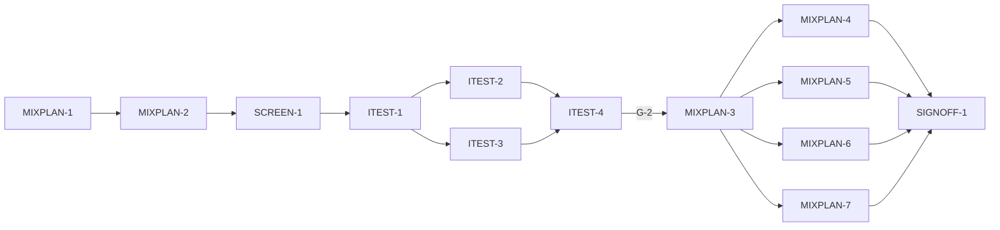

# Master Plan — Mixing a combination from the painter's paints (bs-16)

**Spec:** [bs-16-combination-mixing-plan.feature](../bs-16-combination-mixing-plan.feature)
**Status:** Not started — next MIXPLAN-1 (scaffold); **blocked by G-3 (bs-04) and G-4 (bs-15)**
**Architecture:** [solution intent](../../docs/paint-color-app-solution-intent.md) (*Colour-combination suggestions* §; *Mixing recipes* capability; D3 mixing engine; D9/D11 provenance; SI fixed intent — never a false recipe, out-of-gamut stated) · [bs-04 master plan](../bs-04-mixing-recipes/MASTER_PLAN_FOR_FEATURE.md) (the reused `MixingEngine`/`Recipe`/gamut) · [bs-15 master plan](../bs-15-color-combinations/MASTER_PLAN_FOR_FEATURE.md) (the reused `ColorCombination`/`CombinationLibrary`/`ProjectSink`)
**Code home:** `/Users/matthew.quirk/Nuance` · remote `https://github.com/meatsquirk/Nuance` · base `main` (branch after **both** bs-04 and bs-15 are signed off and merged) · **extends** bs-04 + bs-15

> bs-16 is the bridge between a *chosen* combination (bs-15) and *mixable paint* (bs-04): for each colour in a
> combination it solves the nearest recipe from the selected palette by calling the **existing** `MixingEngine`
> inverse solver — no new mixing math — and reuses bs-04's honest out-of-gamut handling per colour. It adds a
> `CombinationMixPlan` (one `Recipe?` per colour + an in/out-of-gamut summary), a `MixPlanController` + mix-plan
> view reached from the bs-15 combination detail ("mix from my paints"), spoken output over the plan, and a
> save that records the palette it solved against. It does **not** re-specify bs-04's recipe rules (ordering,
> trace, muddying, wet/dry, gamut) — it reuses them. **It cannot start until bs-04 and bs-15 are merged (G-3, G-4).**

## Gap analysis (against `main` once bs-04 + bs-15 are merged)

bs-04 supplies `MixingEngine` (inverse solve minimising ΔE00 under a palette, out-of-gamut, nearest-as-nearest),
`Recipe`/`RecipeComponent` (parts, predicted colour, ΔE00, verdict), `Paint`/`PaintPalette`/`PaletteSource`.
bs-15 supplies `WadaColor`/`ColorCombination`/`CombinationLibrary`, the combinations screen + the "mix from my
paints" entry point, and the `ProjectSink` seam. **No per-combination solve, no `CombinationMixPlan`, no gamut
summary over a combination, no mix-plan view/controller, no plan spoken output and no mix-plan save exist** —
all net-new.

| AC | Scenario | Exists today (post-merge) | Missing |
|---|---|---|---|
| AC-1 | One recipe per colour, solved from the palette | `MixingEngine.inverse`, `ColorCombination` | drive the engine per colour → a `CombinationMixPlan` |
| AC-2 | Each recipe states parts/predicted/ΔE00/verdict | `Recipe` (all of these) | surface the reused `Recipe` per colour in the plan |
| AC-3 | Every per-colour recipe uses only the selected palette | bs-04 palette constraint | pass the selected palette to each per-colour solve |
| AC-4 | Switching the palette re-solves | `PaletteSource` selection | re-run the whole plan on palette change |
| AC-5 | An unreachable colour marked OUT OF GAMUT | bs-04 out-of-gamut rule | apply it per colour; carry the marker in the plan |
| AC-6 | Plan states in-gamut vs out-of-gamut counts | — | count reachable vs out-of-gamut colours |
| AC-7 | Speak the plan | `Speech`; bs-04 recipe phrasing | build one utterance over the plan |
| AC-8 | Save the plan with the palette it solved against | bs-15 `ProjectSink` | a mix-plan `ProjectRecord` variant carrying the palette |

## Build order

| Stage | Phases |
|---|---|
| 1 Scaffold | MIXPLAN-1 |
| 2 Component shells | MIXPLAN-2, SCREEN-1 |
| 3 Acceptance tests | ITEST-1, ITEST-2, ITEST-3, ITEST-4 (test review, G-2) |
| 4 Behavior | MIXPLAN-3, MIXPLAN-4, MIXPLAN-5, MIXPLAN-6, MIXPLAN-7 |
| 5 Sign-off | SIGNOFF-1 |

## Acceptance criteria coverage

| AC | Scenario | Integration test (ITEST) | Behavior phases | Status |
|---|---|---|---|---|
| AC-1 | A combination is turned into one recipe per colour | ITEST-2 `TestAC01_RecipePerColour` | MIXPLAN-3 | ⬜ Todo |
| AC-2 | Each colour's recipe states parts, predicted colour, distance and verdict | ITEST-2 `TestAC02_RecipeDetail` | MIXPLAN-3 | ⬜ Todo |
| AC-3 | Every per-colour recipe uses only the selected palette | ITEST-2 `TestAC03_PaletteConstrained` | MIXPLAN-3 | ⬜ Todo |
| AC-4 | Switching the active palette re-solves the combination | ITEST-3 `TestAC04_ReSolveOnSwitch` | MIXPLAN-5 | ⬜ Todo |
| AC-5 | An unreachable combination colour is marked out of gamut | ITEST-3 `TestAC05_ColourOutOfGamut` | MIXPLAN-4 | ⬜ Todo |
| AC-6 | The plan states the in-gamut and out-of-gamut counts | ITEST-3 `TestAC06_GamutSummary` | MIXPLAN-4 | ⬜ Todo |
| AC-7 | The painter hears the mixing plan spoken | ITEST-2 `TestAC07_SpeakPlan` | MIXPLAN-6 | ⬜ Todo |
| AC-8 | A mixing plan is saved to a project with its palette | ITEST-2 `TestAC08_SavePlan` | MIXPLAN-7 | ⬜ Todo |

## Design decisions

| # | Decision | Why |
|---|---|---|
| D-1 | bs-16 **extends** bs-04 + bs-15 and branches from `main` **after both are merged** (G-3, G-4). Reuses `MixingEngine` (inverse + gamut), `Recipe`/`RecipeComponent`, `Paint`/`PaintPalette`/`PaletteSource`, `WadaColor`/`ColorCombination`/`CombinationLibrary`, `ProjectSink`, `Speech`, `buildApp`/`AppRouter` | the whole value is reuse; bs-16 adds orchestration, not mixing or harmony math |
| D-2 | A combination colour is solved as a bs-04 inverse target: each `WadaColor.lab` becomes the target and `MixingEngine.inverse(target, selectedPalette, opts)` runs. The plan is `CombinationMixPlan {ColorCombination source; List<ColourMixResult> results}`, `ColourMixResult {WadaColor colour; Recipe? best; bool outOfGamut}` (AC-1, AC-2) | **no new mixing math**; each colour is just another target for the proven solver; `Recipe` already carries parts/predicted/ΔE00/verdict |
| D-3 | **Out-of-gamut per colour** (AC-5) is bs-04's rule reused: `best`'s ΔE00 over the gamut threshold ⇒ `outOfGamut=true`, the nearest mix kept but labelled *as nearest*, never a match | SI fixed intent reused unchanged; the honesty rule is already tested in bs-04 |
| D-4 | **Palette constraint + re-solve** (AC-3, AC-4): every per-colour solve passes the **selected** `PaintPalette`; selecting another palette (via `PaletteSource`) re-runs the whole plan | reuses bs-04 AC-3; one selection drives the whole plan |
| D-5 | **Gamut summary** (AC-6) = counts of `outOfGamut` vs reachable `ColourMixResult`s on the plan | a single honest at-a-glance reachability figure |
| D-6 | **Speak the plan** (AC-7) builds one utterance over the plan, reusing bs-04's recipe phrasing per colour (name + paints + parts) | one spoken path; reuses tested phrasing |
| D-7 | **Save** (AC-8) extends bs-15's `ProjectRecord` with a mix-plan variant: the per-colour recipes + the **palette name** it solved against, written through the same `ProjectSink` (bs-06 backs it later) | the plan is only meaningful with the palette that produced it; reuses the bs-15 seam |
| D-8 | A `buildApp` **mix-plan entry** → `CombinationMixPlanScreen` owning a `MixPlanController`, behind `AppRouter.toCombinationMixPlan`, reached from the bs-15 combination detail ("Mix from my paints") | one assembly entry per feature; the entry point lives where the painter already is (the combination) |
| D-9 | **Acceptance** drives the real assembled app; real `MixingEngine`/`Recipe`/`CombinationLibrary`/controller/screen. Faked (infra only): `FakeSpeech`; `InMemoryProjectSink`; the `PaletteSource` fixture (reusing bs-04's `PALETTE_MY_PAINTS` + an out-of-gamut colour). ΔE00 graded against an independent in-harness CIEDE2000 | matches bs-04/bs-15: real math, infra-only fakes, independent ΔE reference |

## Acceptance integration test plan

Module plan: [modules/ITEST.md](modules/ITEST.md).

**Where it lives and how it runs:** `integration_test/mixplan_test.dart`, harness
`integration_test/mixplan_harness.dart`, pending gate `integration_test/bs16/pending.dart`. Default:
`flutter test integration_test/mixplan_test.dart -d <udid>`; run-pending: add
`--dart-define=BS16_RUN_PENDING=true`. Single exclusive lane (`coord.sh with-lock`).
**Where assertions look:** the rendered widget tree (per-colour recipe rows with parts/predicted/ΔE00/verdict,
the OUT OF GAMUT markers, the in/out summary, the speak + save actions); the `MixPlanController` **read endpoint**
(the `CombinationMixPlan`: each `ColourMixResult`'s `best`/`outOfGamut`, the summary counts, the active palette,
the last saved record); the `FakeSpeech` log (AC-7); the `InMemoryProjectSink` (AC-8).
**What is real and what is faked:** the whole app via `buildApp` with the mix-plan entry; the real
`MixingEngine` inverse solve + gamut, `Recipe`, `CombinationLibrary`, controller, screen, routing. Faked (infra
only): `FakeSpeech`, `InMemoryProjectSink`, the injected `PaletteSource`. ΔE00 graded against the independent
`referenceDeltaE00`.

**Fixtures:**

| Fixture | Shape |
|---|---|
| `COMBO_THREE` | a 3-colour `ColorCombination` all three of whose colours are reachable from `PALETTE_MY_PAINTS`. Drives AC-1, AC-2, AC-3, AC-7, AC-8 |
| `COMBO_MIXED_GAMUT` | a 4-colour combination, three in gamut + one high-chroma colour unreachable from `PALETTE_MY_PAINTS`. Drives AC-5, AC-6 |
| `PALETTE_MY_PAINTS` / `PALETTE_TRAVEL` | two injected `PaintPalette`s (reuse bs-04's), so the switch re-solves. Drives AC-3, AC-4 |
| `PROJECT_HARBOUR` | an opened project in `InMemoryProjectSink`. Drives AC-8 |
| `referenceDeltaE00` | independent in-harness CIEDE2000 for grading distances |

**Test catalogue:**

| AC | Given: built via public flows → checked by | When | Then: exact assertions (negative Thens: after <settle point>) | Rejects |
|---|---|---|---|---|
| AC-1 | `COMBO_THREE`, selected `PALETTE_MY_PAINTS` → assert plan empty (endpoint) | mix the combination | `plan.results.length == 3`; each `ColourMixResult` has a non-null `best` `Recipe` (rendered) | solves fewer/more than the colours; a colour with no result |
| AC-2 | a reachable colour's result (from AC-1 flow) → assert result present | its recipe is shown | the row renders parts-by-volume **and** predicted colour **and** `deltaE00` (`closeTo(referenceDeltaE00,0.1)`) **and** a plain verdict | missing any of parts/predicted/ΔE/verdict |
| AC-3 | `COMBO_THREE`, selected `PALETTE_MY_PAINTS` → assert palette selected | mix the combination | **every** recipe's components reference only paints in `PALETTE_MY_PAINTS` | a recipe uses a paint outside the palette |
| AC-4 | a plan solved against `PALETTE_MY_PAINTS` → assert its recipes | select `PALETTE_TRAVEL` as active | the plan re-solves; every recipe now references only `PALETTE_TRAVEL` paints (after re-solve settles) | stale recipes from the old palette; no re-solve |
| AC-5 | `COMBO_MIXED_GAMUT`, `PALETTE_MY_PAINTS` → assert the unreachable colour present | mix the combination | that colour's result is `outOfGamut` + marked "OUT OF GAMUT"; its nearest kept **as nearest**, no match verdict | fabricates a match; no marker; marks a reachable colour |
| AC-6 | `COMBO_MIXED_GAMUT` (3 in / 1 out) → assert plan solved | mix the combination | the summary states 3 of 4 in gamut, 1 out of gamut (matches the per-colour `outOfGamut` flags) | wrong counts; summary ignores a colour |
| AC-7 | a solved `COMBO_THREE` plan; `FakeSpeech` empty → assert plan present | speak the plan | exactly one utterance stating each colour's name + its recipe (paints + parts) | omits a colour or its parts; multiple utterances |
| AC-8 | `PROJECT_HARBOUR` open; a `COMBO_THREE` plan solved against `PALETTE_MY_PAINTS`; sink empty → assert plan + project open | save the plan | the sink has one mix-plan record under "Harbour Dusk" with the per-colour recipes **and** palette name "My paints" | drops the recipes or the palette name; wrong project |

**Red baseline** and **test augmentations:** tracked in [modules/ITEST.md](modules/ITEST.md). No behavior-phase
augmentation is pre-seeded — `COMBO_MIXED_GAMUT` carries the in- and out-of-gamut colours in one fixture, and
AC-2's distance is graded against `referenceDeltaE00`.

## Modules

| Module | Plan | Purpose | Depends on | Status |
|---|---|---|---|---|
| MIXPLAN | [modules/MIXPLAN.md](modules/MIXPLAN.md) | The per-colour solve orchestration: `CombinationMixPlan`/`ColourMixResult`, the `MixPlanController`/state, the read endpoint, the mix-plan entry/route, gamut summary, re-solve, spoken output, save | bs-04 `MixingEngine`/`Recipe`, bs-15 `ColorCombination`/`ProjectSink` | ⬜ Todo |
| SCREEN | [modules/SCREEN.md](modules/SCREEN.md) | The mix-plan view: per-colour recipe rows, OUT OF GAMUT markers, the in/out summary, speak + save actions | MIXPLAN | ⬜ Todo |
| ITEST | [modules/ITEST.md](modules/ITEST.md) | Acceptance integration suite: one pending test per AC, and its review | all shell phases | ⬜ Todo |

## Dependency graph

**Parallel windows:** shells serial (`MIXPLAN-2` defines the plan types `SCREEN-1` renders). AC tests
`{ITEST-2 ∥ ITEST-3}` (disjoint catalogue rows). After G-2, **MIXPLAN-3** runs first alone (the per-colour
solve — every later Given needs a plan), then `{MIXPLAN-4 (gamut/summary) ∥ MIXPLAN-5 (re-solve) ∥ MIXPLAN-6
(speak) ∥ MIXPLAN-7 (save)}` are file-disjoint and may run concurrently (each owns its own controller-helper +
screen region).

## Open gates

| Gate | Kind | Decision needed | Blocks | Status |
|---|---|---|---|---|
| G-1 | decision | Approve the spec (record approval as its first line) | MIXPLAN-1 | Open |
| G-2 | decision | Approve the acceptance tests (ITEST-4's packet) | every behavior phase | Open |
| G-3 | dependency | **bs-04 signed off and merged to `main`** — `MixingEngine` (inverse + gamut), `Recipe`/`RecipeComponent`, `Paint`/`PaintPalette`/`PaletteSource` present. Closed by bs-04 SIGNOFF-1 + merge | MIXPLAN-1 and all phases | Open |
| G-4 | dependency | **bs-15 signed off and merged to `main`** — `ColorCombination`/`WadaColor`/`CombinationLibrary`, the combinations screen + "mix from my paints" entry, the `ProjectSink` seam present. Closed by bs-15 SIGNOFF-1 + merge | MIXPLAN-1 and all phases | Open |

Resolved: `✅ Resolved <date time>: <decision, one line> — <who>`.

## Known flakes

| Test | Symptom | Rate (runs) | Measured at | Owner | Status |
|---|---|---|---|---|---|
| coverage_gate — a `const` constructor line in `lib/**` | Carried: `flutter test --coverage` may record a const-folded constructor line as uncovered | not quantified | — | any phase running the coverage gate | open — re-run once; green ⇒ ignore |
| mixplan integration — no `-d <udid>` | Carried: `flutter test integration_test/…` without a booted device runs zero tests and exits 0 (false green) | — | — | every phase running the acceptance suite | open — always pass `-d <booted-udid>` |

## Session log

| # | Phase | Target | Status | Tokens | Time | Notes |
|---|---|---|---|---|---|---|
| 1 | MIXPLAN-1 | scaffold: branch, baseline, coverage gate, BS16 pending runner | ⬜ Next | | | blocked by G-1, G-3, G-4 |
| 2 | MIXPLAN-2 | shell: `CombinationMixPlan`/`ColourMixResult`; `MixPlanController`/state + read endpoint + mix-plan entry/route; solver stub | ⬜ Todo | | | after MIXPLAN-1 |
| 3 | SCREEN-1 | shell: mix-plan screen scaffold (per-colour rows, OOG, summary, speak/save placeholders) | ⬜ Todo | | | after MIXPLAN-2 |
| 4 | ITEST-1 | acceptance-tests: harness, fixtures, pending gate (8 ACs), smoke | ⬜ Todo | | | |
| 5 | ITEST-2 | acceptance-tests: AC-1,2,3,7,8 (pending) + red baseline | ⬜ Todo | | | ∥ ITEST-3 |
| 6 | ITEST-3 | acceptance-tests: AC-4,5,6 (pending) + red baseline | ⬜ Todo | | | ∥ ITEST-2 |
| 7 | ITEST-4 | test-review: packet; G-2 | ⬜ Todo | | | |
| 8 | MIXPLAN-3 | behavior: AC-1,2,3 — per-colour solve, palette-constrained, recipe detail | ⬜ Todo | | | foundational |
| 9 | MIXPLAN-4 | behavior: AC-5,6 — out-of-gamut per colour + in/out summary | ⬜ Todo | | | ∥ after MIXPLAN-3 |
| 10 | MIXPLAN-5 | behavior: AC-4 — re-solve on palette switch | ⬜ Todo | | | ∥ after MIXPLAN-3 |
| 11 | MIXPLAN-6 | behavior: AC-7 — speak the plan | ⬜ Todo | | | ∥ after MIXPLAN-3 |
| 12 | MIXPLAN-7 | behavior: AC-8 — save the plan with its palette | ⬜ Todo | | | ∥ after MIXPLAN-3 |
| 13 | SIGNOFF-1 | sign-off: packet + summary page + manual approval | ⬜ Todo | | | |

*Tokens* / *Time* = the phase totals from the *Token usage* ledger, filled when the row is marked done.

## Next phase

**MIXPLAN-1 (scaffold)** is next but **blocked by three gates**: **G-1** (approve the spec), **G-3** (bs-04
signed off + merged to `main`) and **G-4** (bs-15 signed off + merged to `main`). bs-16 is deliberately the last
of the three combination/mixing increments: it cannot begin until the `MixingEngine` (bs-04) and the
combinations library + "mix from my paints" entry (bs-15) exist on `main`. Resolve G-1 any time; G-3/G-4 close
when those features sign off.

## Token usage

<!-- One row per session, appended as that session's last edit (SKILL.md § Token usage). -->

| Phase / activity | Session | Start | End | Wall | Active | Model(s) | Input | Cache write | Cache read | Output | Total | Outcome |
|---|---|---|---|---|---|---|---|---|---|---|---|---|
| PLAN | <this session> | <see ledger> | | | | claude-opus-4-8 | | | | | | plan written: 13 phases, 3 modules, 8 ACs; G-1/G-2/G-3/G-4 open |
| PLAN | 9a3b4189 | 2026-10-08 13:40 EDT | 14:48 | 1h 08m | 30m 33s | claude-opus-4-8 | 76 | 239,117 | 6,695,380 | 107,728 | 7,042,301 | plan written: bs-16 spec + 3 modules, 13 phases, 8 ACs; G-1/G-2/G-3(bs-04)/G-4(bs-15) open (shared session with bs-15) |
| **Feature total** |  | **2026-10-08 13:40 EDT** | **2026-10-08 14:48** | **1h 08m** | **30m 33s** |  | **76** | **239,117** | **6,695,380** | **107,728** | **7,042,301** |  |

## Sign-off

| Round | Packet | At code | Grades | Decision |
|---|---|---|---|---|
| 1 | [signoff/round-1.md](signoff/round-1.md) | `<commit>` | — | ⏸ Awaiting |
